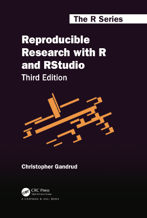

# Reproducible Research with R and RStudio (Third Edition)

Christopher Gandrud

[CRC Press/Chapman &
Hall](http://www.tandf.net/books/details/9781498715379/)

The files in this repository comprise the source code for creating
**Reproducible Research with R and RStudio**.

### File Organization

### Reproduce the Book

The book can be reproduced by using the R package *bookdown*. To do
this:

### Session Info

The current version of the book manuscript was compiled with
[RStudio](http://www.rstudio.com/) (v. 1.2.5019 preview build) with the
following R session:

    ## R version 3.6.2 (2019-12-12)
    ## Platform: x86_64-apple-darwin15.6.0 (64-bit)
    ## Running under: macOS Catalina 10.15.2
    ## 
    ## Matrix products: default
    ## BLAS:   /Library/Frameworks/R.framework/Versions/3.6/Resources/lib/libRblas.0.dylib
    ## LAPACK: /Library/Frameworks/R.framework/Versions/3.6/Resources/lib/libRlapack.dylib
    ## 
    ## locale:
    ## [1] en_US.UTF-8/en_US.UTF-8/en_US.UTF-8/C/en_US.UTF-8/en_US.UTF-8
    ## 
    ## attached base packages:
    ## [1] stats     graphics  grDevices utils     datasets  methods   base     
    ## 
    ## loaded via a namespace (and not attached):
    ##  [1] compiler_3.6.2  magrittr_1.5    tools_3.6.2     htmltools_0.4.0
    ##  [5] yaml_2.2.0      Rcpp_1.0.3      stringi_1.4.3   rmarkdown_2.0  
    ##  [9] knitr_1.26      stringr_1.4.0   xfun_0.11       digest_0.6.23  
    ## [13] rlang_0.4.2     evaluate_0.14

-----

( c ) Christopher Gandrud (2020)
