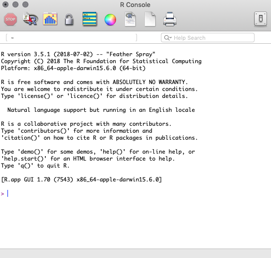
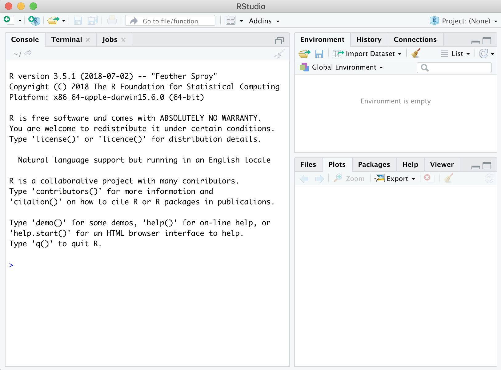
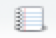
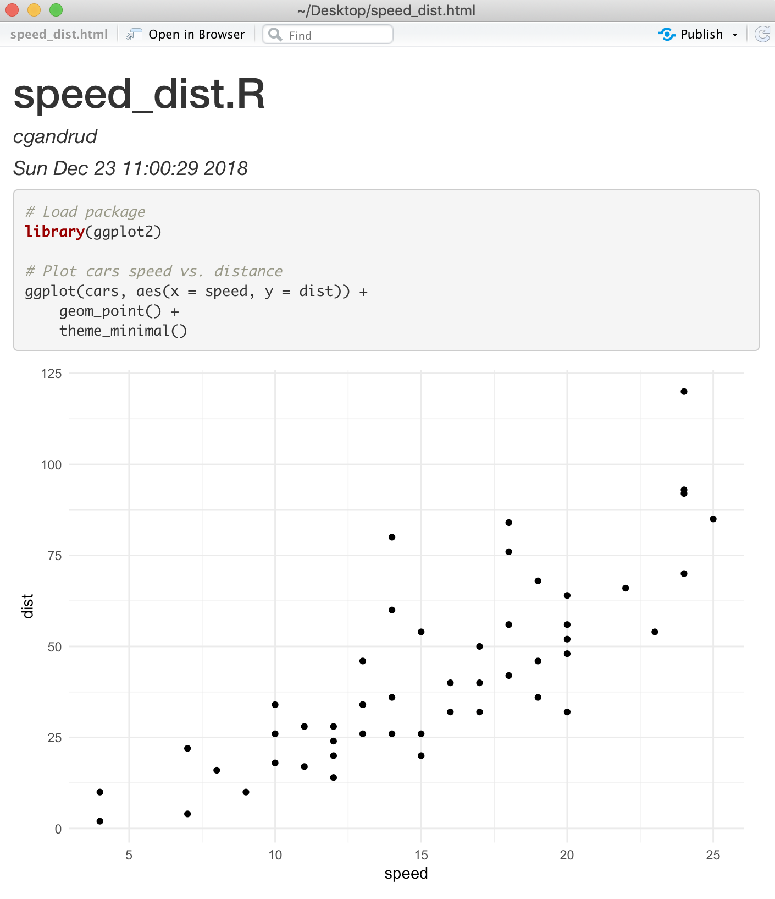
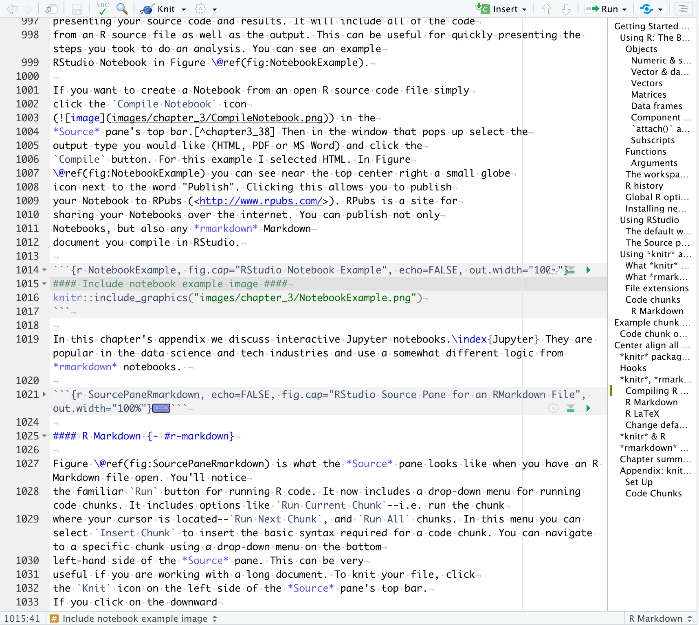
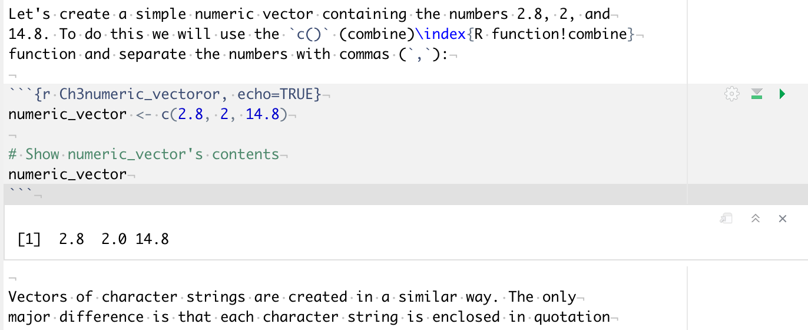

# Getting Started with R, RStudio, and knitr/rmarkdown {#GettingStartedRKnitr}

If you have rarely or never used R before, the first section of this
chapter gives you enough information to be able to get started and
understand the R code I use throughout the book. For more detailed
introductions on how to use R please refer to the resources mentioned
in Chapter \@ref(Intro) (Section \@ref(OtherBooks)). Experienced R users might
want to skip the first section.

In the second section I'll give a brief
overview of RStudio. I highlight the key features of the main RStudio
panel (what appears when you open RStudio) and some of its key features
for reproducible research. Finally, I discuss the basics of the
*knitr* and *rmarkdown* packages, how to use them in R, and how
they are integrated into RStudio.

## Using R: The Basics

To get you started with reproducible research, we'll cover some very
basic R syntax-the rules for talking to R. I cover key parts of the R
language including:

-   objects & assignment,

-   component selection,

-   functions,

-   arguments,

-   the workspace and history,

-   packages.

Before discussing each of these in detail, let's open R and look
around.[^chapter3_1] When you open the R GUI program by clicking on the R icon
you should get a window that looks something like Figure
\@ref(fig:RBlankMain).[^chapter3_2] This window is the **R
console**. Below the start up information-information about
what version of R you are using, license details, and so on-you should
see a `>` (greater-than sign). This prompt is where you enter R
code.[^chapter3_3] To run R code that you have typed after the prompt, press the
`Return` or `Enter` key.

Now that we have a new R session open we can get started.

```{r RBlankMain, fig.cap="R Console at Startup", echo=FALSE, out.height="50%"}

```

### Objects {#Objects}

If you've read a description of the R language before, you will probably have seen it
referred to as an 'object-oriented language'. What are objects? Objects
are like the R language's nouns. They are things, like a vector of
numbers, a data set, a word, a table of results from some analysis, and
so on. Saying that R is object-oriented means that R is focused on doing
actions to objects. We will talk about the actions--functions--later in this
section.[^chapter3_4] Now let's create a few objects.

#### Numeric & string objects {- #ObjectNames}

Objects can have a number of different types. Let's make two simple
objects. The first is a numeric-type object. The other is a character
object.

We can choose almost any name we want for our
objects as long as it begins with an alphabetic character and does not
contain spaces.[^chapter3_5] Just because there are relatively few hard
restrictions on object names, doesn't
mean that you should name your object anything.
Your code will be much easier to read if object
names are short and meaningful. Give each object a
unique name to avoid confusion and conflicts. For example, if you reuse an object
names in an R session you could easily accidentally overwrite it.

Let's begin working with numeric objects by creating a new object called
*number* with the number 10 in it.
To put something into the object we use the assignment operator[^chapter3_6]
(`<-`).\index{R function!<-}:

```{r Ch3NumericObject, echo=TRUE}
number <- 10
```

To see the contents of our object, type its name into the R console.

```{r Ch3NumberSee, echo=TRUE}
number
```

Let's briefly breakdown this output. `10` is clearly the contents of
*number*. The double hash (`##`) is included here to tell
you that this is output rather than R code.[^chapter3_7] If you run functions
in your R console, you will not get the double hash in your output.
Finally, `[1]` gives the position in the object that the number 10 is on. Our object only
has one position.

Creating an object with words and other characters-a character object-is
very similar. The only difference is that you enclose the character
string (letters in a word for example) inside of single or double
quotation marks (`''`, or `""`).[^chapter3_8] Let's create an object called *words*
containing the character string `Hello World`:

```{r Ch3CharacterObject, echo=TRUE}
words <- "Hello World"
```

An object's type is important to keep in mind. It determines what we
can do to the object. For example, you cannot take the mean of a character
object like the *words* object:

```{r Ch3ClassError, echo=TRUE}
mean(words)
```

Trying to find the mean of our *words* object gives us a
warning message and returns the value `r mean(words)`: not applicable. You can also
think of `NA` as meaning "missing". To find out an object's type, use the `class()`
function.[^chapter_3_types]\index{R function!class} For example:

```{r Ch3ClassCommand, echo=TRUE}
class(words)
```

#### Vector & data frame objects {-}

So far we have only looked at objects with a single number or character
string.[^chapter3_9] Clearly we often want to use objects that have many strings
and numbers. In R these are usually data frame-type objects and are
roughly equivalent to the data structures you would be familiar with
from using a program such as Microsoft Excel. We will be using data
frames extensively throughout the book. Before looking at data frames it
is useful to first look at the simpler objects that make up data frames.
These are called vectors. Vectors are R's "workhorse" [@matloff2011].
Knowing how to use vectors will be especially helpful when you cleanup
raw data in Chapter \@ref(DataClean) and make tables in Chapter
\@ref(TablesChapter).[^chapter3_10]

#### Vectors {-}

Vectors are the "fundamental data type" in R [@matloff2011]. They are
simply an ordered group of numbers, character strings, and so on.[^chapter3_11]
It may be useful to think of most data in R as composed of
vectors. For example, data frames\index{data.frame} are basically collections
of vectors of the same length--i.e. they have the same number of rows--attached
together to form columns.

Let's create a simple numeric vector containing the numbers 2.8, 2, and
14.8. To do this we will use the `c()` (combine)\index{R function!combine}
function and separate the numbers with commas (`,`):

```{r Ch3numeric_vectoror, echo=TRUE}
numeric_vector <- c(2.8, 2, 14.8)

# Show numeric_vector's contents
numeric_vector
```

Vectors of character strings are created in a similar way. The only difference is that each character string is enclosed in quotation marks like this:

```{r Ch3CharcterVector, echo=TRUE}
character_vector <- c("Albania", "Botswana", "Cambodia")

# Show character_vector's contents
character_vector
```

#### Matrices {-}

To give you a preview of what we are going to do when we start working
with real data sets, let's combine the two vectors
*numeric_vector* and *character_vector* into a new
object with the `cbind()` function. This function binds the two vectors
together side-by-side as columns.[^chapter3_12]\index{R function!cbind}

```{r Ch3cbind, echo=TRUE}
string_num_matrix <- cbind(character_vector, numeric_vector)

string_num_matrix
```

By binding these two objects together we've created a new matrix
object.[^chapter3_13] You can see that the numbers in the
**numeric_vector** column are between quotation marks. Matrices,
like vectors, can only have one data type, so R has converted the numbers to strings.

#### Data frames {-}

If we want to have an object with rows and columns and allow the columns
to contain data with different types, we need to use data frames. Let's
use the `data.frame` function to combine the *numeric_vector*
and *character_vector* objects.\index{R function!data.frame}

```{r Ch3dataframe, echo=TRUE, tidy=FALSE}
string_num_df <- data.frame(character_vector, numeric_vector)

string_num_df
```

In this output, you can see the data frame's *names* attribute.[^chapter3_14] It is the column names. You can use the `names()` function\index{R function!names} to see any data frame's names:[^chapter3_15]

```{r Ch10Names, echo=TRUE}
names(string_num_df)
```

You will also notice that the first column of the data set has no name
and is a series of numbers. This is the *row.names* attribute. Data frame
rows can be given any name as long as each row name is unique. We can
use the `row.names()` function to set the row names from a vector. For
example,

```{r Ch3ReassignRowNames, echo=TRUE}
# Reassign row.names
row.names(string_num_df) <- c("First", "Second", "Third")

# Display new row.names
row.names(string_num_df)
```

You can see in this example how `row.names()` can also be used
to print the row names.[^chapter3_16] The *row.names* attribute does not behave
like a regular data frame column. You cannot, for example, include it as
a variable in a regression. You can use the `row.names()` function to
assign the *row.names* values to a regular column (for an example see
Section \@ref(RowNamesTidy)).

You will notice in the output for *string_num_df* that the strings in
the **character_vector** column are not in quotation marks. This does
not mean that they are now numeric data. To prove this, try to
find the mean of **character_vector** by running it through the `mean()`\index{R function!mean}
function:

```{r Ch3CharcterVectorMean, echo=TRUE}
mean(string_num_df$character_vector)
```

#### Component selection {- #ComponentSelect}

The last bit of code we just saw will probably be confusing. Why do we have a dollar sign (`$`) between the name of our data frame object name and the `character_vector` variable? The dollar sign is called the component selector.\index{R!component selector}\index{R!\$, component selector} It's also sometimes called the element name operator. Either way, it extracts a part--component--of an object. In the previous example it extracted the **character_vector** column from the *string_num_df* so that it could be fed to
the `mean()` function.

We can use the component selector to create new objects with parts of other objects. Imagine that we have *string_num_df* and want an object with only the information in the numbers column. Let's use the following code:

```{r Ch3CompSelect, echo=TRUE}
# Extract a numeric vector from string_num_df
numeric_extract <- string_num_df$numeric_vector

numeric_extract
```

Knowing how to use the component selector will be especially useful when
we discuss making tables for presentation documents in Chapter
\@ref(TablesChapter).

#### `attach()`  and `with()` {-}

Using the component selector can create long repetitive code if you want
to select many components. You have to write the object name, a dollar
sign, and the component name every time you want to select a component.
You can streamline your code by using functions such as `attach()`\index{R function!attach} and
`with()`\index{R function!with}.

`attach()` attaches a database to R's search path.[^chapter3_17] R will
then search the database for variables you specify. You don't need to
use the component selector to tell R again to look in a particular data
frame after you have attached it. For example, let's attach the *cars*
data that comes with R. It has two variables, **speed** and
**dist**.[^chapter3_18]

```{r Ch3Attach, echo=TRUE}
# Attach cars to search path
attach(cars)

# Display speed
head(speed)

# Display dist
head(dist)
```

We used the `head()`\index{R function!head} function to see just the first few values of each
variable.

Now that we are done working with the *cars* data set, we should `detach()`\index{R function!detach} it. Not doing so could confuse R later in our session.

```{r Ch3Detach, echo=TRUE}
detach(cars)
```

A safer alternative to `attach()` is `with()`. It more clearly delineates when to draw from inside a particular object. For example, we can find the mean of **numeric_vector** `with()` the *string_num_df* data frame:

```{r Ch3With, echo=TRUE, tidy=FALSE}
with(string_num_df, {
        mean(numeric_vector)
    }
)
```

In the `with()` call the data frame object goes first
and then the `mean()` function[^chapter3_19] goes second in curly brackets (`{}`).

In this book I avoid using the `attach()` and `with()`
functions. Instead I use the component selector. Though it creates longer
code, I find that code written with the component selector is less ambiguous
It's always clear which object we are selecting a component
from.

#### Subscripts {-}

Another way to select parts of an object is to use subscripts. You have
already seen subscripts in the output from our examples so far. They are
denoted with square braces (`[]`). We can use subscripts to select not
only columns from data frames but also rows and individual values. As we
began to see in some of the previous output, each part of a data frame
has an address captured by its row and column number. We can tell R to
find a part of an object by putting the row number/name, column
number/name, or both in square braces. The first part denotes the rows
and separated by a comma (`,`) are the columns.

To give you an idea of how this works let's use the *cars*
data set again. Use `head()` to get a sense of what this data looks like.

```{r Ch3HeadSwiss, echo=TRUE}
head(cars)
```

We can see a data frame with information on various cars' speeds
(**speed**) and stopping distances (**dist**). If we want to select only
the third through seventh rows we can use the following subscript
function call:

```{r Ch3FirstSeventhRows, echo=TRUE}
cars[3:7, ]
```

The colon (`:`) creates a sequence of whole numbers from 3 to 7. To
select the fourth row of the **dist** column we can type:

```{r Ch3FourthSecond, echo=TRUE}
cars[4, 2]
```

An equivalent way to do this is:

```{r Ch3FourthDist, echo=TRUE}
cars[4, "dist"]
```

Finally, we can even include a vector of column names to select:

```{r Ch3FourthBoth, echo=TRUE}
cars[4, c("speed", "dist")]
```

### Functions {#FunctionsCommands}

If objects are the nouns of the R language, functions
are the verbs. They do things to objects. Let's use the `mean` function
as an example. This function takes the mean of a numeric vector object.
Remember our *numeric_vector* object from before:

```{r Shownumeric_vector, echo=TRUE}
numeric_vector
```

To find the mean of this object simply type:

```{r numeric_vector_mean, echo=TRUE}
mean(x = numeric_vector)
```

We use the assignment operator to place a function's output into an
object. For example:

```{r numeric_vector_meanAssign, echo=TRUE}
numeric_vector_mean <- mean(x = numeric_vector)
```

Notice that we typed the function's name then enclosed the object name in
parentheses immediately afterwards. This is the basic syntax that all
functions use, i.e. `FUNCTION(ARGUMENTS)`. Even if you don't want to explicitly
include an argument, *you still need to type the parentheses after the function*.[^chapter3_21a]

#### Arguments {-}

Arguments modify what functions do. In our most recent example we gave
the `mean` function one argument (`x = numeric_vector`) telling it that we
wanted to find the mean of *numeric_vector*. Arguments use the
`ARGUMENT_LABEL = VALUE` syntax.[^chapter3_21] In this case **x** is the argument
label.

To find all of the arguments that a function can accept, look at the
**Arguments** section of the function's help
file. To access the help file type: `?FUNCTION`.\index{R function!?} For example:

```{r Ch3HelpMean, echo=TRUE, eval=FALSE, tidy=FALSE}
?mean
```

The help file will also tell you the default values that the arguments
are set to. You do not need to explicitly set an argument if
you want to use its default value.

You do need to be fairly precise with the syntax for your argument's
values. Values for logical arguments must written as `TRUE` or
`FALSE`.[^chapter3_22] Arguments that accept character strings require quotation
marks.

Let's see how to use multiple arguments with the `round()`\index{R function!round} function. This
function rounds a vector of numbers. We can use the `digits` argument to
specify how many decimal places we want the numbers rounded to. To round
the object *numeric_vector_mean* to one decimal place type:

```{r Ch3Round, echo=TRUE}
round(x = numeric_vector_mean, digits = 1)
```

Note that *arguments are always separated by commas*.

Some arguments do not need to be explicitly labeled. For example, we
could write:

```{r Ch3ArgeNoLabel, echo=TRUE}
# Find mean of numeric_vector
mean(numeric_vector)
```

R will do its best to figure out what you want and will only give up
when it can't. This will generate an error message. However, to avoid
any misunderstandings between yourself and R, it is good practice to
label your argument values. This will also make your code easier for
other people to read, i.e. it will be more reproducible.

You can stack functions inside of arguments. For example, have R find the
mean of *numeric_vector* and round it to one decimal place:

```{r Ch3StackedArgs, echo=TRUE}
round(mean(numeric_vector), digits = 1)
```

Stacking functions inside of each other can create code that is
difficult to read. Another option that potentially makes more easily
understandable code is piping\index{pipe} using the pipe function (`%>%`)\index{R function!\%>\%} that you
can access from the *magrittr* [@R-magrittr]\index{R package!magrittr} or *dplyr* [@R-dplyr]\index{R package!dplyr} packages. The basic idea behind the pipe function is that the output of one function is set as the first argument of the next. For example, to find the mean of *numeric_vector* and then round it to one decimal place use:

```{r Ch3Pipe, echo=TRUE}
# Load magrittr package
library(magrittr)

# Find mean of numeric_vector and round to 1 decimal place
mean(numeric_vector) %>%
    round(digits = 1)
```

### The workspace & history {#RSave}

All of the objects you create become part of your workspace,
alternatively known as the current working environment. Use the `ls()`\index{R function!ls}
function to list all of the objects in your current workspace.[^chapter3_23]

```{r Ch3LS, echo=TRUE}
ls()
```

You can remove specific objects from the workspace using the `rm()`\index{R function!rm}
function. For example, to remove the `character_vector` and `words` objects
type:

```{r Ch3RM, echo=TRUE, eval=FALSE}
rm(character_vector, words)
```

To save the entire workspace into a binary-not plain-text-RData file use
`save.image()`.\index{R function!save.image} The main argument of
`save.image()` is the location and name of the file in which you want to
save the workspace. If you don't specify the file path it will be saved
into your current working directory (see Chapter \@ref(DirectoriesChapter)
for information on files paths and working directories). To
save the current workspace in a file called *workspace-2018-12-22.RData* in
the current working directory type:

```{r Ch3Workspace, echo=TRUE, eval=FALSE}
save.image(file = "workspace-2018-12-22.RData")
```

Use `load()`\index{R function!load} to load a saved workspace back into R:

```{r Ch3LoadWS, echo=TRUE, eval=FALSE}
load(file = "workspace-2018-10-22.RData")
```

You should generally avoid having R automatically save your workspace
when you quit and reload it when you start R again. Instead, when you
return to a project, rerun the source code files. This avoids
any complications caused when you use an object in your workspace that
is left over from running an older version of the source code.[^chapter3_24] In
general I also recommend against saving data in binary RData formatted
files if feasible. They are not text files they are not human readable and
are much less future-proof.

One of the few times when saving your workspace is  useful is when
it includes an object that was computationally difficult and took a long
time to create. In this case you can save only the large object with
`save()`.[^chapter3_25]\index{R function!save}
For example, if we have a very large
object called *model-output* we can save it to a file called *model-output.RData* like
this:

```{r Ch3Comp, echo=TRUE, eval=FALSE}
save(model-output, file = "model-output.RData")
```

### R history {#RHistory}

When you execute code in the R console it becomes part of your history. To see
the most recent functions in your history use the `history()` function.\index{R function!history} You
can also use the up and down arrows on your keyboard when your cursor is
in the R console to scroll through your history.

### Global R options {#ROptions}

In R you can set global options with `options()`.\index{R function!options} This lets
you set how R runs and outputs functions through an entire R session. For
example, to have output rounded to one decimal place, set the `digits`
argument:

```{r Ch3Options, echo=TRUE, eval=FALSE}
options(digits = 1)
```

### Installing new packages and loading functions {#Packages}

Functions are stored in R packages. The functions we have used so far were
loaded automatically by default. One of the great things about R is the
many user-created packages[^chapter3_26] that expand the number of
functions we can use. To install functions that do not come with the basic
R installation you need to install the add-on packages that
contain them. To do this, use the `install.packages()`\index{R function!install.packages} function. By default this function downloads and installs the packages from the Comprehensive R Archive Network (CRAN).\index{CRAN}

When you install a package, you will likely be given a list
of "mirrors" from which you can download the package. Select the
mirror closest to you.

Once you have installed a package you need to load when you want to
use its functions. Use the `library()` function\index{R function!library}
to load a package.[^chapter3_27] For example,
the following code loads the popular *ggplot2* plotting package:

```{r Ch3Library, echo=TRUE, warning=FALSE, message=FALSE}
library(ggplot2)
```

Please note that for the examples in this book I only specify what
package a function is from if it is not loaded by default when you start
an R session.

Finally, if you want to make sure R uses a function from a specific
package you can use the double-colon operator (`::`). For example, to
make sure that we use the `qplot` function from the *ggplot2* package we
type:

```{r Ch3ColonOperator, echo=TRUE, eval=FALSE}
ggplot2::qplot(. . .)
```

Using the double-colon ensures
that R will use the function from the particular package you want and
makes it clear to a source code reader what package a function comes
from. If you use the double-colon, you don't need to
include `library()` beforehand. Note that it does not load all of the functions in the package, just the one you ask for.

## Using RStudio

As I mentioned in Chapter \@ref(Intro), RStudio is an integrated
development environment for R. It provides a centralized and
well-organized place to do almost anything you want to do with R. As we
will see later in this chapter, it is especially well integrated with
literate programming tools for reproducible research. Right now let's
take a quick tour of the basic RStudio window.

#### The default window {-}

When you first open RStudio you should see a default window that looks
like Figure \@ref(fig:BlankMain). In this figure you see three window panes.
The large one on the left is the *Console/Terminal/Jobs* pane. The *Console* pane is an R console and functions exactly the same as the console discussed so far in this chapter. *Terminal* is a command-line terminal where you can run command-line tools like those we discuss in Chapter \@ref(DirectoriesChapter). The *Jobs* pane allows you to run R scripts in the background. This is very useful if you have computationally time consuming jobs that you would like to run while also doing other work in RStudio.

The *Environment/History/Connections* panes are in the upper
right-hand corner. The *Environment* pane shows you all of the objects
in your workspace and some of their characteristics, like how many
observations a data frame has. You can click on an object in this pane
to see a preview of its contents. This is especially useful for quickly looking at a
data set in much the same way that you can visually scan a Microsoft
Excel spreadsheet. The *History* pane records all of the functions you
have run. It also allows you to rerun code and insert it into a source
code file. The *Connections* pane allows you to manage connections to databases
such as an SQL server.\index{SQL}

```{r BlankMain, echo=FALSE, fig.cap="RStudio at Startup", out.width="100%"}

```

In the lower right-hand corner you will see the
*Files/Plots/Packages/ Help/Viewer* panes. We will discuss
the *Files* pane in more detail in Chapter \@ref(DirectoriesChapter).
Basically, it allows you to navigate and organize your files. The *Plots*
pane is where figures you create in R appear. This pane allows you to
see all of the figures you have created in a session using the right and
left arrow icons. It also lets you copy and save the figures in a variety of
formats. The *Packages* pane shows the packages you have installed,
allows you to load individual packages by clicking on the dialog box
next to them, access their help files (just click on the package name),
update the packages, and even install new packages. The *Help* pane
shows you help files. You can search for help files and search within
help files using this pane. Finally, the *Viewer* pane allows you to
view local web content like JavaScript graphics and Shiny apps.\index{Shiny}

#### The Source pane {-}

There is an important pane that does not show up when you open RStudio
for the first time. This is the *Source* pane. The *Source*
pane is where you create, edit, and run your source code files. It also
functions as an editor for your markup files. It is the center of
reproducible research in RStudio.

Let's first look at how to use the *Source* pane with regular R files.
We will then cover how it works with *knitr*/*rmarkdown* in
more detail in the next section.

R source code files have the file extension `.R`. When you create a new
source code document, RStudio will open a new *Source* pane. Do this by
going to the menu bar and clicking on `File` `New`. In the `New`
drop-down menu you have the option to create a variety of different
source code documents. Select the `R Script` option. You should now see
a new pane with a bar across the top that looks like
Figure \@ref(fig:TopBarFigs). To run the R code you have in your source code
file highlight it[^chapter3_28] and click the `Run` icon on the top bar. This
sends the code to the console where it is run. The icon to the right of
`Run` runs the code above where you have highlighted. The
`Source` icon next to this runs all of the code in the file using R's
`source()`\index{R function!source} function. When you click on the last icon on the right (it has a series of stacked lines) you will get a navigable table of contents for your file; very useful for working
with longer documents, especially markup documents.

```{r TopBarFigs, echo=FALSE, fig.cap="RStudio Source Code Pane Top Bar", out.width="100%"}

```

## Using knitr and R Markdown: The basics

To get started with knitr and R Markdown in R or RStudio
we need to learn some of the basic concepts and syntax. The concepts are
the same regardless of the markup language we are knitting R code with,
but much of the syntax varies by markup language. *rmarkdown* relies on
*knitr* and a utility called *Pandoc* to create many different types of
presentation documents (HTML, PDF, or MS Word) from one document written
largely using knitr's R Markdown syntax.

### What *knitr* does

Let's take a quick, abstract look at what the *knitr* package does. As
I've mentioned, *knitr* ties together your presentation of results with
the creation of those results. The *knitr* process takes three steps
(see Figure \@ref(fig:KnitProcess)). First we create a knittable markup
document. This contains both the analysis code and the presentation
document's markup--the text and rules for how to format the text. *knitr*
then *knits*: i.e. it runs the analysis code and converts the output
into the markup language you are using according to the rules that you
tell it to use. It inserts the marked-up results into a document that
only contains markup for the presentation document. You *compile* this
markup document as you would if you hadn't used *knitr* into your final
PDF document or webpage presenting your results.

```{r KnitProcess, fig.cap="Knitr/R Markdown Process", engine = "tikz", cache=TRUE, echo=FALSE, fig.ext=if (knitr:::is_latex_output()) 'pdf' else 'png'}
% Define colors for figure
%% Color palette (GnBU) chosen using ColorBrewer 2.0
%% See: http://colorbrewer2.org/
%% Not used in the print version
\definecolor{Blue}{HTML}{7BCCC4}
\definecolor{LiteBlue}{HTML}{A8DDB5}
\definecolor{DarkBlue}{HTML}{08589E}

\definecolor{GrayLine}{HTML}{BDBDBD}

% Set node styles
%% Workflow stage nodes
\tikzstyle{Docs} = [draw=Blue,
                     rectangle,
                     inner sep=0.3cm,
                     font=\small]

% Begin tikz picture
\begin{tikzpicture}

    \node(knit) at (2, 1.75) {{\emph{\textbf{Knit}}}};
    \node(compile) at (6, 1.75) {{\emph{\textbf{Compile}}}};

    % Document nodes
    \node (knittable) at (0, 0) [Docs, text width= 6em]{Knittable Document \\ (Markup + Code Chunks)};
    \node (Markup) at (4, 0) [Docs, text width= 6em]{Markup Only Document};
    \node (Presentation) at (8, 0) [Docs, text width = 6em]{Presentation Document};

    % .Rnw LaTeX Example
    \node(LaTeX) at (1, -2.5) {\textbf{knitr LaTeX Example}};
    \node (Rnw) at (0, -3.5) [Docs, text width= 6em]{\emph{Paper.Rnw}};
    \node (tex) at (4, -3.5) [Docs, text width= 6em]{\emph{Paper.tex}};
    \node (pdf) at (8, -3.5) [Docs, text width = 6em]{\emph{Paper.pdf}};

    % Markdown to HTML Example
    \node(Markdown) at (2, -5) {\textbf{knitr/R Markdown Markdown Example}};
    \node (Rmd) at (0, -6) [Docs, text width= 6em]{\emph{Website.Rmd}};
    \node (md) at (4, -6) [Docs, text width= 6em]{\emph{Website.md}};
    \node (html) at (8, -6) [Docs, text width = 6em]{\emph{Website.html}};

    % Lines
    \draw [->, very thick] (knittable) -- (Markup);
    \draw [->, very thick] (Markup) -- (Presentation);

    \draw [->, very thick] (Rnw) -- (tex);
    \draw [->, very thick] (tex) -- (pdf);

    \draw [->, very thick] (Rmd) -- (md);
    \draw [->, very thick] (md) -- (html);

\end{tikzpicture}
```

### What *rmarkdown* does {#rmardownHeader}

The *rmarkdown* package implements a variation on this process that
utilizes a program called Pandoc to create presentation documents in
multiple formats from an a knittable document written in Markdown. The
main difference between pure *knitr* markdown and *rmarkdown* documents
is the inclusion of a header specifying how you want to render the
document with Pandoc.[^chapter3_29]

The header is written in YAML.[^chapter3_30]\index{YAML} The YAML header can include
information such as the document's title, author, whether or not to
include a table of contents, and a link to a BibTeX bibliography file.
YAML is a straightforward data format that organizes information in a
simple hierarchy. The header begins and ends with three dashes (`---`).
Information keys--like "title" and "author"--are separated from their
associated "values" by a colon (`:`). Sub-values of a hierarchy are
denoted by being placed on a new line and indented.[^chapter3_31] Here is a basic
*rmarkdown* header that indicates the document's title, author, date,
and that it will be turned into a PDF document (via LaTeX).

````yaml
---
title: "A Basic PDF Presentation Document"
author: "Christopher Gandrud"
date: "2018-10-28"
output: pdf_document:
    toc: true
—--
````

The title, author, and date, will be placed at the beginning of the
output document. The final line (`toc: true`) creates a table of
contents near the beginning of the PDF document when we knit it. We will
discuss more header options in Chapter \@ref(MarkdownChapter).

RStudio can automatically create a basic header for the type of output
document that you want when you open a new R Markdown file. Simply
select `File` then `R Markdown…`. A window will appear that looks like
Figure \@ref(fig:rmarkdownWindow). In this window select the type of output document
you want to create and click `Ok`.

In addition to the header, *rmarkdown* differs from basic *knitr* files in that you
can include Pandoc syntax in your R Markdown document. This can be
useful for bibliographies as we will discuss in Chapter
\@ref(MarkdownChapter). Nonetheless, remember that apart from the
header and ability to include Pandoc syntax, at the simplest level
R Markdown documents are knitr documents written in R Markdown
syntax. They have the same code chunk syntax, as we will see shortly.

```{r rmarkdownWindow, fig.cap="The New R Markdown Options Window", echo=FALSE, out.width="100%"}
knitr::include_graphics("images/chapter_3/newRMarkdown.png")
```

### File extensions

When you save a knittable file, use a file extension that indicates (a)
that it is knittable and (b) what markup language it is using. You can
use a number of file extensions for R Markdown files including: `.Rmd`
and `.Rmarkdown`.[^chapter3_32] LaTeX documents that include *knitr*
code chunks are generally called R Sweave files and have the file
extension `.Rnw`. This terminology is a little confusing.[^chapter3_33] It is a
holdover from *knitr*'s main literate programming
predecessor *Sweave*. Note that *rmarkdown* documents can compile to
LaTeX PDF documents and support pretty much the full capabilities of LaTeX.
Because markdown is generally easier to write than raw LaTeX, `.Rnw` markup
is much less commonly used. For example, I converted the third edition of this book
from `.Rnw` to `.Rmd`.

### Code chunks

Use code chunks to include knittable R code into your markup presentation documents.
Code chunk syntax differs depending on the
markup language we are using to write our documents. Let's see the
syntax for R Markdown and R LaTeX files. If you are unfamiliar with
basic LaTeX or Markdown syntax you might want to skim chapters
\@ref(LatexChapter) and \@ref(MarkdownChapter) to familiarize yourself with it
before reading this section.

#### R Markdown {- #RMarkdownChunkBasic}

In R Markdown files we begin a code chunk by writing the head:
` ```{r} `. A code chunk is closed--ended-with: ` ``` `. For example:

````markdown
`r ''````{r}
# Example of an R Markdown code chunk
string_num_matrix <- cbind(character_vector, numeric_vector)
```
````

The R Markdown code chunk syntax is exactly the same for markdown files you
compile with *knitr* or *rmarkdown*.

#### R LaTeX (.`Rnw`) {-}

Code chunks are delimited in non-R Markdown R LaTeX
documents in a way that emulates the long-established
*Sweave* syntax. Sweave-style code chunks begin with the following head:
`<<>>=`. The code chunk is closed with an at sign (`@`).

```{sh, eval=FALSE}
<< >>=
string_num_matrix <- cbind(character_vector, numeric_vector)
@
```

#### Code chunk labels {-}

Each chunk has a label. When a code chunk creates a plot or the output
is cached-stored for future use-*knitr* uses the chunk
label for the new file's name. If you do not explicitly give the chunk a
label it will be assigned one like: `unnamed-chunk-1`.

To explicitly assign chunk labels in R Markdown documents, place the
label name inside of the braces after the `r`. If we wanted to use the, admittedly not descriptive, label `ex-label` we type:

````markdown
`r ''````{r ex-label}
# Example chunk label
```
````

The same general format applies to the two types of LaTeX chunks. In
Sweave-style chunks we type: `<<ex-label>>=`.
Try not to use spaces or periods in your
label names. Also remember that chunk labels *must* be unique.

#### Code chunk options

There are many times when we want to change how our code chunks are
knitted and presented. Maybe we only want to show the code and not the
results or perhaps we don't want to show the code at all but just a
figure that it produces. Maybe we want the figure to be formatted on a
page in a certain way. To make these changes and many others we can
specify code chunk options.

Like chunk labels, you specify options in the chunk head. Place them
after the chunk label, separated by a comma. Chunk options are written
following pretty much the same rules as regular R function arguments.
They have a similar `OPTION_LABEL=VALUE` structure as arguments. The
option values must be written in the same way that argument values are.
Character strings need to be inside of quotation marks. The logical
`TRUE` and `FALSE` operators cannot be written `"true"` and
`"false"`. For example, imagine we have a Markdown code chunk called
`ex-label`. If we want to run the code chunk, but
not show the code in the final presentation document, we can use the
option `echo=FALSE`.

````markdown
`r ''````{r ex-label, echo=FALSE}
string_num_matrix <- cbind(character_vector, numeric_vector)
```
````

Note that all labels and code chunk options must be on the same line.
Options are separated by commas. The syntax for *knitr*
options is the same regardless of the markup language.

Throughout this book we will look at a number of different code chunk
options. Many of the chunk options we will use in this book are listed
in Table \@ref(ChunkOptionsTable). For the full list of
*knitr* options see the *knitr* chunk options
page maintained by *knitr*'s creator Yihui Xie:
<http://yihui.name/knitr/options>.

\begin{table}
  \caption{A Selection of {\emph{knitr}} Code Chunk Options}
  \begin{center}
  \label{ChunkOptionsTable}
  \begin{tabular}{l c p{6cm}}
    \hline
    Chunk Option Label & Type & Description \\[0.25cm] \hline\hline
    \texttt{cache} & Logical & Whether or not to save results from the code chunk in a cache database. Note: cached chunks are only run when they are changed. \\[0.25cm]
    \texttt{cache.vars} & Character Vector & Specify the variable names to save in the cache database. \\[0.25cm]
    \texttt{eval} & Logical & Whether or not to run the chunk. \\[0.25cm]
    \texttt{echo} & Logical & Whether or not to include the code in the presentation document. \\[0.25cm]
    \texttt{error} & Logical & Whether or not to include error messages. \\[0.25cm]
    \texttt{engine} & Character & Set the programming language for {\emph{knitr}} to evaluate the code chunk with. \\[0.25cm]
    \texttt{fig.align} & Character & Align figures. (Note: does not work with R Markdown documents.) \\[0.25cm]
    \texttt{fig.path} & Character & Set the directory where figures will be saved. \\[0.25cm]
    \texttt{include} & Logical & When \texttt{include=FALSE} the chunk is evaluated, but the results are not included in the presentation document. \\[0.25cm]
    \texttt{message} & Logical & Whether or not to include R messages. \\[0.25cm]
    \texttt{out.height} & Numeric & Set figures' heights in the presentation document. \\[0.25cm]
    \texttt{out.width} & Numeric & Set figures' widths in the presentation document. \\[0.25cm]
    \texttt{results} & Character & How to include results in the presentation document. \\[0.25cm]
    \texttt{tidy} & Logical & Whether or not to have \emph{knitr} format printed code chunks. \\[0.25cm]
    \texttt{warning} & Logical & Whether or not to include warnings. \\[0.25cm]
    \hline
  \end{tabular}
  \end{center}
  {\scriptsize{These Functions are discussed in more detail in Chapter \ref{StatsModel}.}}
\end{table}

### Global chunk options {#GlobalChunkOptions}

So far we have only looked at how to set local options in
*knitr* code chunks, i.e. options for only one specific
chunk. If we want an option to apply to all of the chunks in our
document we can set global chunk options. Options are 'global' in the
sense that they apply to the entire document. Setting global chunk
options helps us create documents that are formatted consistently
without having to repetitively specify the same option every time we
create a new code chunk. For example, rather than using the `fig.align='center'` option in each code chunk that creates a figure we can center align all figures in a document by setting the option globally.

To set a global option, first create a new code chunk at the beginning
of your document.[^chapter3_35] You will probably want to set the option `include=FALSE` so that *knitr* doesn't include the code in your presentation
document. Inside the code chunk use `opts_chunk$set`. You can set any chunk option as an
argument to `opts_chunk$set`. The option will be applied across your document, unless
you set a different local option.

Here is an example of how you can center align all of the figures in *rmarkdown* in a chunk placed near the beginning of the document:

````markdown
`r ''````{r set-global, include=FALSE}
# Center align all knitr generated figures
knitr::opts_chunk$set(fig.align='center')
```
````

If you want to use `opts_chunk` in a document rendered with
*rmarkdown* you will need to either explicitly call it as in the example using the double colon or load the *knitr* package before calling it.

### *knitr* package options

*knitr* package options affect how the package itself runs.
For example, the `progress` option can be set as either `TRUE` or `FALSE` [^chapter3_36] depending on whether or not you want a progress bar to be displayed when you knit a
code chunk. You can use `base.dir` to set the directory where you want all of your
figures to be saved (see Chapter \@ref(DirectoriesChapter)) or the `child.path` option
to specify where child documents are located (see Chapter \@ref(LargeDocs)).

You set package options in a similar way as global chunk options with `opts_knitr$set`.
For example, include this code at the beginning of a document to turn
off the progress bar when it is knitted:

### Hooks

You can also set hooks. Hooks come in two types: chunk hooks and output
hooks. Chunk hooks run a function before or after a code chunk. Output
hooks change how the raw output is formatted. I don't cover hooks in
much detail in this book. For more information on hooks, please see
Yihui Xie's webpage: <http://yihui.name/knitr/hooks>.

### knitr, R Markdown, & RStudio

RStudio is highly integrated with knitr/R Markdown and
the markup languages that they work with. RStudio is probably the easiest tool
for creating and compiling knitr/R Markdown. Most of the
RStudio/knitr/R Markdown features are accessed in the
*Source* pane. The *Source* pane's appearance and capabilities change
depending on the type of file you have open in it. RStudio uses a file's
extension and, if it is an *rmarkdown* document, its header, to
determine what type of file you have open.[^chapter3_37] We have already seen
some of the features the *Source* pane has for R source code files.
Let's now look at how to use *knitr* and *rmarkdown* with R
source code files as well as the markup formats we cover in this book: R
Markdown and R LaTeX.

#### Compiling R source code Notebooks {- #PublishRPubs}

If you want a quick well-formatted account of the code that you ran and
the results that you got you can use RStudio's "Compile Notebook"
capabilities. RStudio uses *rmarkdown* to create a standalone file
presenting your source code and results. It will include all of the code
from an R source file as well as the output. This can be useful for quickly presenting the steps you took to do an analysis. You can see an example
RStudio Notebook in Figure \@ref(fig:NotebookExample).

If you want to create a Notebook from an open R source code file simply
click the `Compile Notebook` icon
() in the
*Source* pane's top bar.[^chapter3_38] Then in the window that pops up select the
output type you would like (HTML, PDF or MS Word) and click the
`Compile` button. For this example I selected HTML. In Figure
\@ref(fig:NotebookExample) you can see near the top center right a small globe
icon next to the word "Publish". Clicking this allows you to publish
your Notebook to RPubs (<http://www.rpubs.com/>).\index{RPubs} RPubs is a site for
sharing your Notebooks over the internet. You can publish not only
Notebooks, but also any *rmarkdown* Markdown
document you compile in RStudio.

```{r NotebookExample, fig.cap="RStudio Notebook Example", echo=FALSE, out.width="100%"}
#### Include notebook example image ####

```

In this chapter's appendix we discuss interactive Jupyter notebooks.\index{Jupyter} They are popular in the data science and tech industries and use a somewhat different logic from *rmarkdown* notebooks.

```{r SourcePaneRmarkdown, echo=FALSE, fig.cap="RStudio Source Pane for an RMarkdown File", out.width="100%"}

```

#### R Markdown {- #r-markdown}

Figure \@ref(fig:SourcePaneRmarkdown) is what the *Source* pane looks like when you have an R Markdown file open. You'll notice
the familiar `Run` button for running R code. It now includes a drop-down menu for running code chunks. It includes options like `Run Current Chunk`--i.e. run the chunk
where your cursor is located--`Run Next Chunk`, and `Run All` chunks. In this menu you can select `Insert Chunk` to insert the basic syntax required for a code chunk. You can navigate to a specific chunk using a drop-down menu on the bottom
left-hand side of the *Source* pane. This can be very
useful if you are working with a long document. To knit your file, click
the `Knit` icon on the left side of the *Source* pane's top bar.
If you click on the downward
arrow on the right of this icon you will be given the opportunity to knit the document to HTML, PDF, or, MS Word using *rmarkdown*.
Helpfully the R Markdown *Source* pane's top bar also includes the `ABC` spell check icon.

RStudio can properly highlight both the markup language
syntax and the R code in the *Source* pane. This makes your source code
much easier to read and navigate. RStudio can also fold code chunks.
This makes navigating through long documents, with long code chunks,
much easier. At line 1014 in Figure \@ref(fig:SourcePaneRmarkdown) you can see a
small downward facing arrow, If you were to click this arrow, the code
chunk would collapse to look like line 1021 in Figure
\@ref(fig:SourcePaneRmarkdown). To unfold the chunk, just click on the arrow again.

You may also notice that there is a code folding arrow on line 1015 in Figure
\@ref(fig:SourcePaneRmarkdown). This allows us to fold parts of the code chunk.
To enable this option, create a comment line with at least one hash
before the comment text and at least four after it like this:

```{r CommentFold, echo=TRUE}
#### An RStudio Foldable Comment ####
```

You will be able to fold all of the text after this comment up until the
next similarly formatted comment (or the end of the chunk).

#### R (Sweave) LaTeX {-}

Many of the *Source* pane options for R (`.Rnw`) LaTeX files are the same as R Markdown
files, the key differences being that there is a `Compile PDF` icon instead of
`Knit`. Clicking this icon knits the file and creates a PDF file in
your R LaTeX file's directory. There is also a `Format` icon instead of
the question mark icon. This actually inserts LaTeX formatting functions
into your document for things such as section headings and bullet lists.
These functions can be very tedious to type out by hand otherwise.

By default RStudio may be set up to use *Sweave* for compiling LaTeX
documents. To use *knitr* instead of *Sweave* to knit
`.Rnw` files you should click on `Tools` in the RStudio menu bar then
click on `Global Options...`. Once the
**Options** window opens, click on the
`Sweave` button. Select `knitr` from the drop-down menu for "Weave Rnw
files using:". Finally, click `Apply`.[^chapter3_39]

In the `Sweave` options menu you can also set which LaTeX typesetting
engine to use. By default it is set to the more established engine
pdfLaTeX.\index{pdfLaTeX} Another option is XeLaTeX.\index{XeLaTeX} XeLaTeX has the ability to use many more characters than pdfLaTeX as it works with UTF-8 encoded input.\index{UTF-8} It can also use any font on your computer. XeLaTeX is especially useful
compared to pdfLaTeX if you are using characters that are not found in
standard English.

### *knitr* & R

As *knitr* is a regular R package, you can of course, knit
documents in R (or using the console in RStudio). All of the
*knitr* syntax in your markup document is the same as
before, but instead of clicking a or button use the function. To knit a
hypothetical Markdown file *example.Rmd* you first use the
`setwd()` function to set the working directory (for more details see
Chapter \@ref(DirectoriesChapter)) to the folder where the
*example.Rmd* file is located. In this example it is
located in the Documents folder.[^chapter3_40]

```{r Ch3RawKnitSetwd, echo=TRUE, eval=FALSE, tidy=FALSE}
setwd("/Documents/")
```

Then you knit the file:\index{R function!knit}

```{r Ch3RawKnit, echo=TRUE, eval=FALSE, tidy=FALSE}
knit(input = "example.Rmd", output = "example.md")
```

You use the same steps for all other knittable document types. Note that
if you do not specify the output file, *knitr* will
determine what the file name and extension should be. In this example it
would come up with the same name and location as we gave it.

In this example, using the `knit()` function only creates a Markdown file
and not an HTML file, as clicking `Knit` in RStudio did. Likewise, if you use
on a file you will only end up with a basic LaTeX file and not a
compiled PDF. To convert the Markdown file into HTML you need to further
run the file through the function from the *markdown*
package, i.e.:\index{R function!markdownToHTML}

```{r Ch3MDtoHTML, eval=FALSE, tidy=FALSE, echo=TRUE}
markdownToHTML(file = "example.md", output = "example.html")
```

This is a bit tedious. Luckily, there is a function in the
*knitr* package that combines `markdownToHTML()` and `knit()`.
It is called `knit2html()`. You use it like this:\index{R function!knit2html}

```{r Ch3RMDtoHTML, echo=TRUE, eval=FALSE, tidy=FALSE}
knit2html(file = "example.Rmd", output = "example.html")
```

If we want to compile a file in R we run it through the function in the
*tools* package. This package will run both LaTeX and
BibTeX to create a PDF with a bibliography (see Chapter \@ref(LatexChapter)
for more details on using BibTeX for bibliographies). Here is a example:\index{R function!texi2pdf}

```{r CH3tex2pdf, echo=TRUE, eval=FALSE, tidy=FALSE}
# Load tools package
library(tools)

# Compile pdf
texi2pdf(file = "example.tex")
```

Just like with `knit2html()`, you can simplify this process by using the
`knit2pdf()` function to compile a PDF file from a `.Rnw` document.\index{R function!knit2html}\index{R function!knit2pdf}

### *rmarkdown* and R {#rmarkdownRender}

Just as *knitr* is an R package that you can run from the console, you
can also run *rmarkdown* from the console. Instead of the `knit`
function use `render`. Imagine that *example.Rmd* now has an *rmarkdown*
header:

````yaml
---
title: "A Basic PDF Presentation Document"
author: "Christopher Gandrud"
date: "2018-10-28"
output:
    pdf_document:
        toc: true
    html_document:
    toc: false
—--
````

This header specifies how the file can be compiled to either PDF or
HTML. When compiled to PDF it will include a table of contents. When
compiled to HTML it won't. Now we use `render()`:\index{R function!render}

```{r Ch3RenderBasic, eval=FALSE, echo=TRUE}
render("example.Rmd")
```

This call will compile the document to a PDF in the working directory,
because PDF is listed as the first output format in the header. The
document will be called *example.pdf*. Alternatively, to compile the R
Markdown file to HTML use:

```{r Ch3RenderHTML, eval=FALSE, echo=TRUE}
render("example.Rmd", "html_document")
```

We could compile to both formats using:

```{r Ch3RenderBasicAll, eval=FALSE, echo=TRUE}
render("example.Rmd", "all")
```

or

```{r Ch3RenderBasicAltAll, eval=FALSE, echo=TRUE}
render("example.Rmd", c("pdf_document", "html_document"))
```

In all of these cases, `render()` will create, but not keep the intermediate *.md* or
*.tex* document. You can have these documents saved by adding `keep_md`
or `keep_tex` to the header. For example:

````yaml
output:
    pdf_document:
        toc: true
        keep_tex: true
    html_document:
      keep_md: true
    toc: false
—--
````

Finally, if you want to output to one format with the default rendering
style, for example, the HTML document, use `html_document: default`.

### Chapter summary {#chapter-summary .unnumbered}

We've covered a lot of ground in this chapter, including R basics, how
to use RStudio, and *knitr*/*rmarkdown* syntax for multiple markup
languages. These tools, especially R and *knitr*/*rmarkdown*, are
fundamental to the reproducible research process we will learn in this
book. They enable us to create dynamic text-based files that record our
research steps in detail. In the next chapter we will look at how to
organize files created with these types of tools into reproducible
research projects.

## Appendix: Jupyter interactive notebooks {- #jupyter}

Jupyter notebooks are a commonly used alternative to R Markdown notebooks and knitr generally for displaying and discussing computational analyses. They are especially prevalent in the data science industry.  For example, I never used Jupyter notebooks during my academic life in the quantitative social sciences, but after moving to the tech industry I regularly write and read them. A reason for this is that they  are useful for fast prototyping data analyses as they are interactive. You run the code directly in the notebook and see the results printed in the notebook immediately.

Jupyter is often associated with Python, but the name 'Jupyter' actually refers to three languages used in data science **Ju**lia,\index{Julia} **Py**thon,\index{Python} and **R** and can be used with other languages as well.

This book is clearly focused on R Markdown, but if you would like to explore launching Jupyter from R see the *IRkernel* package [@R-IRkernel]. Though personally I have been using launching Jupyter from Python or Julia, as the installation is more straightforward. In fact, the Python installation is a prerequisite for *IRkernel*. For more details see:

- Python installation instructions: <http://jupyter.org/install.html>,

- Julia installation instructions: <https://github.com/JuliaLang/IJulia.jl>.

#### Controversy {-}

In mid-2019 there was a major controversy about Jupyter notebooks (well at least a topic heavily discussed on data science Twitter)\index{Twitter}. Joel Grus started the controversy by giving a talk at the main Jupyter conference--JupyterCon--called 'I Don't Like Notebooks'.[^jupyter_dont_like]

His critique was multi-pronged, but one critique that resonated with my strong interest in reproducibility (and personal experience using these notebooks) is that you can execute code in Jupyter notebooks in an arbitrary order. Using R Markdown terminology: you could execute the third code chunk before the second and then make changes to and rerun the second chunk without rerunning the third. This is troubling for reproducibility as it is difficult for a third person (or yourself a few minutes later) to know what order the code was executed in to get the displayed results. Jupyter notebooks do record the order in which code was executed within the same session, but this adds an additional layer of complexity to figuring out results. The order also becomes inconsistent when a notebook is relaunched.

#### R Markdown vs. Jupyter {-}

A big reason that I personally prefer R Markdown over Jupyter is that it provides the 'best of both worlds'. RStudio allows you to interact with R Markdown documents in a very similar way to Jupyter notebooks (see Figure \@ref(fig:RMarkdownInteractive)). To enable fast prototyping, you can interactively run code chunks in any order and immediately see the results in line with the markup. It also channels you towards running the code in order when you knit the document before you share it with others.[^chapter_3_jupyter_r]

```{r RMarkdownInteractive, fig.cap="R Markdown Interactive Behavior Example in RStudio", echo=FALSE, out.width="100%"}
#### Include notebook example image ####

```


## Appendix: knitr and Lyx {- #LyxAppendix}

You may be more comfortable using a what-you-see-is-what-you-get
(WYSIWYG) editor, similar to Microsoft Word. Lyx is a WYSIWYG LaTeX
editor that can be used with *knitr*. I don't cover Lyx in detail in
this book, but here is a little information to get you started.

#### Set Up {-}

To set up Lyx so that it can compile `.Rnw` files, click `Document` in
the menu bar then `Settings`. In the left-hand panel the second option
is `Modules`. Click on `Modules` and select `Rnw (knitr)`. Click `Add`
then `Ok`. Now, compile your LaTeX document in the normal Lyx way.

#### Code Chunks {-}

Enter code chunks into TeX Code blocks within your Lyx documents. To
create a new TeX Code block, select `Insert` from the menu bar then
`TeX Code`.

[^chapter3_1]: Please see Chapter \@ref(Intro) for instructions on how to install R.

[^chapter3_2]: This figure and almost all screenshots in this book were taken on
    a computer using the Mac OS 10.14 operating system.

[^chapter3_3]: If you are using a Unix-like system such as Linux Ubuntu or Mac OS
    10, you can also access R via an application called the Terminal. If
    you have installed R on your computer you can type `R` into the Terminal.
    This will begin a new R session. You will know
    you are in a new R session because the same type of start up
    information as in Figure \@ref(fig:RBlankMain) will be printed in your
    Terminal.

[^chapter3_4]: Somewhat confusingly, functions are themselves
    objects. In this chapter I treat them as distinct from other object
    types to avoid confusion.

[^chapter3_5]: @whickham2014book argues that underscores (`_`) should be used
    to separate words in object names to make the names easier to read.
    For example: `health_data` rather than `healthdata`.
    The nderscore object naming convention appears to now be the dominant
    naming style in the R community. Other conventions include using
    periods (`.`) or capital letters (referred to as CamelBack). For more
    information on R naming conventions see @baath2012.

[^chapter3_6]: The assignment operator is sometimes also referred to as the 'gets
    arrow'.

[^chapter3_7]: The double hash is generated automatically by
    *knitr*. Prepending the output with hashes makes it easier to copy and paste code
    into R from a document created by *knitr*/*rmarkdown* because R
    will ignore everything after a hash.

[^chapter3_8]: Single and double quotation marks are interchangeable in R for
    this purpose. In this book I always use double quotes, except for
    *knitr* code chunk options.

[^chapter_3_types]: R object types are not fixed. They can be implicitly converted by assigning values of a different type to them. Other languages, such as Scala, prohibit implicit type conversions.\index{Scala} These languages are sometimes referred to as 'type safe'. They make it impossible to implicitly change an object's type, which can sometimes produce errors.\index{type safe}

[^chapter3_9]: These might be called scalar objects, though in R scalars are just
    vectors with a length of 1.

[^chapter3_10]: If you want information about other types of R objects such as
    lists and matrices, Chapter 1 of Norman Matloff's [-@matloff2011]
    book is a really good place to look.

[^chapter3_11]: In a vector, every member of the group must be of the same type.
    If you want an ordered group of values with different types you can
    use lists.

[^chapter3_12]: If you want to combine objects as if they were rows of the same
    column(s), use the `rbind()` function.

[^chapter3_13]: Matrices are basically collections of vectors, each represented
    as a column.

[^chapter3_14]: Matrices can also have a names attribute.

[^chapter3_15]: You can also use `names()` to assign names for the entire data
    frame. For example,
    `names(string_num_df) <- c(variable_1, variable_2)`

[^chapter3_16]: Note that this is really only useful for data frames with few
    rows.

[^chapter3_17]: You can see what is in your current search path with the `search`
    function. Just type `search()` \index{R function!search}into your R console.

[^chapter3_18]: For more information on this data set, type `?cars` into your R
    console.

[^chapter3_19]: Using R terminology, the second 'argument' value--the code after
    the comma--of the `with()` function is called an 'expression', because
    it can contain more than one R function or statement. See Section
    \@ref(arguments) for a more comprehensive discussion of R function
    arguments.

[^chapter3_21a]: If you don't include the parentheses after the function name
    R will return the source code for the function just like when you enter an
    object name into your console returns the contents. This is because in
    R functions are actually also objects!

[^chapter3_21]: Note: you do not have to put spaces between the argument label
    and the equals sign or the equals sign and the value. However,
    having spaces can make your code easier to read.

[^chapter3_22]: They can be abbreviated `T` and `F`.

[^chapter3_23]: Note: your workspace will probably include different objects than
    this example. These are objects created to knit the book.

[^chapter3_24]: For example, imagine you create an object, then change the source
    code you used to create the object. However, there is a syntax error
    in the new version of the source code. The old object won't be
    overwritten and you will be mistakenly using the old object in
    future functions.

[^chapter3_25]: `save.image()` is just a special case of `save()`.

[^chapter3_26]: For the latest list see:
    <http://cran.r-project.org/web/packages/available_packages_by_name.html>.

[^chapter3_27]: You will probably see R packages referred to as "libraries",
    though this is a misnomer.

[^chapter3_28]: If you are only running one line of code, you don't need to
    highlight the code; you can simply put your cursor on that line.

[^chapter3_29]: Note that you can also create an *rmarkdown* document without a
    header. *rmarkdown* will just use the default settings when knitting.

[^chapter3_30]: YAML is a recursive acronym that means "YAML Ain't Markup
    Language".

[^chapter3_31]: It doesn't matter how many spaces you use to indent, as long as
    all indentations have the same number of spaces.

[^chapter3_32]: R Markdown files that you compile with *knitr* or *rmarkdown*
    have the same `.Rmd` file extension.

[^chapter3_33]: The "nw" refers to noweb simple literate programming tool that
    Sweave builds on @leisch2002 [@ramseynoweb].

[^chapter3_35]: In Markdown, you can put global chunk options at the very top of
    the document. In `.Rnw` documents they should be placed after the
    `\begin{document}` function (see Chapter \@ref(LatexChapter) for more
    information on how LaTeX documents are structured).

[^chapter3_36]: It's set as `TRUE` by default.

[^chapter3_37]: You can manually set how you want the *Source* pane to act by
    selecting the file type using the drop-down menu in the lower
    right-hand corner of the *Source* pane.

[^chapter3_38]: Alternatively, `File` `Compile Notebook...`

[^chapter3_39]: In the Mac version of RStudio, you can also access the `Options`
    window via `RStudio` `Preferences` in the menu bar.

[^chapter3_40]: Using the directory name is for Mac computers. Please use
    alternative syntax discussed in Chapter \@ref(DirectoriesChapter) on
    other types of systems.

[^jupyter_dont_like]: The presentation is available here: <https://docs.google.com/presentation/d/1n2RlMdmv1p25Xy5thJUhkKGvjtV-dkAIsUXP-AL4ffI/preview?slide=id.g362da58057_0_1>. For a comprehensive discussion of the 'first notebook war' by Yihui Xie see: <https://yihui.name/en/2018/09/notebook-war/>.

[^chapter_3_jupyter_r]: See Nathan Stephens' 2017 blog post further making the case for R Notebooks: <https://rviews.rstudio.com/2017/03/15/why-i-love-r-notebooks/>.
