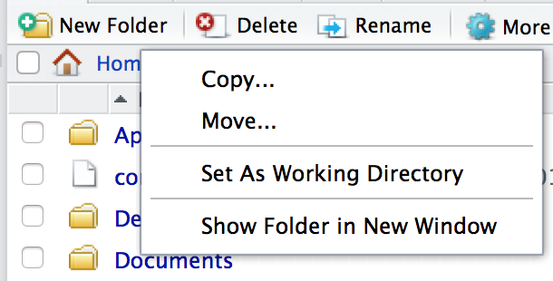

# Getting Started with File Management {#DirectoriesChapter}

Careful file management is crucial for reproducible research. Remember
two of the guidelines from Chapter
\@ref(GettingStartedRR):

-   Explicitly tie your files together.

-   Have a plan to organize, store, and make your files available.

Apart from the times when you have an email exchange (or even meet in
person) with someone interested in reproducing your research, the main
information independent researchers have about the procedures is what
they access in files you make available: data files, analysis files, and
presentation files. If these files are well organized and the way they
are tied together is clear, replication will be much easier. File
management is also important for you as a researcher, because if your
files are well organized you will be able to more easily make changes,
benefit from work you have already done, and collaborate with others.

Using tools such as R, knitr/R Markdown, and markup languages like
LaTeX requires fairly detailed knowledge of where files are stored in
your computer. Handling files to enable reproducibility may require you
to use command-line tools to access and organize your files. R and
Unix-like shell programs allow you to control files-creating, deleting,
relocating-in powerful and really reproducible ways. By typing these
commands you are documenting every step you take. This is a major
advantage over graphical user interface-type systems where you organize
files by clicking and dragging them with the cursor. However, typed
commands require you to know your files' specific addresses--their file
paths.

In this chapter we discuss how a reproducible research project may be
organized and cover the basics of file path naming conventions in
Unix-like operating systems, such as Mac OS X and Linux, and
Windows. We then learn how to organize them with RStudio Projects.
We'll cover some basic R and Unix-like shell commands for
manipulating files as well as how to navigate through files in RStudio
in the *Files* pane. The skills you will learn in this chapter will be
heavily used in the next chapter (Chapter \@ref(Storing)) and
throughout the book.

In this chapter we work with locally stored files, i.e. files stored on
your computer. In the next chapter we will discuss various ways to store
and access files remotely stored in the cloud.

## File Paths & Naming Conventions

All of the operating systems covered in this book organize files in
hierarchical directories, also known as file trees. To a large extent,
directories can be thought of as the folders you usually see on your
Windows or Mac desktop.[^chapter4_1] They are called hierarchical because
directories are located inside of other directories, as in Figure \@ref(fig:ExampleTree).[^chapter_4_tree_cmd]

### Root directories

A root directory is the first level in a disk, such as a hard drive. It
is the root out of which the file tree 'grows'. All other directories
are sub-directories of the root directory.\index{root directory}

On Windows computers you can have multiple root directories, one for
each storage device or partition of a storage device. The root directory
is given a drive letter assignment. If you use Windows regularly you
will most likely be familiar with `C:\` used to denote the C partition
of the hard drive. This is a root directory. On Unix-like systems,
including Macs and Linux computers, the root directory is simply denoted
by a forward slash (`/`) with nothing before it.

### Sub-directories & parent directories

You will probably not store all of your files in the root directory.
This would get very messy. Instead you will store your files in
sub-directories of the root directory. Inside of these sub-directories may
be further sub-directories and so on. A directory inside of another
directory is referred to as a child directory of a parent
directory.\index{child directory}\index{parent directory}

On Windows computers separate sub-directories are indicated with a back
slash (`\`). For example, if we have a folder called *data* inside of a
folder called *example-project* which is located in the C root directory
it has the address `C:\example-project\data`.[^chapter4_2] When you type Windows
file paths into R you need to use two backslashes rather than one: e.g.
`C:\\example-project\\data`. This is because the `\` is an escape
character in R.[^chapter4_3]\index{escape character} Escape characters tell R to interpret the next character or sequence of characters differently. For example, in Section \@ref(TSVEscape)
you'll see how `\t` can be interpreted by R as a tab rather than the
letter "t". Add another escape character to neutralize the escape
character so that R interprets it as a backslash. In other words, use an
escape character to escape the escape character. Another option for
writing Windows file names in R is to use one forward slash (`/`).

On Unix-like systems, including Mac computers, directories are indicated
with a forward slash (`/`). The file path of the *data* file on a
Unix-like system would be: `/example-project/data`. Remember that a
forward slash with nothing before it indicates the root directory. So
`/example-project/data` has a different meaning than
`example-project/data`. In the former, *example-project* is a sub-directory
of the root. In the latter, *example-project* is a sub-directory of the
current working directory (see below for details about working
directories). This is also true in Windows.

In this chapter I switch between the two file system naming conventions
to expose you to both. In subsequent chapters I use Unix-like
file paths. When you use relative paths (see below), these will work across
operating systems in R. We'll get to relative paths in a moment.

### Working directories

When you use R, markup languages, and many of the other tools covered in
this book, it is important to keep in mind what your current working
directory is. The working directory is the directory where the program
automatically looks for files and other directories, unless you tell it
to look elsewhere. It is also where it will save files. Later in this
chapter we will cover functions for finding and changing the working
directory.\index{working directory}

```{r ExampleTree, engine = "tikz", fig.cap = "Example Research Project File Tree", cache=TRUE, echo=FALSE, fig.ext=if (knitr:::is_latex_output()) 'pdf' else 'png'}
\usetikzlibrary{trees}

% Set node styles
\tikzstyle{DirBox} = [draw=black,
                      rectangle,
                      minimum width=5em,
                      very thick,
                      font=\small]

\tikzstyle{every node} = [draw=gray,
                          thin,
                          anchor=west,
                          font=\small]

% Begin tikz picture
\begin{tikzpicture}[%
  grow via three points={one child at (0.5,-0.7) and
  two children at (0.5,-0.7) and (0.5,-1.4)},
  edge from parent path={(\tikzparentnode.south) |- (\tikzchildnode.west)}]
  % Root Directory
  \node (root) at (5, 10) [DirBox]{Root};

  % Project Directory
  \node (project) at (4.5, 8.5) [DirBox]{example-project}
        child {node {{\small{paper.Rmd}}}}
        child {node {{\small{slideshow.Rmd}}}}
        child {node {{\small{website.Rmd}}}}
        child {node {{\small{main.bib}}}}
            ;

  % Data Directory
  \node (data) at (0, 4.5) [DirBox]{data}
      child {node {{\small{main-data.csv}}}}
      child {node {{\small{Makefile}}}}
      child {node {{\small{merge-data.R}}}}
      child {node {{\small{gather-1.R}}}}
      child {node {{\small{gather-2.R}}}}
      child {node {{\small{main-data-variable-descriptions.md}}}}
      child {node {{\small{README.Rmd}}}}
        ;

  % Analysis subdirectores/files
  \node (analysis) at (1.5, 7) [DirBox]{analysis}
      child {node {{\small{analysis-1.R}}}}
      child {node {{\small{analysis-2.R}}}}
        ;

  % README and .Rproj files
  \node (readme) at (9, 7) {README.md};
  \node (rproj) at (10, 6) {example-project.Rproj};

  % Connect boxes that are not explicit children
  \draw (root) -- (project);
  \draw (project) -| (analysis);
  \draw (project) -| (data);
  \draw (project) -| (readme);
  \draw (project) -| (rproj);

\end{tikzpicture}
```


### Absolute vs. relative paths

\index{absolute file path}\index{relative file path}

For reproducible research, collaborative research, and even if you ever
change the computer you work on, it is a good idea to use relative
rather than absolute file paths. Absolute file paths give the entire
path of a given file or directory on a specific system. For example,
`/example-project/data` is an absolute path as it specifies the path of
the *data* child directory all the way back to the root directory.
However, if our current working directory is *example-project* and we
want to link to the *data* child directory or a file in it, we don't
need the absolute path. We could simply use `data/`, i.e. the path
relative to the working directory.

It is good practice to use relative paths and organize
your files such that using relative paths is easy. This makes your code
less dependent on the particular file structure of a particular
computer. For example, imagine you use `C:\\example-project\\data` in
your source code to link to the *data* directory. If someone--a
collaborator, a researcher reproducing your work, or even you--then
tries to run the code on a different computer, the code will break if
they are, for instance, using a Unix-like system or have placed
*example-project* in a different partition of their hard drive. This can
be fixed relatively by changing the file path in the
source. However, this is tedious (often not well documented) and
unnecessary if you use relative file paths.

Below we'll see how to RStudio Projects and the *here* [@R-here] package to automatically set working directories so that your relative file paths will transport even more easily across computers.

### Spaces in directory & file names

It is good practice to avoid putting spaces in your file and
directory names. For example, I called the example project parent
directory in Figure \@ref(fig:ExampleTree) "example-project" rather than "Example Project". Spaces in file and directory names can sometimes create problems for computer programs
trying to read the file path. The program may believe that the space
indicates that the path name has ended. To make multi-word names easily
readable without using spaces, adopt a consistent naming convention. 

One approach is to use a convention that contrasts with the R object naming convention you are using. For example, if we adopt the underscore method for R object names used in Chapter \@ref(GettingStartedRKnitr) (e.g. `health_data`) we could use em dashes (`-`) to separate words in file names. For example: `example-source.R`.

## Organizing Your Research Project

Figure \@ref(fig:ExampleTree) gives an example of how the files in a simple
reproducible research project could be organized. The project's parent
directory is called *example-project*. Inside this directory are the
primary knittable documents (*paper.Rmd* *slideshow.Rmd*, and
*website.Rmd*). In addition there is an *analysis* sub-directory with
the R files to run the statistical analyses followed by a further *data*
child directory.

The nested file structure allows you to use relative file paths. The
knittable documents can call *analysis-1.R* with the relative path
*analysis/analysis-1.R*. 

```{r ProjectMenu, fig.cap="An Example RStudio Project Menu", echo=FALSE, fig.align='center', out.height="30%"}
knitr::include_graphics("images/chapter_4/ProjectMenu.png")
```

In addition to the main files and sub-directories in *example-project* you
will notice a files called *README.md* and *example-project.Rproj*. We'll discuss the *example-project.Rproj* file in the next section. The *README.md* file
is a human readable overview of all the files in the project. It should briefly
describe the project including things like its title, author(s), topic,
any copyright information, and so on. It should also indicate how the
folders in the project are organized and give instructions for how to
reproduce the project. The README file should be in the main project
folder--in our example this is called *example-project*--so that it is
easy to find. If you are storing your project as a GitHub repository
(see Chapter \@ref(Storing)) and the file is called *README*, its contents will
automatically be displayed on the repository's main page. If the
*README* file is written using Markdown (e.g. *README.md*), it will also
be properly formatted. Figure \@ref(fig:BookRepository) shows an example of this.

It is good practice to dynamically include the system information for
the R session you used to create the project. To do this you can write
your README file with R Markdown. Simply include the `sessionInfo()`
function in a *knitr* code chunk in the R Markdown document. If you knit
this file immediately after knitting your presentation document, it will
record the information for that session.

You can also dynamically include session info in a LaTeX document. To do
this, use the function in a code chunk. The code chunk should have the
option `results='asis'`. The code is:\index{R function!toLatex}\index{R function!sessionInfo}

```{r Ch4SessionInfoLatex, eval=FALSE, echo=TRUE}
toLatex(sessionInfo())
```

## Organizing Research with RStudio Projects {#CreateRStudioProject}

If you are using RStudio, you may want to organize your files as
Projects. You can turn a normal directory into an
RStudio Project by clicking on `File` in the RStudio menu bar and
selecting `New Project…`. A new window will pop-up. Select the option
`Existing Directory`. Find the directory you want to turn into an
RStudio Project by clicking on the `Browse` button. Finally, select
`Create Project`. You will also notice in the Create Project pop-up
window that you can build new project directories and create a project
from a directory already under version control (we'll do this at the end
of Chapter \@ref(Storing)). When you create a new project you will see that
RStudio has put a file with the extension `.Rproj` into the directory, like *example-project.Rproj* in Figure \@ref(fig:ExampleTree).

Making your research project directories RStudio Projects is useful for
a number of reasons:

-   The project is listed in RStudio's Project menu where it can be
    opened easily (see Figure \@ref(fig:ProjectMenu)).

-   When you open the project in RStudio it automatically sets the
    working directory to the project's directory and can load the
    source code files you were last working on.

-   You can set project specific options like whether PDF presentation
    documents should be compiled with *Sweave* or *knitr*.

-   When you close the project your R workspace and history are saved in
    the project directory if you want (though avoid saving your workspace as this could make reproducibility harder).

-   It helps you version control your files.

-   You can build your Project--run the files in a specific way--with
    makefiles.

-   Gives you an easy-to-use interface for managing the R packages that
    your project depends on.

## R File Manipulation Functions

R has a range of functions for handling and navigating through files.
Including these functions in your source code files allows you to more
easily replicate your actions.

#### `getwd()` {-}

To find your current working directory use the `getwd()` function:\index{R function!getwd}

```{r Ch4Getwd, echo=TRUE}
getwd()
```

The example here shows you the current working directory that was used
while knitting this chapter.

#### `list.files()` {-}

Use the `list.files()` function to see all of the files and sub-directories
in the current working directory. You can list the files in other
directories too by adding the directory path as an argument to the
function.\index{R function!list.files}

Because my current working directory has a lot of files in it, I will shorten the output for illustration by piping\index{pipe}\index{R function!\%>\%} it through `head()`.\index{R function!head}

```{r Ch4ListFiles, echo=TRUE}
library(magrittr)
list.files() %>% head()
```

#### `setwd()` {-}

\index{R function!setwd}

The `setwd()` function is the base R way to set the current working directory. For example, if we are on a Mac or other Unix-like computer we can set the working directory to
the *analysis* directory in our Example Project (see Figure \@ref(fig:ExampleTree)) like this:

````r
setwd("/example-project/analysis/")
````

Now R will automatically look in the *analysis* folder for files and
will save new files into this folder, unless we explicitly tell it to do
otherwise.

When working with a knittable document, setting the working directory
once in a code chunk changes the working directory for all subsequent
code chunks.

However . . .

#### `here::set_here()` {- #sethere}

\index{R function!here}

It is *not* good practice for reproducibility (and just general convenience when using a source code file across multiple computers) to use `setwd()`. You will need to tediously set specific file paths for each system. Instead, use RStudio Projects, which automatically set the working directory to the one with the *.Rproj* file. If you are not using RStudio Projects, include `set_here()` from the *here* package at the top of your source code. This will create a file called *.here* in the current working directory. It functions similarly to *.Rproj* to automatically flag for *here* what should be the current working directory. Remember when you share your source code to also share the *.Rproj*/*.here* file.

#### `root.dir` in knittable documents {-}

\index{root.dir}

By default the root (or working) directory for all of the code chunks in
a knittable document is the directory where this document is located.
You can reset the directory by feeding a new file path to the `root.dir`
option. We can set this globally[^chapter4_4] for all of the chunks in the
document by including the following code in the document's first chunk.

````r
opts_knit$set(root.dir = "/example-project/analysis")
````

We set the */example-project/analysis* sub-directory as the root
directory for all of the chunks in our presentation document.

**Note:** In general it is preferable to use the knittable file's default directory and file paths relative to it rather than manually specifying `root.dir()`. Setting an alternate root directory will make reproducibility more difficult.

#### `dir.create()` {-}

\index{R function!dir.create}

Sometimes you may want to create a new directory. You can use the `dir.create()` function to do this.[^chapter4_5] For example, to create a *example-project* file
in the root *C* directory on a Windows computer type:

````r
dir.create("C:\\example-project")
````

#### `file.create()` {-}

\index{R function!file.create}

Similarly, you can create a new blank file with the `file.create()`
function. To add a blank R source code file called *source-code.R* to the
*example-project* directory on the *C* drive use:

````r
file.create("C:\\example-project\\source-code.R")
````

#### `cat()` {- #catR}

\index{R function!cat}

If you want to create a new file and put text into it use the `cat()`
(concatenate and print) function. For example, to create a new file in
the current working directory called *example-cat.md* that includes the
text "Reproducible Research with R and RStudio" type:

````r
cat("Reproducible Research with R and RStudio",
    file = "example-cat.md")
````

In this example we created a markdown formatted file by using the `.md`
file extension. We could, of course, change the file extension to `.R`
to set it as an R source code file, `.Rnw` to create a *knitr* LaTeX
file, and so on.

You can use `cat()` to print the contents of one or more objects to a
file. **Warning:** the `cat()` function will overwrite existing files with
the new contents. To add the text to existing files use the
`append = TRUE` argument.

````r
cat("More Text", file = "example-cat.md", append = TRUE)
````

#### `unlink()` {-}

\index{R function!unlink}

You can use the `unlink` function to delete files and directories.

````r
unlink("C:\\example-project\\source-code.R")
````

**Warning:** the `unlink()` function permanently deletes files, so be very
careful using it.

#### `file.rename()` {-}

\index{R function!file.rename}

You can use `file.rename()` to, obviously, rename a file. It can also
be used to move a file from one directory to another. For example,
imagine that we want to move the *example-cat.md* file from the directory
*example-project* to one called *markdown-files* that we already
created.[^chapter4_6]

````r
file.rename(from = "C:\\example-project\\example-cat.md",
            to = "C:\\markdown-files\\example-cat.md")
````

#### `file.copy()` {-}

\index{R function!file.copy}

`file.rename()` fully moves a file from one directory to another. To
copy the file to another directory use the `file.copy()` function. It has
the same syntax as `file.rename()`:

````r
file.copy(from = "C:\\example-project\\example-cat.md",
          to = "C:\\markdown-files\\example-cat.md")
````

## Unix-like Shell Commands for File Management

Though this book is mostly focused on using R for reproducible research
it can be useful to use a Unix-like shell program to manipulate files in
large projects. Unix-like shell programs including Bash on Mac and Linux
and Windows PowerShell give you type-able commands to interact with your
computer's operating system.[^chapter4_7] We will especially return to shell
commands in the next chapter when we discuss Git version control and
makefiles for collecting data in Chapter \@ref(DataGather), as well as the command-line program[^chapter4_8] Pandoc in chapters \@ref(LargeDocs) and \@ref(MarkdownChapter)). We don't have enough space to fully introduce shell programs or even all of the commands for manipulating
files. We are just going to cover some of the basic and most useful
commands for file management. For good introductions for Unix and Mac OS
10 computers see William E. Shotts Jr.'s [-@shottsjr2012] book on the
Linux command-line. For Windows users, Microsoft maintains a tutorial on
Windows PowerShell at
<http://technet.microsoft.com/en-us/library/hh848793>. The commands
discussed in this chapter should work in both Unix-like shells and
Windows PowerShell.

It's important at this point to highlight a key difference between R and
Unix-like shell syntax. In shell commands you don't need to put
parentheses around your arguments. For example, if I want to change my
working directory to my Mac Desktop in a shell using the `cd` command I
simply type:[^chapter4_9]

````bash
cd /Users/cgandrud/Desktop
````

In this example `cgandrud` is my user name.

#### `cd` {-}

\index{shell command!cd}

As we just saw, to change the working directory in the shell just use
the `cd` (change directory) command. Here is an example of changing the
directory in Windows PowerShell to `C:/`:

````bash
cd C:/
````

If you are in a child directory and want to change the working directory
to the previous working directory you were in, simply type:

````bash
cd -
````

If, for example, our current working directory is */User/Me/Desktop* and
we typed `cd` followed by a minus sign (`cd -`) then the working
directory would change to */User/Me*. Note this will not work in
PowerShell.

#### `pwd` {-}

\index{shell command!pwd}

To find your current working directory, use the `pwd` command (present
working directory). This is essentially the same as R's `getwd()` function.

```{r Ch4pwdcmd, engine='sh', cache=TRUE}
pwd
```

#### `ls` {-}

\index{shell command!ls}

The `ls` (list) command works very similarly to R's `list.files()`
function. It shows you what is in the current working directory.

Again, I have a lot of files in my working directory, so I will shorten the output for this example by piping it through the command line's `head` command.\index{shell command!head} The command line pipe is not `%>%`\index{R fuction!\%>\%}, as in R, but instead `|`.\index{shell command!|}

```{r Ch4lscmd, engine='sh'}
ls | head
```

As we saw earlier, R also has an `ls` command. R's `ls()` function lists
items in the R workspace. The shell's `ls` command lists files and
directories in the working directory.

#### `mkdir` {-}

\index{shell command!mkdir}

Use `mkdir` to create a new directory. For example, if I wanted to
create a sub-directory of my Linux root directory called *new-directory* I
would type:

````shell
mkdir /new-directory
````

#### `echo` {-}

\index{shell command!echo}

There are a number of ways to create new files in Unix-like shells. One
of the simplest is the `echo` command. This command prints its argument to the Terminal. 
For example:

```{r Ch4Echo1, engine='sh', echo=TRUE, cache=TRUE}
echo Reproducible Research with R and RStudio
```

If you add the greater-than symbol (`>`) after the text you want to
print and then a file name, `echo` will create the file (if it doesn't
already exist) in the current working directory and then print the text
into the file.

```{r Ch4Echo2, eval=FALSE, engine='sh', echo=TRUE, cache=TRUE}
echo Reproducible Research with R and RStudio > example-echo.md
```

Using only one greater-than sign will completely erase the
*example-echo.md* file's contents and replace them with
`Reproducible Research with R and RStudio`. To append the text at the end
of an existing file, use two greater-than signs (`>>`).

```{r Ch4Echo3, eval=FALSE, engine='sh', echo=TRUE, cache=TRUE}
echo More text. >> example-echo.md
```

There is also a `cat` shell command. It works slightly differently than
the R version of the command and I don't cover it here.

#### `rm` {-}

\index{shell command!rm}

The command `rm` removes (deletes) files or directories. 

````bash
rm example-echo.md
````

If you want to delete a directory you will need to add the `d` (directory) option. Note that options are like arguments in an R function.\index{shell command!options} For example:

````bash
rm -d example-dir
````

Again, be careful when using this command, because it
permanently deletes the files or directories.

As we saw in Chapter \@ref(GettingStartedRKnitr), R also has an `rm()` function. It is
different because it removes objects from your R workspace rather than
files from your working directory.

#### `mv` {-}

\index{shell command!mv}

To move a file from one directory to another from a shell, use the
`mv` (move) command. For example, to move the file *example-echo.md* from
*example-project* to *markdown-files* use the following code and imagine
both directories are in the root directory:[^chapter4_10]

````bash
mv /example-project/example-echo.md/markdown-files
````

Note that the *markdown-files* directory must already exist, otherwise it
will simply rename the file. This command is similar to the R function
`file.rename()`.

#### `cp` {-}

\index{shell command!cp}

The `mv` command completely moves a file from one directory to another.
To copy a version of the file to a new directory use the `cp` command.
The syntax is similar to `mv`:

````bash
cp /example-project/ExampleEcho.md /markdown-files
````

#### `system()` (R function) {- #systemRcommand}

\index{R function!system}

You can run shell commands from within R using R's `system()` function. For
example, to run the `echo` command from within R type:

````r
system("echo Text to Add > ExampleEcho.md")
````

## File Navigation in RStudio

The RStudio *Files* pane allows us to navigate our file tree and do some
basic file manipulations. Figure \@ref(fig:FilesPane)
shows us what this pane looks like. The pane allows us to navigate to
specific files and folders and delete and rename files. To select a
folder as the working directory tick the dialog box next to the file
then click the `More` button and select `Set As Working Directory`.
Under the `More` button you will also find
options to `Move` and `Copy` files (see Figure \@ref(fig:FilesPaneMore)).

The *Files* pane is a GUI, so our actions in the *Files* pane are not recorded as such are not as easily reproducible as the commands we learned earlier in this chapter.

```{r FilesPane, fig.cap="The RStudio Files Pane", echo=FALSE, fig.align='center', out.height="30%"}
knitr::include_graphics("images/chapter_4/RStudioFiles.png")
```

```{r FilesPaneMore, fig.cap="More Functionality in the RStudio Files Pane", echo=FALSE, fig.align='center', out.height="10%"}

```

### Chapter summary {-}

In this chapter we've learned how to organize our research files to
enable dynamic replication. This included not only how they can be
ordered in a computer's file system, but also the file path naming
conventions-the addresses-that computers use to locate files. Once we
know how these addresses work we can use R and shell commands to refer
to and manipulate our files. This skill is particularly useful because
it allows us to place code in text-based files to manipulate our project
files in highly reproducible ways. In the next few chapters we will
begin to put these skills in practice when we learn how to store our
files and create data files in reproducible ways.

[^chapter_4_tree_cmd]: The command line utility *tree* is very useful for 
    visualizing your file trees. For more information see: <https://en.wikipedia.org/wiki/Tree_(command)>.\index{shell command!tree}

[^chapter4_1]: To simplify things, I use the terms 'directory' and 'folder'
    interchangeably in this book.

[^chapter4_2]: For more information on Windows file path names see this helpful
    website:
    <http://msdn.microsoft.com/en-us/library/windows/desktop/aa365247(v=vs.85).aspx>

[^chapter4_3]: As we will see in Part IV, it is also a LaTeX and Markdown escape
    character.

[^chapter4_4]: See the discussion of global chunk options in Chapter \@ref(GettingStartedRKnitr),
    Section \@ref(GlobalChunkOptions).

[^chapter4_5]: Note: you will need the correct system permissions to be able to
    do this.

[^chapter4_6]: The `file.rename()` function won't create new directories. To move a
    file to a new directory you will need to create the directory first
    with `dir.create()`.\index{R function!dir.create}

[^chapter4_7]: You can access Bash via the Terminal program on Mac OS 10 and
    Linux computers. It is the default shell on Mac and Linux, so it
    loads automatically when you open the Terminal. Windows PowerShell
    comes installed with Windows.

[^chapter4_8]: A command-line program is just a program you run from a shell.

[^chapter4_9]: Many shell code examples in other sources include the shell
    prompt, like the `$` in Bash or `>` in PowerShell. These are like
    R's `>` prompt. I don't include the prompt in code examples in this
    book because you don't type them.

[^chapter4_10]: If they were not in the root directory we would not place a
    forward slash at the beginning.
