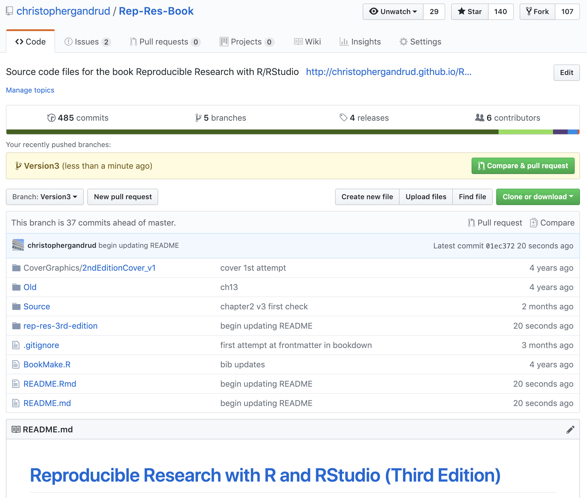
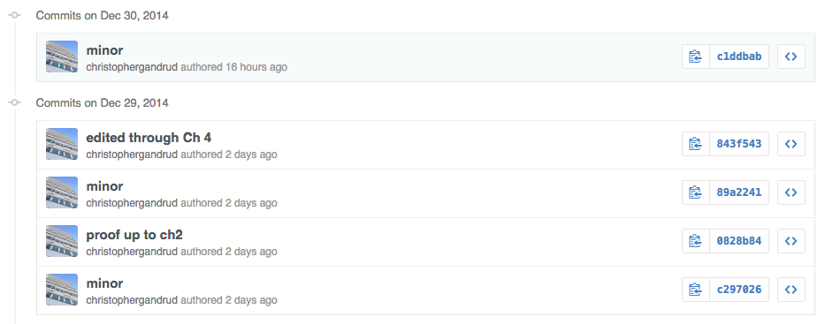
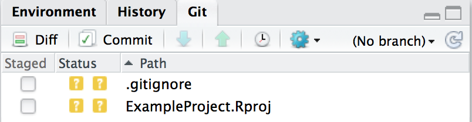
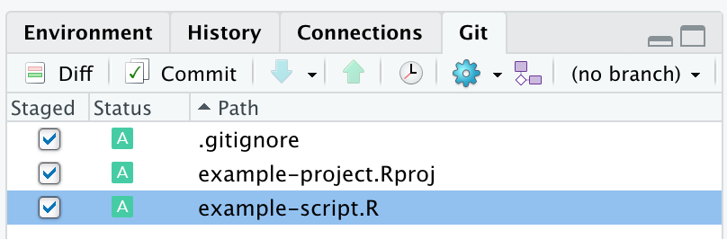

# (PART) Data Gathering and Storage {-}

# Storing, Collaborating, Accessing Files, and Versioning {#Storing}

In addition to being well organized, your research files need to be
accessible for other researchers to be able to reproduce your findings.
A useful way to make your files accessible is to store them on a cloud
storage service[^chapter_5_1] [see @howe2012]. This chapter describes in detail
two different cloud storage services--Dropbox and GitHub--that you can
use to make your research files easily accessible to others. Not only do
these services enable others to reproduce your research, they also have
a number of benefits for your research workflow. Researchers often face
a number of data management issues that, beyond making their research
difficult to reproduce, can make doing the initial research difficult.

First, there is the problem of **storing** data so that it is protected
against computer failure--virus infections, spilling coffee on your
laptop, and so on. Storing data locally--on your computer--or on a flash
drive is generally more prone to loss than on remote servers in the
cloud.

Second, we may work on a project with different computers and mobile
devices. For example, we may use a computer at work to run
computationally intensive analysis, while editing our presentation
document on a tablet while riding the train to the office. So,
we need to be able to **access** our files from multiple devices in
different locations. We often need a way for our **collaborators** to
access and edit research files as well.

Finally, we almost never create a data set or write a paper perfectly
all at once. We may make changes and then realize that we liked an
earlier version, or parts of an earlier version better. This is a
particularly important issue in data management where we may transform
our data in unintended ways and want to go back to earlier versions.
Also, when working on a collaborative project, one of the authors may
accidentally delete something in a file that another author needed. To
deal with these issues we need to store our data in a system that has
**version control**. Version control systems keep track of changes we
make to our files and allows us to access previous versions if we want
to.

You can solve all of these problems in a couple of different ways using
free or low cost cloud-based storage formats. In this chapter we will
learn how to use Dropbox and Git/GitHub for research files:

-   storage,

-   accessing,

-   collaboration,

-   version control.

## Saving Data in Reproducible Formats {#TSVEscape}

Before getting into the details of cloud-based data storage for all of
our research files, let's consider what type of formats you should
actually save your data in. A key issue for reproducibility is that
others are able to not only get hold of the exact data you used in your
analysis, but be able to understand and use the data now and in the
future. Some file formats make this easier than others.

In general, for small to moderately-sized data sets[^chapter_5_2] plain-text
formats like comma-separated values (`.csv`)\index{CSV} or tab-separated values[^chapter_5_3]
(`.tsv`)\index{TSV} are good ways to store your data. These formats simply store a
data set as a text file. A row in the data set is a line in the text
file. Data is separated into columns with commas or tabs, respectively.
These formats are not dependent on a specific program. Any program that
can open text files can open them, including a wide variety of
statistical programs other than R as well as spreadsheet programs like
Microsoft Excel. Using text file formats helps future-proof your
research. Version control systems that track changes to text--like
Git--are also very effective version control systems for these types of
files.

The `write.table()` function\index{R function!write.table} is one way to save data in plain-text formats from R. For example, to save a data frame called *data* as a CSV file called *main-data.csv* in our example *data* directory (see Figure \@ref(fig:ExampleTree)):

```{r Ch5WriteTable, eval=FALSE, tidy=FALSE}
write.table(Data, "/example-project/data/main-data.csv",
            sep = ",",
            row.names = FALSE)
```

`row.names = FALSE` prevents R from including the row names in the
output file.[^chapter_5_4] The `sep = ","` argument specifies that we want to use
commas to separate values into columns. For CSV files you can use a
modified version of this command called `write.csv()`.\index{R function!write.csv} This function makes it so that you don't have to write `sep = ","`.[^chapter_5_5]\index{comma separated file format}\index{CSV}

If you want to save your data with values separated by tabs, rather than
commas, simply set the argument `sep = "\t"` and set the file extension
to `.tsv`.\index{tab separated file format}

R is able to save data in a wide variety of other file formats, mostly
through the *foreign* or *rio* [@R-rio] packages (see Chapter \@ref(DataGather)). These formats may be less future-proof than simple text-formatted data files.

One advantage of many other statistical programs' file formats is that
they include not only the underlying data but also other information
like variable descriptions. If you are using plain-text files to store
your data you will need to include a separate file, preferably in the
same directory as the data file describing the variables and their
sources. In Chapter \@ref(TablesChapter) (Section \@ref(VarDescriptTables)) we 
will look at how to automate the creation of variable description files.

## Storing Your Files in the Cloud: Dropbox

In this book we'll cover two (largely) free cloud storage services that
allow you to store, access, collaborate on, and version control your
research files. These services are Dropbox and GitHub.[^chapter_5_6] Though they
both meet our basic storage needs, they do so in different ways and
require different levels of effort to set up and maintain.

These two services are certainly not the only way to make your research
files available. Research-oriented services include the Zenodo,[^chapter_5_7]
the Dataverse Project,[^chapter_5_8] figshare,[^chapter_5_9] and RunMyCode.[^chapter_5_10] These services include good built-in citation systems, unlike Dropbox and
GitHub. They also aim to provide persistent URLs for your files. This helps avoid the 'link rot' that threatens reproducibility,\index{link rot} i.e. a hosting service changes their URL structure breaking existing links. These services may be a very good place to store research files once the research is completed or close to completion. Many journals now require key reproducibility files be uploaded to these sites. However, these sites' ability to store, access, collaborate on, and version control files *during* the main part of the research process is mixed. Services like Dropbox and GitHub are very capable of being
part of the research workflow from the beginning. 

Zenodo and GitHub have excellent integration, allowing you to actively develop a research project on GitHub then persist it on Zenodo.\index{Zenodo} For details see: <https://guides.github.com/activities/citable-code/>.

The easiest types of cloud storage for your research are services like
Dropbox[^chapter_5_11] and Google Drive.[^chapter_5_12]\index{Google Drive}\index{Dropbox} These services not only store your
data in the cloud, but also provide ways to share files. They even
include basic version control capabilities. I'm going to focus on
Dropbox because it currently offers a complete set of features that
allow you to store, version, collaborate, and access your data. I will
focus on how to use Dropbox on a computer. Some Dropbox functionality
may be different on mobile devices.

### Storage

When you sign up for Dropbox and install the program[^chapter_5_13] it creates a
directory on your computer's hard drive. When you place new files and
folders in this directory and make changes to them, Dropbox
automatically syncs the directory with a similar folder on a cloud-based
server. Typically when you sign up for the service you'll receive a
limited amount of storage space for free, usually a few gigabytes. This
is probably enough storage space for a number of text file-based
research projects.

### Accessing data {#EnablePublicFolder}

All files stored on Dropbox have a URL address through which they can be
accessed from a computer connected to the internet. To access a Dropbox file or directory's URL so that it can be downloaded, right-click on the file
icon in your Dropbox folder on your computer. Then click
`Copy Drobbox Link`. This copies the URL into your clipboard.

You need to make one small change to the link so that it can be programmatically downloaded. By default, the link will point to the Dropbox website page for the file/directory. To be able to programmatically download it, you need to change the last `0` in the URL to a `1`. For example, change:

````
https://www.dropbox.com/s/1xapw69efofpg3b/public.fin.msm.model.
csv?dl=0
````

to

```
https://www.dropbox.com/s/1xapw69efofpg3b/public.fin.msm.model.
csv?dl=1
```

We changed the download (`dl`) option from false (`dl=0`) to true (`dl=1`). Now you can use the link to download data in your R source code, for example.

Once you have the URL you can load the file directly into R using the
`import()`\index{R function!import} function from the *rio* package. `import()` works for
many different data formats and is generally more robust than `read.table(). Use the `source_url()` \index{R function!source\_url} function in the *devtools* package [@R-devtools] to download and run R source code files (see Chapter \@ref(StatsModel)).

Let's download data directly into R from Dropbox. The data set's URL is:
<https://www.dropbox.com/s/1xapw69efofpg3b/public.fin.msm.model.csv?dl=1>.[^chapter_5_15]

```{r Ch5DropboxDownload, message=TRUE}
# Download data on financial regulators stored on Dropbox

# Load rio
library(rio)

# Place the URL into the object fin_url
fin_url <- "https://bit.ly/2xlQ2j5"

# Download data
fin_regulator <- import(fin_url, format = "csv")

# Show variables in fin_regulator
names(fin_regulator)
```

The argument `format = "csv"` tells `import()` what format the file is in. This isn't necessary if the file path has an informative file extension, e.g. it ends with `.csv`.

### Collaboration

Though others can easily access your data and files with Dropbox URL
links, you cannot save files through the link. You must save files in
the Dropbox folder on your computer or upload them through the website.
If you would like collaborators to be able to modify the research files
you will need to 'share' the Dropbox folder with them. Once you create a Dropbox folder you
can share it with your collaborators by
right-clicking on the folder's name. Then select
`Share`. Enter your collaborator's email address
when prompted and select `Can Edit` from the permissions dropdown menu.
They will be sent an email that will allow them to accept
the share request and, if they don't already have an account, sign up
for Dropbox.

### Version control

Dropbox has a simple version control system. Every time you save a
document a new version is created on Dropbox. To view a previous
version, navigate to the file on the Dropbox website. Then click
on the file. In the upper-right there is a menu where you can select `Version history`. This
will take you to a page listing previous versions of the file, who
created the version, and when it was created. A new version of a file is
created every time you save a file and it is synced to the Dropbox cloud
service.

Note that with a free Dropbox account, previous versions of a file are
only stored for **30 days**. To be able to save previous versions for
more than 30 days you will need a paid account.[^chapter_5_16]

## Storing Your Files in the Cloud: GitHub {#GitHubMain}

Dropbox minimally meets our four basic criteria for reproducible data
storage. It is easy to set up and use. GitHub meets the criteria and
more, especially when it comes to version control. It is, however, less
straightforward at first. In this section we will learn enough of the
basics to get you started using GitHub to store, access, collaborate on,
and version control your research.

GitHub is an interface and cloud hosting service built on top of the Git
version control system.[^chapter_5_17] Git does the version control. GitHub stores
the data remotely as well as providing a number of other features, some
of which we look at below. GitHub was not explicitly designed to host
research projects or even data. It was designed to host "socially coded"
computer programs--in what Git calls "repositories"--repos for short--by
making it easy for a number of collaborators to work together to build
computer programs. This seems very far from reproducible research.\index{git!repo}\index{git!repository}

Remember that as reproducible researchers, we are building projects out
of interconnected text files. In important ways, this is exactly the
same as building a computer program. Computer programs are also
basically large collections of interconnected text files. Like computer
programmers, we need ways to store, version control, access, and
collaborate on our text files. Because GitHub is very actively used by
people with similar needs (who are also really good programmers), the
interface offers many highly developed and robust features for
reproducible researchers.

GitHub's extensive features and heart in the computer programming
community means that it takes a longer time than Dropbox for novice
users to set up and become familiar with. So we need good reasons to
want to invest the time needed to learn GitHub. Here is a list of
GitHub's advantages over Dropbox for reproducible research that will
hopefully convince you to get started using it:[^chapter_5_18]

#### Storage and access {-}

-   Dropbox simply creates folders stored in the cloud which you can
    share with other people. GitHub makes your projects accessible on a
    fully featured project website (see Figure \@ref(fig:BookRepository)). An example feature is that it
    automatically renders Markdown files called *README.md*[^chapter_5_19] in a
    GitHub directory on the repository's website. This makes it easy for
    independent researchers to find the file and read it.

-   GitHub can create and host a website for your research project that
    you could use to present the results, not just the replication
    files.
    
-   It's close integration with Zenodo allows you to easily make your full replication material persistently accessible and citable.

#### Collaboration {-}

-   Dropbox allows multiple people to share files and change them.
    GitHub does this and more.

-   GitHub keeps meticulous records of who contributed what to a
    project.

-   Each GitHub repository has an "Issues" area where you can note
    issues and discuss them with your collaborators. Basically, this is
    an interactive to-do list for your research project. It also stores
    the issues so you have a full record.

-   Each repository can also host a wiki that, for example, could
    explain in detail how certain aspects of a research project were
    done.

-   Anyone can suggest changes to files in a public repository. These
    changes can be accepted or declined by the project's authors. The
    changes are recorded by the Git version control system. This could
    be especially useful if an independent researcher notices an error.

#### Version control {-}

-   Dropbox's version control system only lets you see files' names, the
    times they were created, who created them, and revert back to
    specific versions. Git tracks every change you make. The GitHub
    website and GUI programs for Mac and Windows provide nice interfaces
    for examining specific changes in text files.

-   Dropbox creates a new version every time you save a file. This can
    make it difficult to actually find the version you want as the
    versions quickly multiply. Git's version control system only creates
    a new version when you tell it to.

-   All files in Dropbox are version controlled. Git allows you to
    ignore specific files. This is helpful if you have large binary
    files (i.e. not text files) that you do not want to version control
    because doing so will use up considerable storage space.

-   Unless you have a paid account, previous file versions in Dropbox
    disappear after 30 days. GitHub stores previous versions
    indefinitely for all account types.

-   Dropbox does not merge conflicting versions of a file together. This
    can be annoying when you are collaborating on a project and more
    than one author is making changes to documents at the same time. Git
    identifies conflicts and lets you reconcile them.

-   Git is directly integrated into RStudio Projects.[^chapter_5_20]

```{r BasicGitRepo, fig.cap="A Basic Git Repository with Hidden .git Folder Revealed", echo=FALSE, fig.align='center', out.width="50%"}
knitr::include_graphics("images/chapter_5/BasicGitRepository.png")
```

### Setting up GitHub: Basic

There are at least three ways to use Git/GitHub on your computer. You
can use the command-line version of Git. It's available for Mac and
Linux (in the Terminal) as well as Windows through Git Bash.[^chapter_5_21] You
can also use the Graphical User Interface GitHub program. Currently,
it's only available for Windows and Mac. RStudio also has GUI-style Git
functionality for RStudio Projects. In this section I focus on how to
use the command-line version, because it will help you understand what
the GUI versions are doing and allow you to better explore more advanced
Git features not covered in this book. In the next section I will
mention how to use Git with RStudio Projects.

The first thing to do to set up Git and GitHub is go to the GitHub
website (<https://github.com/>) and sign up for an account. Second, you
should go to the following website for instructions on setting up
GitHub: <https://help.github.com/articles/set-up-git/>. The instructions
on that website are very comprehensive, so I'll direct you there for the
full setup information. Note that installing the GUI version of GitHub
also installs Git and, on Windows, Git Bash.

### Version control with Git

Git is primarily a version control system, so we will start our
discussion of how to use it by looking at how to version your
repositories.

#### Setting up Git repositories locally {-}

\index{git!repositories}
\index{git!repos}

You can setup a Git repo on your computer with the command-line.[^chapter_5_22] I
keep my repositories in a folder called *git_repositories*,[^chapter_5_23] though
you can use Git with almost any directory you like. The
*git_repositories* directory has the root folder as its parent. Imagine
that we want to set up a repository in this directory for a project
called *example_project*. Initially it will have one README file called
*README.md*. To do this, we would first type into the Terminal for Mac
and Linux computers:\index{shell command!mkdir}\index{shell command!cd}\index{shell command!echo}

````bash
# Make new directory 'example-project'
mkdir /git_repositories/example-project

# Change to directory 'example-project'
cd /git_repositories/example-project

# Create new file README.md
echo "# An Example Repository" > README.md
````

So far we have only made the new directory and set it as our working
directory (see Chapter \@ref(DirectoriesChapter)). All of the examples in this section
assume your current working directory is set to the repo. Then, with the
`echo` shell command we created a new file named *README.md* that
includes the text `# An Example Repository`. Note that the code is
basically the same in Windows PowerShell or Git Bash. Also, you don't
have to do these steps in the command-line. You could just create the
new folders and files the same way that you normally do with your mouse
in your GUI operating system.

Now that we have a directory with a file, we can tell Git that we want
to treat the directory *example-project* as a repository and that we want
to track changes made to the file *README.md*. Use Git's `init`
(initialize) command\index{shell command!git init} to set the directory as a repository. See Table \@ref(GitCommandsTable) for the list of Git commands covered in
this chapter.[^chapter_5_24] Use Git's `add` command to add a file to the Git
repository. For example,\index{shell command!git add}

````bash
# Initialize the Git repository
git init

# Add README to the repository
git add README.md
````

You probably noticed that you always need to put `git` before the
command. This tells the shell what program the command is from. When you
initialize a folder as a Git repository, a hidden folder called *.git*
is added to the directory (see Figure \@ref(fig:BasicGitRepo)).
This is where all of your changes are kept. If you want to add all of
the files in the working directory to the Git repository type:

````bash
# Add all files to the repository
git add .
````

When we want Git to track changes made to files added to the repository
we can use the `commit` command. In Git language we are "committing" the
changes to the repository.\index{shell command!git commit}

````bash
# Commit changes
git commit -a -m "First Commit, created README file"
````

Note: the files won't appear on GitHub yet. Later in the chapter we will
learn how to push commits to your remote GitHub repository. The `-a`
(all) option commits changes made to all of the files that have been
added to the repository. You can include a message with the commit using
the `-m` option like: `"First Commit, created README file"`. Messages
help you remember general details about individual commits. This is
helpful when you want to revert to old versions. **Remember:** Git only
tracks changes when you commit them.

Finally, you can use the `status` command for details about your
repository, including uncommitted changes. Generally it's a good idea to
use the `-s` (short) option, so that the output is more readable.\index{shell command!git status}

````bash
# Display status
git status -s
````

\begin{table}
  \caption{A Selection of Git Commands}
  \label{GitCommandsTable}
      \begin{center}
      \begin{tabular}{l p{7cm}}
            \hline
            Command & Description \\[0.25cm] \hline\hline
            \texttt{add} & Add a file to a Git repository. \\[0.25cm]
            \texttt{branch} & Create and delete branches. \\[0.25cm]
            \texttt{checkout} & Checkout a branch. \\[0.25cm]
            \texttt{clone} & Clone a repository (for example, the remote GitHub version) into the current working directory. \\[0.25cm]
            \texttt{commit} & Commit changes to a Git repository. \\[0.25cm]
            \texttt{fetch} & Download objects from the remote (or another) repository. \\[0.25cm]
            \texttt{.gitignore} & Not a Git command, but a file you can add to your repository to specify what files/file types Git should ignore. \\[0.25cm]
            \texttt{init} & Initialize a Git repository. \\[0.25cm]
            \texttt{log} & Show a repo's commit history. \\[0.25cm]
            \texttt{merge} & Merge two or more commits/branches together. \\[0.25cm]
            \texttt{pull} & \texttt{fetch} data from a remote repository and try to \texttt{merge} it with your commits. \\[0.25cm]
            \texttt{push} & Add committed changes to a remote Git repository, i.e. GitHub. \\[0.25cm]
            \texttt{remote add} & Add a new remote repository to an existing project. \\[0.25cm]
            \texttt{rm} & Remove files from Git version tracking. \\[0.25cm]
            \texttt{status} & Show the status of a Git repository including uncommitted changes made to files. \\[0.25cm]
            \texttt{tag} & Bookmark particularly significant commits. \\[0.25cm]
            \hline
      \end{tabular}
    \end{center}
  {\scriptsize{Note: when you use these commands in the shell, you will need to precede them with \texttt{git} so the shell knows what program they are from.}}
\end{table}

```{r BookRepository, fig.cap="Part of this Book's GitHub Repository Webpage", echo=FALSE, fig.align='center', out.width="90%"}

```

#### Checkout {-}

\index{git!checkout}

It is useful to step back for a second and try to understand what Git is
doing when you commit your changes. In the hidden *.git*, folder Git is
saving all of the information in compressed form from each of your
commits into a sub-folder called *objects*. Commit objects[^chapter_5_25] are
everything from a particular commit. I mean everything. If you delete
all of the files in your repository (except for the *.git* folder) you
can completely recover all of the files from your most recent commit
with the `checkout` command:\index{shell command!git checkout}

````bash
# Checkout latest
commit git checkout -- .
````

Note that there is a space between the two dashed lines and the period.
You can also change to any other commit or any committed version of a
particular file with `checkout`. Simply replace the `--` with the commit
reference. Note that the period at the end is still very important to
include after the commit reference. The commit reference is easy to find
and copy from a repository's GitHub webpage (see below for more
information on how to create a GitHub webpage).[^chapter_5_26] For an example of a
GitHub repo webpage, see Figure \@ref(fig:BookRepository).
Click on the link that lists the number of repo commits on the left-hand
side of the repo's webpage. This will show you all of the commits. A
portion of this book's commit history is shown in Figure \@ref(fig:BookHistory). By
clicking on the icon
() you can see
what the files at any commit looked like. Next to this button is another
with a series of numbers and letters. This is the commit's SHA-1
hash.[^chapter_5_27] For our purposes, it is the commit's reference number. Click
on the button to the left of the SHA to copy it. You can then paste it
as an argument to your command. This will revert you to that particular
commit. Also include the file name if you want to revert to a particular
version of a particular file.

```{r BookHistory, fig.cap="Part of this Book's GitHub Repository Commit History", echo=FALSE, fig.align='center', out.width="90%"}

```

#### Tags {-}

\index{git!tags}
\index{shell command!git tag}

SHA-1 hashes are a bit cumbersome to use as references. What was the
hash number for that one commit? To solve this problem you can add
bookmarks, known as "tags", to particularly important commits. Imagine
we just committed our first full draft of a project. We want to tag it
as version 0.1, i.e. "v0.1". To do this use Git's tag command:

````bash
# Tag most recent commit v0.1 
git tag -a v0.1 -m "First draft"
````

The `-a` option adds the tag `v0.1` and `-m` lets us add a message. Now
we can checkout this particular commit by using its tag, i.e.:\index{shell command!git checkout}

````bash
# Checkout v0.1 
git checkout v0.1
````

This will create a new "branch" with a generic name *(detached from
v0.1)* where you can make changes and commit them. If you plan to
checkout a previous tagged version and make changes to it, it is a good
idea to specifically name the branch using the `-b` argument.[^chapter_5_28] For
example, to give it the name *v0.1_branch* type:

````bash
# Checkout v0.1 as v0.1_branch 
git checkout v0.1 -b v0.1_branch
````

What is a branch?

#### Branches {-}

\index{shell command!git branch}
\index{git!branches}

Sometimes you may want to work on an alternative version of your project
and then merge changes made to this version back into the main one. For
example, the main version could be the most stable current copy of your
research, while the alternative version could be a place where you test
out new ideas. Git allows you to create a new *branch* (alternative
version of the repo) which can be merged back into the *master* (main)
branch. To see what branch you are using type:

```{r Ch5CheckBranch, engine='sh'}
# Show git branch 
git branch
```

To create a new branch use, simply enough, the `branch` command. For
example, to create a new branch called *test*:

````bash
# Create test branch 
git branch test
````

You can now use `checkout` to switch to this branch.[^chapter_5_29] Here is a
shortcut for creating and checking out the branch:

````bash
# Create and checkout test branch 
git checkout -b test
````

The `-b` (branch) option for `checkout` creates the new *test* branch
before switching to it.

To merge changes you commit in the *test* branch to the *master*, `add`
and `commit` your changes, `checkout` the *master* branch, then use the
`merge` command.[^chapter_5_30]\index{shell command!git add}\index{shell command!git merge}

````bash
# Add files 
git add .

# Commit changes to test branch 
git commit -a -m "commit changes to test"

# Checkout master branch 
git checkout master

# Merge master and test branches 
git merge test
````

Note, when you merge a branch you may encounter conflicts in the files
that make it impossible to smoothly merge the files together. Git will
tell you what and where these are; you then need to decide what to keep
and what to delete.

#### Having Git ignore files {-}

\index{git!ignore}
\index{git!.gitignore}

There may be files in your repository that you do not want to keep under
version control. Maybe this is because they are very large files or
cached files from *knitr* or other files that are byproducts of
compiling an R LaTeX document (see Chapter \@ref(StatsModel)). You also want to ignore files that contain private information. Make sure to **never include private information** (e.g. passwords or confidential data) in your Git history. Once they are committed it will be very difficult to definitively remove them. Once they are on GitHub, they will be publicly accessible. 

To have Git ignore particular files, simply create a file called *.gitignore*.[^chapter_5_31] You can either put this file in the repository's parent directory to create a *.gitignore* file for the whole repository or in a subdirectory to ignore files in that
subdirectory. In the *.gitignore* file, add ignore rules by simply
including the names of the files that you want to have Git ignore. For
example, GitHub has a *.gitignore* file that is useful for ignoring files[^chapter_5_github_r_ignore] that we often don't want to commit to our git history when using R and R Markdown:

````
# History files
.Rhistory
.Rapp.history

# Session Data files
.RData

# Example code in package build process
*-Ex.R

# Output files from R CMD build
/*.tar.gz

# Output files from R CMD check
/*.Rcheck/

# RStudio files
.Rproj.user/

# produced vignettes
vignettes/*.html
vignettes/*.pdf

# OAuth2 token, see https://github.com/hadley/httr/releases/tag/v0.3
.httr-oauth

# knitr and R markdown default cache directories
/*_cache/
/cache/

# Temporary files created by R markdown
*.utf8.md
*.knit.md
````

The asterisk (`*`) is a "wildcard" and stands for any character. In
other words, it tells Git to look for files with any name that end with
a specified file extension. This is faster than writing out the full
name of every file you want to ignore individually. It also makes it
easy to copy the rules into new repos. For example, you'll notice the `*-Ex.R` and
`/*_cache/` rules. These tell Git to ignore all of the files with a name ending in *-Ex.R* and all files in subdirectories with a name ending in *_cache*. 

Git will not ignore files that have already been committed to a
repository. To ignore these files you will first need to remove them
from Git with Git's `rm` (remove) command. If you wanted to remove a
file called *example-project.tex* from version tracking type:\index{shell command!git rm}

````bash
# Remove example-project.tex from Git version tracking 
git rm --cached example-project.tex
````

Using the `–cached` argument tells Git not to track the file, but not
delete it.

For more information on *.gitignore* files, see GitHub's reference page
on the topic at: <https://help.github.com/articles/ignoring-files/>.

### Remote storage on GitHub {#NewGitHubRepo}

So far we've been using repos stored locally. Let's now look at how to
also store a repository remotely on GitHub. You can either create a new
repository on GitHub and download (`clone`) it to your computer or
upload (`push`) an existing repository to a new GitHub remote repo. In
both cases you need to create a new repository on GitHub.

To create a new repository on GitHub go to your main GitHub account
webpage and click the `New repository` button. On the next page that
appears, give the repository a name, brief description, and choose
whether to make it public or private. If you want to store an existing
repository on GitHub give it the same name as the one that already
exists on your computer. If you already have files in your local
repository do not check the boxes for creating *README.md*, *LICENSE*,
and *.gitignore* files. When you then click `Create Repository` you will
be directed to the repository's GitHub
webpage.[^chapter_5_32]

#### Clone a new remote repository {- #GitClone}

\index{shell command!git clone}
\index{git!clone}

If you are working with a new repository and do not have an existing
version on your computer you need to "clone" the GitHub repo to your
computer. The repo's GitHub page contains a button called
`Clone in Desktop`. Clicking this will open GUI GitHub (if it is
installed) and prompt you to specify what directory on your computer you
would like to clone the repository into. You can also use the `clone`
command in the shell. Imagine that the URL for a repo called *Example
Project* is `https://GitHub.com/USER/example-project.git`. To clone
it into the */git_repositories* directory
type:[^chapter_5_33]

````bash
# Change working directory
cd /git_repositories/

# Clone example-project 
git clone https://GitHub.com/USER/example-project.git
````

#### Push an existing repository to a new GitHub repo {- #RemoteAdd}

\index{git!remote repository}
\index{shell command!git remote}

If you already have a repository with files in it on your computer and
you want to store them remotely in a new GitHub repo, you need to add
the remote repository and `push` your files to it. Type Git's
`remote add` command. For example, if your repository's GitHub URL is
`https://github.com/USER/example-project.git`, then type:

````bash
# Change working directory to existing local repo 
cd /git_repositories/example-project

# Add a remote (GitHub) repository to an existing repo 
git remote add origin https://github.com/USER/example-project.git
````

This will tell your local repository where the remote one is. Finally,
push the repository to GitHub:\index{shell command!git push}

````bash
# Push local repository to GitHub for the first time 
git push -u origin master
````

The `-u` (upstream tracking) option adds a tracking reference for the
upstream (GitHub) repository branches.

#### Pushing commits to a GitHub repo {-}

\index{shell command!git push}

Once you have your local repository connected to GitHub you can add new
commits with the `push` command. For example, if your current working
directory is the Git repo you want to push and you have already
added/committed the changes you want to include in the remote repo,
type:

````bash
# Add changes to the GitHub remote master branch 
git push origin master
````

The `origin` is simply the remotely stored repository on GitHub and
`master` is the master branch. You can change this to another branch if
you'd like. If you have not set up password caching[^chapter_5_34] you will now be
prompted to give your GitHub user name and password.

You can also push your tags to GitHub. To push all of the tags to GitHub
type:

````bash
git push --tags
````

Now on the repo's GitHub page there will be a `Tags` section that will
allow you to view and download the files in each tagged version of the
repository.

### Accessing on GitHub

#### Downloading into R {- #GitDownload #RawGitHub} 

In general, the process of downloading data directly into R is similar
to what we saw earlier for loading data from Dropbox Public folders. We
can simply use the `import()` function.\index{R function!import} First we need to find our
plain-text data file's *raw* URL. To do this, go to your repository's
GitHub site, navigate to the file you want to load, and click the `Raw`
button on the right just above the file preview. I have data in
comma-separated values format stored in a GitHub repository.[^chapter_5_35] The
URL for the raw (plain-text) version of the data is
<https://raw.githubusercontent.com/christophergandrud/Disproportionality_Data/master/Disproportionality.csv>.[^chapter_5_36]

```{r Ch5URLAddress, message=TRUE, tidy=FALSE}
# Place shortened URLinto url object 
url <- "http://bit.ly/14aSjxB"

# Download data 
disprop_data <- rio::import(url, format = "csv")

# Show variable names 
names(disprop_data)
```

`import()` downloaded the most recent version of the file from the
master branch. 

We can actually use `import()` to download a particular version of a
file--from a particular Git commit--directly into R. This makes
reproducing a specific result much easier. To do this you just need to
use a file's raw URL from a particular commit. To find a file's
particular commit raw URL first click on the file on GitHub's website.
Then click the `History` button. This will take you
to a page listing all of the file's versions. Click on the git commit hash button next to
the version of the file that you want to use. Then click `View file` and finally the `Raw` button to be taken to the text-only version of the file. Copy this
page's URL address and use it with `import()`.

For example, I have an old version of the disproportionality data. To
download it I find this particular version of the file's URL and use it
in `import()`:

```{r Ch5sourceDataOld, tidy=FALSE, message=FALSE, warning=FALSE}
# Create object containing the file's URL 
old_url <- paste0("https://raw.githubusercontent.com/", 
                  "christophergandrud/",
                  "Disproportionality_Data/", 
                  "1a59d360b36eade3b183d6336a",
                  "2262df4f9555d1/", 
                  "Disproportionality.csv")

# Download old disproportionality data 
disprop_old <- rio::import(old_url, format = "csv")
```

In this example I did not shorten the URL, but instead used the `paste0()`\index{R function!paste0}
function to paste it together.[^chapter_5_37] You do not have to do this. I did it
here so that the URL would fit on the printed page. 

#### Viewing files {-}

The GitHub web user interface also allows you, your collaborators (see
below) or, if the repo is public, anyone to look at text files from a
web browser. Collaborators can actually also create, modify, and commit
changes in the web user interface. This can be useful for making small
changes, especially from a mobile device without a Git installation.
Anyone with a GitHub account can suggest changes to files in a public
repository on the repo's website. Simply click the `Edit` button (it looks like a pencil) above the file and make edits. If the person making the edits is not a designated
collaborator, their edits will be sent to the repository's owner for
approval.[^chapter_5_38] This can be a useful way for independent researchers to
fix errors.

#### Collaboration with GitHub {-}

Repositories can have official collaborators that can make changes to
files in the repo. Public repositories can have unlimited collaborators.
Anyone with a GitHub account can be a collaborator. To add a
collaborator to a repository you created, click on the `Settings` button
on the repository's website (see Figure \@ref(fig:BookRepository)). Then click the `Collaborators` button on the left-hand side of the page. You will be given a box to enter your collaborator's GitHub user name. If your collaborator doesn't have a
GitHub account, they will have to create a new one. Once you add someone
as a collaborator they can clone the repository onto their computer as
you did earlier and push changes.

#### Syncing a repository {-}

\index{shell command!git pull}
\index{git!pull}

If you and your collaborators are both making changes to the files in a
repo you might create conflicting changes, i.e. different changes to the
same part of a file. To avoid too many conflicts, it is a good idea to
sync your local repository with the remote repository **before** you
push your commits to GitHub. Use the `pull` command to sync your local
and remote repository. First add and commit your changes, then type:

````bash
# Sync repository 
git pull
````

If the files you are pulling conflict with your local files you will
probably want to resolve these in the individual files and commit the
changes. When there are merge conflicts, Git adds both versions of a
piece of text to the file. You then open the file and decide which
version to keep and which one to delete. When the conflicts are resolved
and changes committed, push your merged changes up to the remote
repository as we did before.

### Summing up the GitHub workflow

We've covered a lot of ground in this section. Let's sum up the basic
GitHub workflow you will probably follow once your repo is set up.

1.  Add any changes you've made with `git add`.

2.  `commit` the changes.

3.  `pull` your collaborators' changes from the GitHub repo, resolve any
    merge conflicts, and `commit` the changes.

4.  `push` your changes to GitHub.

```{r NewRStudioProject, fig.cap="Creating RStudio Projects", echo=FALSE, fig.align='center', out.width='50%'}
knitr::include_graphics("images/chapter_5/GitNewProject.png")
```

```{r NewProjectNewDirectory, fig.cap="Creating RStudio Projects in New Directories", echo=FALSE, fig.align='center', out.width='50%'}
knitr::include_graphics("images/chapter_5/NewProject_NewDirectory.png")
```

## RStudio & GitHub

When you open a Project with a Git repository in RStudio you will see a
new *Git* tab next to *Environment*, *History*, and *Connections* (see Figure \@ref(fig:GitTab)). From here you can do many of the things we covered in the previous section. Let's look at how to set up and use Git in RStudio Projects.

### Setting up Git/GitHub with Projects

You can Git initialize new RStudio Projects, Git initialize existing
projects, and create RStudio Projects from cloned repos. When you do any
of these things RStudio automatically adds a *.gitignore* file telling
Git to ignore *.Rproj.user*, *.Rhistory*, and *.RData* files.

#### Git with a new project {- #NewProjectGit}

To create a new project with Git version control, go to `File` in the
RStudio menu bar. Then click `New Project…`. In the box that appears
(see Figure \@ref(fig:NewRStudioProject)) select `New Directory` `Empty Project`.
Enter the Project's name and desired directory. Make sure to check the
dialog box for `Create a git repository` (see Figure \@ref(fig:NewProjectNewDirectory)).

#### Git initialize existing projects {-}

If you have an existing RStudio Project and want to add Git version
control to it, first go to `Tools` in the RStudio menu bar. Then select
`Project Options …`. Select the `Git/SVN` icon. Finally, select `Git`
from the drop-down menu for `Version Control System:`.

#### Clone repository into a new project {-}

Again go to `File` in the RStudio menu bar to create a new project from
a cloned GitHub repository. Then click `New Project…`. Select the
`Version Control` option and then `Git`. Finally, paste the repository's
URL in the field called `Repository URL:`, enter the directory you would
like to locate the cloned repo in, and click `Create Project`.

#### Add existing Project repository to GitHub {-}

You can push an existing Project repository stored on your computer to a
new remote repository on GitHub. To do this, first create a new repo on
GitHub with the same name as your RStudio Project (see Section \@ref(NewGitHubRepo)). Then copy the remote repository's URL like we saw before when we cloned a repository from GitHub (see Section \@ref(GitClone)). Open a new shell from within RStudio. To do this, click the `Shell` button in the *Git* tab's `More` drop-down menu (it looks like a gear). Now follow the same steps that we used in Section \@ref(RemoteAdd) to
connect a locally stored repository to GitHub for the first time.

```{r GitTab, fig.cap="The Git Repository Tab in RStudio", echo=FALSE, fig.align='center', out.width="50%"}

```

```{r GitRstudioAdd, fig.cap="Adding Changes to the Repository", echo=FALSE, fig.align='center', out.width="50%"}

```

### Using Git in RStudio Projects

The RStudio *Git* tab allows you to do many of the same things with Git
that we covered in the previous section. In Figure \@ref(fig:GitTab) you will
see the *Git* tab for a new RStudio Project called *example-project*. It
has two files that have not been added or committed to Git. To add and
commit the files to the repository, click on the dialog boxes next to
the file names. In Figure \@ref(fig:GitRstudioAdd) you can
see that I've created a new R file called *example-script.R* and clicked
the dialog box next to it, along with the other files. The yellow
question marks in the top panel have now become green A's for "add".
Clicking `Commit` opens a new window called **Review Changes** where you
can commit the changes. Simply write a commit message in the box called
*Commit Message* in the **Review Changes** window and click `Commit`. If
you add file names to the *.gitignore* files, they will not show up in
RStudio's *Git* tab.

If you are using a GitHub repo that is associated with a remote
repository on GitHub, you can push and pull it with the `Pull Branches`
and `Push Branch` buttons in Git menu bar (the blue and green arrows,
respectively). You can use the same buttons in the **Review Changes**
window. The *Git* tab also allows you to change branches, revert to
previous commits, add files to `.gitignore`, and view your commit
history. You can always use the `More -> Shell…` option to open a new
shell with the Project set as the working directory to complete any
other Git task you might want to do.

### Chapter summary {-}

In this chapter we have primarily learned how to store text-based
reproducible research files in ways that allow us and others to access
them easily from many locations, enable collaboration, and keep a record
of previous versions. In the next chapter we will learn how to use
text-based files to reproducibly gather data that we can use in our
statistical analyses.

[^chapter_5_1]: These services store your data on remote servers.

[^chapter_5_2]: I don't cover methods for storing and handling very large data
    sets--with high hundreds of thousands and more observations. For
    information on large data and R, not just storage, one place to look
    is this blog post from RDataMining:
    <http://rdatamining.wordpress.com/2012/05/06/online-resources-for-handling-big-data-and-parallel-computing-in-r/>
    (posted 6 May 2012). One popular service for large file storage is
    Amazon S3 (<http://aws.amazon.com/s3/>).

[^chapter_5_3]: Sometimes this format is called tab-delimited values.

[^chapter_5_4]: Frequently the row names are just the row numbers which may have
    no substantive meaning.

[^chapter_5_5]: `write.csv()` is a 'wrapper' for `write.table()`.

[^chapter_5_6]: Dropbox provides a minimum amount of storage for free, above which
    they charge a fee. GitHub lets you create publicly accessible
    repositories--kind of like project folders--for free, but they
    charge for private repositories.

[^chapter_5_7]: <https://zenodo.org/>

[^chapter_5_8]: <https://dataverse.org/>

[^chapter_5_9]: <http://figshare.com/>

[^chapter_5_10]: <http://www.runmycode.org/>

[^chapter_5_11]: <http://www.dropbox.com/>

[^chapter_5_12]: <https://drive.google.com/>

[^chapter_5_13]: See <https://www.dropbox.com/downloading> for downloading and
    installation instructions.

[^chapter_5_15]: This data is from [@gandrud2012]. I've shortened the URL using
    Bitly (<https://bitly.com/>) so that it will fit on the page.

[^chapter_5_16]: For more details see: <https://www.dropbox.com/en/help/11>.

[^chapter_5_17]: I used Git version 2.20.1 for this book.

[^chapter_5_18]: Because many of these features apply to any service that relies
    on Git, much of this list of advantages also applies to alternative
    Git cloud storage services such as Bitbucket
    (<https://bitbucket.org/>).

[^chapter_5_19]: You can use a variety of other markup languages as well. See
    <https://GitHub.com/GitHub/markup>.

[^chapter_5_20]: RStudio also supports the Subversion version control system, but
    I don't cover that here.

[^chapter_5_21]: The interface for Git Bash looks a lot like the Terminal or
    Windows PowerShell.

[^chapter_5_22]: Much of the discussion of the command-line in this section is
    inspired by Nick Farina's blog post on Git (see
    <http://nfarina.com/post/9868516270/git-is-simpler>, posted 7
    September 2012).

[^chapter_5_23]: To follow along with this code you will first need to create a
    folder called *git_repositories* in your root directory. Note also
    that throughout this section I use Unix file path conventions.

[^chapter_5_24]: For a comprehensive guide to Git commands, see
    <http://git-scm.com/>.

[^chapter_5_25]: Other Git objects include trees (sort of like directories), tags
    (bookmarks for important points in a repo's history), and blobs
    (individual files).

[^chapter_5_26]: You can also search your commit history and roll back to a
    previous commit using only the command-line. To see the commit
    history use the `log` command (more details at
    <http://git-scm.com/book/en/Git-Basics-Viewing-the-Commit-History>).
    When a repo has many commits, this can be a very tedious command to
    use, so I highly recommend the GUI version of GitHub or the repo's
    GitHub website.

[^chapter_5_27]: Secure Hash Algorithm. This is a unique identifier for each commit. 

[^chapter_5_28]: If you don't, then the new branch will have a "detached head"
    which will create problems using the branch in the future.

[^chapter_5_29]: To delete the *Test* branch use the `-d` argument, i.e.
    `git branch -d Test`.

[^chapter_5_30]: Any uncommitted changes are merged with a branch when it is
    checked out.

[^chapter_5_31]: Note that like *.git*, *.gitignore* files are hidden.

[^chapter_5_32]: Before the repo has any files in it, the webpage will include
    instructions for how to set it up on your computer.

[^chapter_5_33]: If you are on the repo's webpage the URL to copy is under
    `HTTPS clone URL`.

[^chapter_5_34]: See <https://help.github.com/articles/set-up-git/> for more
    details.

[^chapter_5_35]: For full information about the disproportionality data set,
    please see
    <http://christophergandrud.github.io/Disproportionality_Data/>.

[^chapter_5_36]: It has been shortened with Bitly in the example.

[^chapter_5_37]: `paste0` is the same as `paste`, but has the argument `sep = ""`
    so that white space is not placed between the pasted elements.

[^chapter_5_38]: This is called a `pull` request in Git terminology. See the next
    section for more details.
    
[^chapter_5_github_r_ignore]: From: <https://github.com/github/gitignore/blob/master/R.gitignore> as of 26 December 2018.
