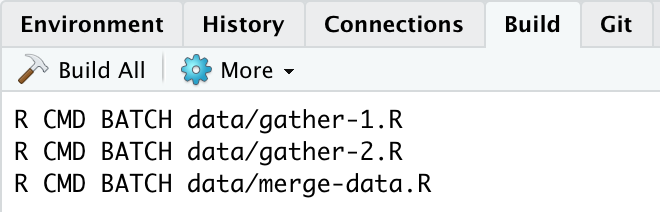

# Gathering Data with R {#DataGather}

How you gather your data directly impacts how reproducible your research
will be. You should try your best to document every step of your data
gathering process. Reproduction will be easier if your
documentation--especially, variable descriptions and source code--makes
it easy for you and others to understand what you have done. If all of
your data gathering steps are tied together by your source code, then
independent researchers (and you) can more easily regather the data.
Regathering data will be easiest if running your code allows you to get
all the way back to the raw data files--the rawer the better. Of course,
this may not always be possible. You may need to conduct interviews or
compile information from paper based archives, for example. The best you
can sometimes do is describe your data gathering process in detail.
Nonetheless, R's automated data gathering capabilities for
internet-based information is extensive. Learning how to take full
advantage of these capabilities greatly increases reproducibility and
can save you considerable time and effort over the long run.

In this chapter we'll learn how to gather quantitative data in a fully
reproducible way. We'll start by learning how to use data gathering
makefiles to organize your whole data gathering process so that it can
be completely reproduced. Then we will learn the details of how to
actually load data into R from various sources, both locally on your
computer and remotely via the internet. In the next chapter (Chapter \@ref(DataClean))
we'll learn the details of how to cleanup raw data so that it can be
merged together into data frames that you can use for statistical
analyses.

## Organize Your Data Gathering: Makefiles

Before getting into the details of using R to gather data, let's start
by creating a plan to organize the process. Organizing your data
gathering process from the beginning of a research project improves the
possibility of reproducibility and can save you significant effort over
the course of the project by making it easier to add and regather data
later on.

A key part of reproducible data gathering with R, like reproducible
research in general, is segmenting the process into modular files that
can all be run by a common "makefile". In this chapter we'll learn how
to create make-like files run exclusively from R as well as GNU Make
makefiles,[^chapter_6_1] which you run from a shell.[^chapter_6_2] Learning how to create R
make-like files is fairly easy. Using GNU Make does require learning
some more new syntax. However, it has one very clear advantage: it only
runs a source code file that has been updated since the last time you
ran the makefile. This is very useful if part of your data gathering
process is very computationally and time intensive.

Segmenting your data gathering into modular files and tying them
together with some sort of makefile allows you to more easily navigate
research text and find errors in the source code. The makefile's output
is the data set that you'll use in the statistical analyses. There are
two types of source code files that the makefile runs: data
gathering/cleanup files and merging files. Data cleanup files bring raw
individual data sources into R and transform them so that they can be
merged together with data from the other sources. Many of the R tools
for data cleanup and merging will be covered in Chapter \@ref(DataClean).
In this chapter we mostly cover the ways to bring raw data into R.
Merging files are executed by the makefile after it runs the data
gathering/cleanup files.

It's a good idea to have the source code files use very raw data as
input. Your source code should avoid directly changing these raw data
files. Instead changes should be put into new objects and data files.
Doing this makes it easier to reconstruct the steps you took to create
your data set. Also, while cleaning and merging your data you may
transform it in unintended ways, for example, accidentally deleting some
observations that you wanted to keep. Having the raw data makes it easy
to go back and correct your mistakes.

The files for the examples used in this section can be downloaded from
GitHub at: <https://github.com/christophergandrud/rep-res-book-v3-examples>.

### R Make-like files

When you create make-like files in R to organize and run your data
gathering you usually only need one or two commands, and . As we talked
about in Chapter \@ref(DirectoriesChapter), simply tells R where to look for and
place files. tells R to run code in an R source code file.[^chapter_6_3] Let's see
what an R data make file might look like for a project with a file
structure similar to the example project in Figure \@ref(ExampleTree). The file paths in this example are for
Unix-like systems and the make-like file is called *Makefile.R*.

```{r Ch6ExampleRMake, eval=FALSE}
################ # Example R make-like file
# Christopher Gandrud
# Updated 12 January 2019
################

# Set working directory setwd("/example-project/data/")

# Gather and cleanup raw data files with a for loop
gatherers <- c("gather-1.R", "gather-2.R", "gather-3.R")
for (i in gatherers) source(i)

# Merge cleaned data frames into data frame object CleanedData
source("merge-data.R")
```

This code first sets the working directory. Then it runs three source
code files to gather data from three different sources. These files
gather the data and clean it so that it can be merged together. The
cleaned data frames are available in the current workspace. Next the
code runs the *merge-data.R* file that merges the data frames and saves
the output data frame as a CSV formatted file. The CSV file could be the
main file we use for statistical analysis. *merge-data.R* also creates a
Markdown file with a table describing the variables and their sources.
We'll come back to how to create tables in Chapter \@ref(TablesChapter).

You can run the commands in this file one by one or run the make-like
file by putting it through the `source()` function\index{R function!source} so that it will run it
all at once.

### GNU Make

R make-like files are a simple way to tie together a segmented data
gathering process. If one or more of the source files that our example
before runs is computationally intensive it is a good idea to run them
only when they are updated. However, this can become tedious, especially
if there are many segments. The well-established GNU Make command-line
program[^chapter_6_4] deals with this problem by comparing the output files' time
stamps[^chapter_6_5] to time stamps of the source files that created them. If a
source file has a time stamp that is newer than its output, Make will
run it. If the source's time stamp is older than its output, Make will
skip it.

In Make terminology the output files are called "targets" and the files
that create them are called "prerequisites". You specify a "recipe" to
create the targets from the prerequisites. The recipe is basically just
the code you want to run to make the target file. The general form is:

````
    TARGET ... : PREREQUISITE ...
        RECIPE
        ...
        ...
`````

Note that, unlike in R, tabs are important in Make. They indicate what
lines are the recipe. Make uses the recipe to ensure that targets are
newer than prerequisites. If a target is newer than its prerequisite,
Make does not run the prerequisite.

The basic idea of reproducible data gathering with Make is similar to
what we saw before, with a few twists and some new syntax. Let's see an
example that does what we did before: gather data from three sources,
clean and merge the data, and save it in CSV format.

#### Example makefile {- #AsteriskWildcard}

The first thing we need to do is create a new file called *Makefile*[^chapter_6_6]
and place it in the same directory as the data gathering files we
already have. The makefile we are going to create runs prerequisite
files by the alphanumeric order of their file names. So we need to
ensure that the files are named in the order that we want to run them.
Now let's look at the actual makefile:

````bash
  ################
  # Example Makefile
  # Christopher Gandrud
  # Updated 1 July 2013
  # Influenced by Rob Hyndman (31 October 2012)
  # See: http://robjhyndman.com/researchtips/makefiles/
  ################

  # Key variables to define
  RDIR = .
  MERGE_OUT = merge-data.Rout

  # Create list of R source files
  RSOURCE = $(wildcard $(RDIR)/*.R)

  # Files to indicate when the RSOURCE file was run
  OUT_FILES = $(RSOURCE:.R=.Rout)

  # Default target
  all: $(OUT_FILES)

  # Run the RSOURCE files
  $(RDIR)/%.Rout: $(RDIR)/%.R
      R CMD BATCH $<

  # Remove Out Files
  clean:
      rm -fv $(OUT_FILES)

  # Remove merge-data.Rout
  cleanMerge:
      rm -fv $(MERGE_OUT)
````

Ok, let's break down the code. The first part of the file defines
variables that will be used later on. For example, in the first line of
executable code (`RDIR = .`) we create a simple variable[^chapter_6_7] called
`RDIR` with a period (`.`) as its value. In Make and Unix-like shells,
periods indicate the current directory. The next line allows us to
specify a variable for the outfile created by running the *merge-data.R*
file. This will be useful later when we create a target for removing
this file to ensure that the *merge-data.R* file is always run.

The third executed line (`RSOURCE:= $(wildcard $(RDIR)/*.R)`) creates a
variable containing a list of all of the names of files with the
extension `.R`, i.e. our data gathering and merge source code files.\index{wildcard}
This line has some new syntax, so let's work through it. In Make (and
Unix-like shells generally) a dollar sign (`$`) followed by a variable
name substitutes the value of the variable in place of the name.[^chapter_6_8] For
example, `$(RDIR)` inserts the period `.` that we defined as the value
of `RDIR` previously. The parentheses are included to clearly demarcate
where the variable name begins and ends.[^chapter_6_9]

You may remember the asterisk (`*`) from the previous chapter. It is a
"wildcard",\index{wildcard} a special character that allows you to select
file names that follow a particular pattern. Using `*.R` selects any
file name that ends in `.R`.

Why did we also include the actual word `wildcard`? The `wildcard`
function is different from the asterisk wildcard character. The function
creates a list of files that match a pattern. In this case the pattern
is `$(RDIR)/*.R`. The general form for writing the `wildcard` function
is: `$(wildcard PATTERN)`.

The third line (`OUT_FILES = $(RSOURCE:.R=.Rout)`) creates a variable
for the `.Rout` files that Make will use to tell how recently each R
file was run.[^chapter_6_10] `$(RSOURCE:.R=.Rout)` is a variable that uses the
same file name as our RSOURCE files, but with the file extension
`.Rout`.

The second part of the makefile tells Make what we want to create and
how to create it. In the line `all: $(OUT_FILES`) we are specifying the
makefile's default target. Targets are the files that you instruct Make
to make. `all:` sets the default target; it is what Make tries to create
when you enter the command `make` in the shell with no arguments. We
will see later how to instruct Make to compile different targets.

The next two executable lines (`$(RDIR)/%.Rout: $(RDIR)/%.R` and
`R CMD BATCH $<`) run the R source code files in the directory. The
first line specifies that the `.Rout` files are the targets of the `.R`
files. The percent sign (`%`) is another wildcard. Unlike the asterisk,
it replaces the selected file names throughout the command used to
create the target.

The dollar and less-than signs (`$<`) indicate the first prerequisite
for the target, i.e. the `.R` files. `R CMD BATCH` is a way to call R
from a Unix-like shell, run source files, and output the results to
other files.[^chapter_6_11] The out-files it creates have the extension `.Rout`.

The next two lines specify another target: `clean`. When you type
`make clean` into your shell Make will follow the recipe:
`rm -fv $(OUT_FILES)`. This removes (deletes) the `.Rout` files. The `f`
argument (force) ignores files that don't exist and the `v` argument
(verbose) instructs Make to tell you what is happening when it runs.
When you delete the `.Rout` files, Make will run all of the `.R` files
the next time you call it.

The last two lines help us solve a problem created by the fact that our
simple makefile doesn't push changes downstream. For example, if we make
a change to *gather-2.R* and run `make`, only *gather-2.R* will be rerun.
The new data frame will not be added to the final merged data set. To
overcome this problem the last two lines of code create a target called
`cleanMerge`, this removes only the *merge-data.Rout* file.

##### Running the Makefile

To run the makefile for the first time, simply change the working
directory to where the file is and type `make` into your shell. It will
create the CSV final data file and four files with the extension
`.Rout`, indicating when the segmented data gathering files were last
run.[^chapter_6_12]

When you run `make` in the shell for the first time you should get the
output:\index{shell command!make}

````bash
## R CMD BATCH gather-1.R
## R CMD BATCH gather-2.R
## R CMD BATCH gather-3.R
## R CMD BATCH merge-data.R
````

If you run it a second time without changing the R source files you will
get the following output:

````
## make: Nothing to be done for 'all'.
````

To remove all of the `.Rout` files, set the make target to `clean`:

````bash
make clean

## rm -fv ./gather-1.Rout ./gather-2.Rout ./gather-3.Rout
## ./merge-data.Rout
## ./gather-1.Rout
## ./gather-2.Rout
## ./gather-3.Rout
## ./merge-data.Rout
````

If we run the following code:

````bash
# Remove merge-data.Rout and make all R source files
make cleanMerge all
````

then Make will first remove the *merge-data.Rout* file (if there is one)
and then run all of the R source files as need be. *merge-data.R* will
always be run. This ensures that changes to the gathered data frames are
updated in the final merged data set.

#### Makefiles and RStudio Projects

You can run makefiles from RStudio's *Build* tab. For the type of
makefile we have been using, the main advantage of running it from
within RStudio is that you don't have to toggle between RStudio and the
shell. Everything is in one place. Imagine that the directory with our
makefile is an RStudio Project. If a Project already contains a
makefile, RStudio will automatically open a *Build* tab on the
*Environment/Historyr/Connections* pane, the same place where the *Git* tab appears
(see Figure \@ref(fig:Ch6BuildTab)).[^chapter_6_13]

The *Build* tab has buttons you can click to `Build All` (this is
equivalent to `make all`), and, in the `More` drop-down menu,
`Clean all` (i.e., `make clean`) and `Clean and Rebuild` (i.e.,
`make clean all`). As you can see in Figure \@ref(fig:Ch6BuildTab), the *Build*
tab shows you the same output you get in the shell.

```{r Ch6BuildTab, fig.cap="The RStudio Build", echo=FALSE, out.width="50%"}

```

#### Other information about makefiles

Note that Make relies heavily on commands and syntax of the shell
program that you are using. The above example was written and tested on
a Mac. It should work on other Unix-like computers without modification.

You can use Make to build almost any project from the shell, not just to
run R source code files. It was an integral part of early reproducible
computational research [@fomel2009; Buckheit1995]. Rob Hyndman more
recently posted a description of the makefile he uses to create a
project with R and LaTeX.[^chapter_6_14] The complete source of information on GNU
Make is the official online manual. It is available at:
<http://www.gnu.org/software/make/manual/>.

## Importing Locally Stored Data Sets

Now that we've covered the big picture, let's learn the different tools
you will need to know to gather data from different types of sources.
The most straightforward place to load data from is a local file, e.g.
one stored on your computer. Though storing your data locally does not
really encourage reproducibility, most research projects will involve
loading data this way at some point. The tools you will learn for
importing locally stored data files will also be important for most of
the other methods further on.

Data stored in plain-text files on your computer can be loaded into R
using the `read.table()` function.\index{R function!read.table} For example, imagine we have a CSV file called *test-data.csv* stored in the current working directory. To load
the data set into R simply type:

```{r Ch6LocalReadTable, eval=FALSE}
test_data <- read.table("test-data.csv", sep = ",", header = TRUE)
```

See Section \@ref(SepHeadExplain) for a discussion of the arguments in this
function.

If you are using RStudio you can do the same thing with drop-down menus.
To open a plain-text data file click on `Environment` `Import Dataset…`
`From Text File…`. In the box that pops up, specify the column
separator, whether or not you want the first line to be treated as
variable labels, and other options. This is initially easier than using
`read.table`. But it is much less reproducible.

If the data is not stored in plain-text format, but is instead saved in
a format created by another statistical program such as SPSS, SAS, or
Stata, we can import it using commands in the *foreign* package. For
example, imagine we have a data file called *data-1.dta* stored in our
working directory. This file was created by the Stata statistical
program. To load the data into an R data frame object called *stata_data*
simply type:

```{r Ch6Stata, eval=FALSE, tidy=FALSE, echo=TRUE}
# Load foreign package
library(foreign)

# Load Stata formatted data
stata_data <- read.dta(file = "data-1.dta")
```

As you can see, function in the *foreign* package have similar syntax to
`read.table()`. To see the full range of commands and file formats that
the *foreign* package supports, use the following:\index{R function!read.dta}

```{r Ch6ForeignHelp, eval=FALSE, echo=TRUE}
library(help = "foreign")
```

Typically an even simpler solution is to use `import()`\index{R function!rio} from the *rio* package. It will automatically try to find the right way to parse whatever data format you give it. For example:

````r
stata_data <- rio::import("data-1.dta")
````

If you have data stored in a spreadsheet format such as Excel's *.xlsx*,\index{Excel}
it may be best to first cleanup the data in the spreadsheet program by
hand and then save the file in plain-text format. When you cleanup the
data make sure that the first row has the variable names and that
observations are in the following rows. Also, remove any extraneous
information such as notes, colors, and so on that will not be part of
the data frame. `import()` can also attempt to import *.xlsx* files. This is much easier if they are cleaned up to resemble text files.

To aid reproducibility, locally stored data should include careful
documentation of where the data came from and how, if at all, it was
transformed before it was loaded into R. Ideally, the documentation
would be written in a text file saved in the same directory as the raw
data file.

## Importing Data Sets from the Internet

There are many ways to import data that is stored on the internet
directly into R. We have to use different methods depending on where and
how the data is stored.

### Data from non-secure (http) URLs

[CONSIDER REMOVING SECTIONS OR MOVING CONTENT FROM CH5]

Importing data into R that is located at a non-secure URL[^chapter_6_15]--ones
that start with --is straightforward provided that:

-   the data is stored in a simple format, e.g. plain-text,

-   the file is not embedded in a larger HTML website.

We already discussed the first issue in detail. You can determine if the
data file is embedded in a website by opening the URL in your web
browser. If you only see the raw plain-text data, you are probably good
to go. To import the data, simply include the URL as the file's name in
your `read.table()` function.\index{R function!read.table}.

### Data from secure (*https*) URLs {#SecureDataDownload}

Storing data at non-secure URLs is now very uncommon. Services like
Dropbox, GitHub, and Dataverse store their data at secure URLs.[^chapter_6_16] You can
tell if the data is stored at a secure web address if it begins with
`https` rather than `http`. We have to use a different function to
download data from secure URLs.

As we saw last chapter in Section \@ref(EnablePublicFolder), `import()` has no problem gathering data from secure URLs, e.g.:

```{r Ch6importhttps}
# Place the URL into the object fin_url
fin_url <- "https://bit.ly/2xlQ2j5"

# Download data
fin_regulator <- import(fin_url, format = "csv")
```

### Compressed data stored online

Sometimes data files are large, making them difficult to store and
download without compressing them. There are a number of compression
methods such as Zip and Tar.[^chapter_6_19] Zip files have the extension and Tar
files use extensions such as and . In most cases[^chapter_6_20] you can download,
decompress, and create data frame objects from these files directly in
R. To do this you need to:[^chapter_6_21]

-   create a temporary file with to store the zipped file, which you
    will later remove with the at the end,

-   download the file with `download.file()`,

-   decompress the file with one of the commands in base R,[^chapter_6_22]

-   read the file with `read.csv()`.

The reason that we have to go through so many extra steps is that
compressed files are more than just a single file and contain a number
of files as well as metadata.

Let's download a compressed file called *uds_summary.csv* from
[@pemstein2010]. It's in a compressed file called *uds_summary.csv.gz*.
At the time of writing, the file's URL address is
<http://www.unified-democracy-scores.org/files/20140312/z/uds_summary.csv.gz>.

```{r Ch5ZipDownload, warning=FALSE, tidy=FALSE, cache=TRUE, size='footnotesize'}
# For simplicity, store the URL in an object called 'URL'
URL <- "http://www.unified-democracy-scores.org/files/20140312/z/uds_summary.csv.gz"

# Create a temporary file called 'temp' to put the zip file into.
temp <- tempfile()

# # Download the compressed file into the temporary file
# download.file(URL, temp)
#
# # Decompress the file and convert it into a data frame
# uds_data <- read.csv(gzfile(temp, "uds_summary.csv"))
#
# # Delete the temporary file
# unlink(temp)
#
# # Show variables in data
# names(uds_data)
```

### Data APIs & feeds

There are a growing number of packages that can gather data directly
from a variety of internet sources and import them into R. Most of these
packages use the sources' web application programming interfaces (API).
Web APIs allow programs to interact with a website. Needless to say,
this is great for reproducible research. It not only makes the data
gathering process easier as you don't have to download many Excel files
and fiddle around with them before even getting the data into R, but it
also makes replicating the data gathering process much more
straightforward and makes it easy to update data sets when new
information becomes available.

##### API Package Example: World Bank Development Indicators {-}

Each of these packages has its own syntax and it isn't possible to go
over all of them here. Nonetheless, let's look at an example of
accessing World Bank data with the *WDI* to give you a sense of how
these packages work. Imagine that we want to gather data on fertilizer
consumption. We can use *WDI*'s `WDIsearch` command to find fertilizer
consumption data available at the World Bank:

```{r Ch6WDIsearch}
# Load WDI package
library(WDI)

# Search World Bank for fertilizer consumption data
WDIsearch("fertilizer consumption")
```

This shows us a selection of indicator numbers and their names.[^chapter_6_31]
Let's gather data on countries' fertilizer consumption in kilograms per
hectare of arable land. The indicator number for this variable is:
`AG.CON.FERT.ZS`. We can use the function `WDI()` to gather the data and put
it in an object called *fert_cons_data*.

```{r Ch6WDIFert, eval=TRUE}
fert_cons_data <- WDI(indicator = "AG.CON.FERT.ZS",
                      start = 2010, end = 2017)
```

The `start` and `end` arguments allow us to set the starting and ending year of the data to download.

The data we downloaded looks like this:

<!-- ```{r Ch6WDIFertSave, include=FALSE, eval=FALSE} -->
<!-- # This ensures that the PDF will still compile even if the data is unavailable via WDI -->
<!-- load(file = "Source/Children/Chapter6/FertData.RData") -->
<!-- ``` -->

```{r Ch6HeadFert}
head(fert_cons_data)
```

You can see that `WDI` has downloaded data for four variables:
**iso2c**,[^chapter_6_32] **country**, **AG.CON.FERT.ZS** and **year**.

## Advanced Automatic Data Gathering: Web Scraping

If a package does not already exist to access data from a particular
website, there are other ways to automatically "scrape" data with R.
This section briefly discusses some of R's web scraping tools and
techniques to get you headed in the right direction to do more advanced
data gathering.

#### The general process {-}

Simple web scraping involves downloading a file from the internet,
parsing it (i.e. reading it), and extracting the data you are interested
in then putting it into a data frame object. We already saw a simple
example of this when we downloaded data from the a secure HTTPS website.
We downloaded a website's content from a URL address into R with the
`getURL()` function.\index{R function!getURL} We then parsed the downloaded text as a CSV formatted
data file, extracted it, and put it into a new data frame object.

This was a relatively simple process, because the webpage was very
simply formatted. It basically only contained the CSV formatted text.
So, the process of parsing and extracting the data was very
straightforward. You may not be so lucky with other data sources. Data
may be stored in an HTML formatted table within a more complicated HTML
marked up webpage. The *XML* package [@R-XML] has a number of useful
commands such as `readHTMLTable()`\index{R function!readHTMLTable} for parsing and extracting this kind of
data. The *XML* package also clearly has functions for handling XML
formatted data.[^chapter_6_33] In addition, the helpful *rvest* [@R-rvest] package
provides an easy to use set of functions with capabilities similar to
and often more capable than *XML*. If the data is stored in JSON[^chapter_6_34]
you can read it with a package like *jsonlite* [@R-jsonlite].

There are more websites with APIs than R packages designed specifically
to access each one. If an API is available, the *httr* package [@R-httr]
may be useful.

#### More tools to learn for web scraping {-}

Beyond learning about the various R packages that are useful for R web
scraping, an aspiring web scraper should probably invest time learning a
number of other skills:

-   HTML: Obviously you will encounter a lot of HTML markup when web
    scraping. Having a good understanding of the HTML markup language
    will be very helpful. W3 Schools (<http://www.w3schools.com/>) is a
    free resource for learning HTML as well as JSON, JavaScript, XML,
    and other languages you will likely come across while web scraping.

-   Regular Expressions: Web scraping often involves finding character
    patterns. Some of this is done for you by the R packages above that
    parse text. There are times, however, when you are looking for
    particular patterns, like tag IDs, that are particular to a given
    website and change across the site based on a particular pattern.
    You can use regular expressions to deal with these situations. R has
    a comprehensive if bare-bones introduction to regular expressions.
    To access it type `?regex` into your R console.

-   Looping: Web scraping often involves applying a function to multiple
    things, e.g. tables or HTML tags. To do this in an efficient way you
    will need to use loops and apply functions. [@matloff2011] provides
    a comprehensive overview. The *dplyr* [@R-dplyr] for data frame
    manipulation is also particularly useful.

-   Finally, [@munzert2015] provide a comprehensive overview of web
    scraping and text mining with R.

### Chapter summary {-}

In this chapter we have learned how to reproducibly gather data from a
number of sources. If the data we are using is available online we may
be able to create really reproducible data gathering files. These files
have commands that others can execute with makefiles that allow them to
actually regather the exact data we used. The techniques we can use to
gather online data also make it easy to update our data when new
information becomes available. Of course, it may not always be possible
to have really reproducible data gathering. Nonetheless, you should
always aim to make it clear to others (and yourself) how you gathered
your data. In the next chapter we will learn how to clean and merge
multiple data files so that they can easily be used in our statistical
analyses.

[^chapter_6_1]: GNU stands for "GNU's Not Unix", indicating that it is Unix-like.

[^chapter_6_2]: To standardize things, I use the terms "R make-like file" for
    files created and run in R and the standard "makefile" for files run
    by Make.

[^chapter_6_3]: We use the command more in the Chapter
    [\[StatsModel\]](#StatsModel){reference-type="ref"
    reference="StatsModel"}.

[^chapter_6_4]: GNU Make was originally developed in 1977 by Stuart Feldman as a
    way to compile computer programs from a series of files, its primary
    use to this day. For an overview see:
    <http://en.wikipedia.org/wiki/Make_(software)>. For installation
    instructions please see Section \@ref(InstallMake).

[^chapter_6_5]: A file's time stamp records the time and date when it was last
    changed.

[^chapter_6_6]: Alternatively you can call the file *GNUmakefile* or *makefile*.

[^chapter_6_7]: Simple string variables are often referred to as "macros" in GNU
    Make. A common convention in Make and Unix-like shells generally is
    to use all caps for variable names.

[^chapter_6_8]: This is a kind of parameter expansion. For more information about
    parameter expansion see [@frazier2008].

[^chapter_6_9]: Braces (`{}`) are also sometimes used for this.

[^chapter_6_10]: The R out-file contains all of the output from the R session used
    while running the file. These can be a helpful place to look for
    errors if your makefiles give you an error like
    `make: *** [Gather.Rout] Error 1`.

[^chapter_6_11]: You will need to make sure that R is in your PATH. Setting this
    up is different on different systems. If on Mac and Linux you can
    load R from the Terminal by typing `R`, R is in your PATH. The usual
    R installation usually sets this up correctly. There are different
    methods for changing the file path on different versions of Windows.

[^chapter_6_12]: If you open these files you fill find the output from the R
    session used when their source file was last run.

[^chapter_6_13]: If a project doesn't have a makefile you can still set up RStudio
    Build. Click on `Build` in the Menu bar then
    `Configure Build Tools . . .`. Select `Makefile` from the drop-down
    menu then `Ok`. You will still need to manually add a Makefile in
    the Project's root directory.

[^chapter_6_14]: See his blog at:
    <http://robjhyndman.com/researchtips/makefiles/>. Posted 31 October
    2012. This method largely replicates what we do in this book with
    *knitr*. Nonetheless, it has helpful information about Make that can
    be used in other tasks. It was in fact helpful for writing this
    section of the book.

[^chapter_6_15]: URL stands for "Uniform Resource Locator".

[^chapter_6_17]: Remember we placed the file's raw GitHub URL address inside of
    the object *url_address*.

[^chapter_6_19]: Tar archives are sometimes referred to as 'tar balls'.

[^chapter_6_20]: Some formats that require the *foreign* package to open are more
    difficult. This is because functions such as for opening Stata files
    only accept file names or URLs as arguments, not connections, which
    you create for unzipped files.

[^chapter_6_21]: The description of this process is based on a Stack Overflow
    comment by Dirk Eddelbuettel (see
    <http://stackoverflow.com/questions/3053833/using-r-to-download-zipped-data-file-extract-and-import-data?answertab=votes#tab-top>,
    posted 10 June 2010.)

[^chapter_6_22]: To find a full list of commands type into the R console.

[^chapter_6_23]: <http://www.google.com/finance>

[^chapter_6_24]: <http://finance.yahoo.com/>

[^chapter_6_25]: <http://research.stlouisfed.org/fred2/>

[^chapter_6_26]: <http://treebase.org>

[^chapter_6_27]: <https://twitter.com/>

[^chapter_6_28]: <http://data.worldbank.org/data-catalog/world-development-indicators>

[^chapter_6_29]: <http://ropensci.org/>

[^chapter_6_30]: [http://stats.stackexchange.com/questions/12670/data-apis-feeds-available-as-packages-in-r](http://stats.stackexchange.com/questions/12670/data-apis-feeds-available-as-packages-in-r)

[^chapter_6_31]: You can also search the World Bank Development Indicators
    website. The indicator numbers are at the end of each indicator's
    URL.

[^chapter_6_32]: These are the countries' or regions' International Standards
    Organization's two-letter codes. For more details see:
    <http://www.iso.org/iso/country_codes.htm>.

[^chapter_6_33]: XML stands for "Extensible Markup Language".

[^chapter_6_34]: JSON means "JavaScript Object Notation"
