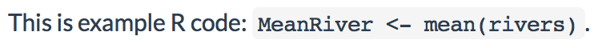
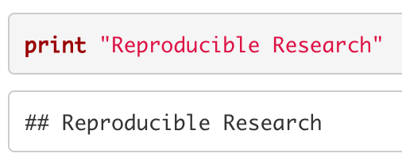

# Statistical Modeling and *knitr* {#StatsModel}

When you have your data cleaned and organized you will begin to examine
it with statistical analyses. In this book we don't look at how to do
statistical analysis in R (a subject that would and does take up many
books). Instead we focus on how to make your analyses really
reproducible. To do this you dynamically connect your data gathering and
analysis source code to your presentation documents. When you
dynamically connect your data gathering makefiles and analysis source
code to your markup document you will be able to completely rerun your
data gathering and analysis and present the results whenever you compile
the presentation documents. Doing this makes it very clear how you found
the results that you are advertising. It also automatically keeps the
presentation of your results--including tables and figures--up-to-date
with any changes you make to your data and analyses source code files.

You can dynamically tie your data gathering, statistical analyses, and
presentation documents together with Knitr/R Markdown. In Chapter \@ref(GettingStartedRKnitr) you learned basic *knitr*/*rmarkdown*
syntax. For the rest of the chapter I'll simply refer to it as "*knitr*
syntax", but it applies to *rmarkdown* as well. In this chapter we will
begin to learn *knitr* syntax in more detail, particularly code chunk
options for including dynamic code in your presentation documents. This
includes code that is run in the background, i.e. not shown in the
presentation document, as well as displaying the code and output in your
presentation document both as separate blocks and inline with the text.
We will also learn how to dynamically include code from languages other
than R. We examine how to use *knitr* with modular source code files.
Finally, we will look at how to create reproducible 'random' analyses
and how to work with computationally intensive code chunks.

The goal of this and the next two chapters--which cover dynamically
presenting results in tables and figures--is to show you how to tie data
gathering and analyses into your presentation documents so closely that
every time the documents are compiled they actually reproduce your
analysis and present the results. Please see the next part of this book,
Part IV, for details on how to create the LaTeX and Markdown documents
that can include *knitr* code chunks.

**Reminder:** Before discussing the details of how to incorporate your
analysis into your source code, it's important to reiterate something we
discussed in Chapter \@ref(GettingStartedRR). The syntax and capabilities of R packages and R itself can change with new versions. Also, as we have seen for
file path names, syntax can change depending on what operating system
you are using. So it is important to have your R session info available
(see Section \@ref(SessionInfoHow) for details) to make your research more
reproducible and future-proof. If someone reproducing your research has
this information, they will be able to download your files and use the
exact version of the software that you used. For example, CRAN maintains
an archive of previous R package versions that can be downloaded.[^chapter_8_1]
Previous versions of R itself can also be downloaded through CRAN.[^chapter_8_2]

## Incorporating Analyses into the Markup

For a relatively short piece of code that you don't need to run in
multiple presentation documents it may be simplest to type the code
directly into chunks written in your *knitr* markup document. In this
section we will learn how to set *knitr* options for handling these code
chunks. For a list of many of the chunk options covered here see Table \@ref(ChunkOptionsTable).

### Full code chunks

By default, *knitr* code chunks are run by R, and the code and any text
output (including warnings and error messages) are inserted into the
text of your presentation documents in blocks. The blocks are positioned
in the final presentation document text at the points where the code
chunk was written in the knittable markup. Figures are inserted as well.
Let's look at the main options for determining how code chunks are
handled by *knitr*.

#### `include` {-}

Use `include=FALSE`\index{knitr option!include} if you don't want to include anything in the text of
your presentation document, but you still want to evaluate a code chunk.
It is `TRUE` by default.

#### `eval` {-}

The `eval`\index{knitr option!eval} option determines whether or not the code in a chunk will be
run. Set the `eval` option to `FALSE` if you would like to include code
in the presentation document text without actually running the code. By
default it is set to `TRUE`, i.e. the code is run. You can alternatively
use a numerical vector with `eval`. The numbers in the vector tell
*knitr* which expressions in the chunk to evaluate. For example, if you
only want to evaluate the first two expressions, simply set `eval=1:2`.

#### `echo` {-}

If you would like to hide a chunk's code from the presentation document
you can set `echo=FALSE`.\index{knitr option!echo} Note that if you also have `eval=TRUE` then
the chunk will still be evaluated and the output will be included in
your presentation document. Clearly, if `echo=TRUE`, then source code
will be included in the presentation document. As with `eval`, you can
alternatively use a numerical vector in `echo`. The numbers in the
vector indicate which expressions to echo in your final document.

#### `results` {-}

We will look at the `results`\index{knitr option!results} option in more detail in the next two
chapters (see especially Section \@ref(ResultsOptions)). However, let's briefly discuss the option value `hide`. Setting `results='hide'` is almost the opposite of `echo=FASLE`. Instead of showing the results of the code chunk and
hiding the code, `results='hide'` shows the code, but not the results.
Warnings, errors, and messages will still be printed.

#### `warning`, `message`, `error` {-}

If you don't want to include the warnings, messages, and error messages
that R outputs in the text of your presentation documents, just set the
`warning`, `message`, and `error` options to `FALSE`. They are set to
`TRUE` by default.\index{knitr option!warning}\index{knitr option!message}\index{knitr option!error}

#### `cache` {-}

If you want to run a code chunk once and save the output for when you
knit the document again, rather than running the code chunk every time,
set the option `cache=TRUE`.\index{knitr option!cache} When you do this the first time the
document is knitted, the chunk will be run and the output stored in a
subdirectory of the working directory called *cache*. When the document
is subsequently knitted, the chunk will only be run if the code in the
chunk changes or its options change. This is very handy if you have a
code chunk that is computationally intensive to run. The `cache` option
is set to `FALSE` by default. Later in this chapter (Section \@ref(CacheVars))
we will see how to use the `cache.vars` function to cache only certain
variables created by a code chunk.

#### `dependson` {-}

Cached chunks are only rerun when their code changes. Sometimes one
chunk will depend on the results from a prior chunk. In these cases it
is good to rerun the chunk if the prior one is also rerun. The
`dependson`\index{knitr option!dependson} option allows you to do this. You can specify either a
vector of the labels for the chunks depended on or their numbers in
order from the start of the document. For example, `dependson=c(2, 3)`
specifies that if the second or third chunks are rerun, then the current
chunk will also be rerun.

#### `cache.extra` {-}

Sometimes to ensure reproducibility it may be useful to rerun a chunk
when some other condition changes, such as when a new version of R is
installed or a dependent file changes. You can feed a list of conditions
to `cache.extra`\index{knitr option!cache.extra} to do this. For instance:

```{r Ch8CacheExtra, eval=FALSE, echo=TRUE}
cache.extra=list(file.info(Data.csv)$mtime, R.version)
```

Here we set two conditions under which the chunk will be rerun. The
first specifies that the chunk should be rerun whenever the *Data.csv*
file is modified. The `file.info` function extracts information about
the file and `mtime` gives the last time that the file was modified. If
this differs from when the chunk was last run, then it will be run
again. This is very useful for keeping your cached chunks and the files
they rely on in sync.

The second condition enabled by `R.version` reruns the chunk whenever
the R version or even the operating system changes. If you only want to
rerun the chunk when the version of R is different, then use
`R.version.string`.

#### `size` {-}

If you do want to print part or all of your code chunk into your LaTeX
document, you may also want to resize the text. To do this, use the
`size`\index{knitr option!size} option. By default it is set to `size='normalsize'`. You can use
any of the LaTeX font sizes listed in Table \@ref(LaTeXFontSize) from Chapter \@ref(LatexChapter).

### Showing code & results inline

Sometimes you may want to have R code or output show up inline with the
rest of your presentation document's text. For example, you may want to
include a small chunk of stylized code in your text when you discuss how
you did an analysis. Or you may want to dynamically report the mean of
some variable in your text so that the text will change when you change
the data. The *knitr* syntax for including inline code is different for
the LaTeX and Markdown languages. We'll cover both in turn.

#### LaTeX {-}

#### *Inline static code* {-}

There are a number of ways to include a code snippet inline with your
text in LaTeX. You can simply use the LaTeX function `\texttt`\index{LaTeX!texttt} to have
text show up in the `typewriter` font commonly used in LaTeX-produced
documents to indicate that some text is code (I use typewriter font for
this purpose in this book, as you have probably noticed). For example,
using `\texttt{2 + 2}` will give you `2 + 2` in your text. Note that in
LaTeX curly brackets (`{}`) work exactly like parentheses in R, i.e.
they enclose a function's arguments.

However, the `\texttt` function isn't always ideal, because your LaTeX
compiler will still try to run the code inside of the function as if it
were LaTeX markup. This can be problematic if you include characters
like the backslash `\` or curly brackets `{}`. They have special
meanings for LaTeX. The hard way to solve this problem is to use escape
characters (see Chapter \@ref(DirectoriesChapter)). The backslash is an escape character in LaTeX.

Probably the better option is to use the `\verb` function.\index{LaTeX!verb} It is
equivalent to the `eval=FALSE` option for full *knitr* code chunks. To
use the `\verb` function, pick some character you will not use in the
inline code. For example, you could use the vertical bar (`|`). This
will be the `\verb` delimiter. Imagine that we want to actually include
'`\texttt`' in the text. We would type:

```
\verb|\texttt|
```

The LaTeX compiler will ignore almost anything from the first vertical
bar up until the second bar following `\verb`. All of the text
in-between the delimiter characters is put in typewriter font.[^chapter_8_3]

#### Inline dynamic code {-}

If you want to dynamically show the results of some R code in your
*knitr* LaTeX-produced text you can use `\Sexpr`.\index{LaTeX!Sexpr} This is a pseudo LaTeX
function; it looks like LaTeX, but is actually *knitr*.[^chapter_8_4] Its structure
is more like a LaTeX function's structure than *knitr*'s in that you
enclose your R code in curly brackets (`{}`) rather than the
`<<>>= . . . @` syntax you use for block code chunks.

For example, imagine that you wanted to include the mean of a vector of
river lengths--`r round(mean(rivers), digits = 0)`--in the text of your document. The *rivers* numeric vector, loaded by default in R, has the lengths of 141 major rivers recorded in miles. You can simply use the `mean()`\index{R function!mean} function to find the mean and the `round()`\index{R function!round} function to round the result to the nearest whole number:

```{r Ch8MeanRivers}
round(mean(rivers), digits = 0)
```

To have just the output show up inline with the text of your document
you would type something like:

```{r Ch8SexprExample, eval=FALSE}
The mean length of 141 major rivers in North America is
\Sexpr{round(mean(rivers), digits = 0)} miles.
```

This produces the sentence:

````markdown
The mean length of 141 major rivers in North America is miles.
````

R code included inline with `Sexpr` is evaluated using current R
options. So if you want all of the output from `Sexpr` to be rounded to
the same number of digits, for example, it might be a good idea to set
this in a code chunk with R's `options` function. See page for more
details.

#### Markdown {-}

#### *Inline static code* {-}

To include static code inline in an R Markdown (and regular Markdown)
document, enclose the code in single backticks (`` ` . . . `  ``). For
example:

```{r Ch8MarkdownInline, eval=FALSE, tidy=FALSE}
 This is example R
code: 'MeanRiver <- mean(rivers)'.
```

produces:[^chapter_8_5]



#### *Inline dynamic code* {-}

Including dynamic code in the body of your R Markdown text is similar to
including static code. The only difference is that you put the letter
`r` after the first single backtick. For example:

````markdown
`r mean(rivers)`
````

will include the mean value of the *rivers* vector in the text of your
Markdown document.

### Dynamically including non-R code in code chunks

You are not limited to dynamically including just R code in your
presentation documents. *knitr* can run code from a variety of other
languages including: Python, Ruby, Bash, Julia, and Stan.\index{python}\index{Ruby}\index{Bash}\index{Julia}\index{Stan} All you have to do to dynamically include code from one of these languages is use the
`engine`\index{knitr option!engine} code chunk option to tell *knitr* which language you are using.
For example, to dynamically include a simple line of Python code in an R
Markdown document type:

````r
`r ''````{r engine='python'}
print "Reproducible Research"
```
````

In the final HTML file you will get:[^chapter_8_6]



Many of the programming language values `engine` can take are listed in
Table \@ref(EngineOptions).

\begin{table}[ht]
    \caption{A Selection of \emph{knitr} \texttt{engine} Values}
    \label{EngineOptions}
    \begin{center}
        \begin{tabular}{l p{4cm}}
            \hline\vspace{0.15cm}
            Value & Programming Language \\
            \hline\hline
            \texttt{awk} & Awk\index{Awk} \\
            \texttt{bash} & Bash shell \index{Bash} \\
            \texttt{gawk} & Gawk\index{Gawk} \\
            \texttt{haskell} & Haskell\index{Haskell} \\
            \texttt{julia} & Julia\index{Julia} \\
            \texttt{python} & Python\index{Python} \\
            \texttt{R} & R (default) \\[0.25cm]
            \texttt{ruby} & Ruby\index{Ruby} \\
            \texttt{sas} & SAS\index{SAS} \\
            \texttt{sh} & Bourne shell\index{Bourne shell} \\
            \texttt{stan} & Stan probablistic programming language\index{Stan} \\
            \hline
        \end{tabular}
    \end{center}
\end{table}

## Dynamically Including Modular Analysis Files

There are a number of reasons why you might want to have your R source
code located in separate files from your markup documents even if you
compile them together with *knitr*.

First, it can be unwieldy to edit both your markup and long R source
code chunks in the same document, even with RStudio's handy *knitr* code
folding and chunk management options. There are just too many things
going on in one document.

Second, you may want to use the same code in multiple documents--an
article and slide show presentation, for example. It is nice to not have
to copy and paste the same code into multiple places. Instead, it is
easier to have multiple documents link to the same source code file.
When you make changes to this source code file, the changes will
automatically be made across all of your presentation documents. You
don't need to make the same changes multiple times.

Third, other researchers trying to replicate your work might only be
interested in specific parts of your analysis. If you have the analysis
broken into separate and clearly labeled modular files that are
explicitly tied together in the markup file with *knitr*, it is easy for
them to find the specific bits of code that they are interested in.

### Source from a local file

Usually, in the early stages of your research, you may want to run code
stored in analysis files located on your computer. Doing this is simple.
The *knitr* syntax is the same as for block code chunks. The only change
is that instead of writing all of your code in the chunk, you save it to
its own file and use the `source()`\index{R function!source} function to access it.[^chapter_8_7] For example, in an R Markdown file we could run the R code in a file called
*main-analysis.R* from our *example-project* like this:

````markdown
`r ''````{r, include=FALSE}
# Run main analysis
source("/example-project/analysis/main-analysis.R")
```
````

Notice that we set the option `include=FALSE`. This will run the
analysis and produce objects created by the analysis code that can be
used by other code chunks, but the output will not show up in the
presentation document's text.

#### Sourcing a makefile in a code chunk {-}

In Chapter \@ref(DataGather) we created a GNU Makefile to organize our data
gathering. You can run makefiles every time you compile your
presentation document. This can keep your data, analyses, figures, and
tables up-to-date. One way to do this is to run the GNU makefile in an R
code chunk with the `system()`\index{R function!system} function. Perhaps a better way to run makefiles from
*knitr* presentation documents is to include the functions in a code
chunk using the Bash engine. For example, a Sweave-style code chunk for
running the makefiles in our example project would look like this:

````markdown
<<r engine='bash', include=FALSE>>=
# Change working directory to /example-project/Analysis/Data
cd /example-project/Analysis/Data/

# Run makefile
make cleanMerge all

# Change to working directory to /example-project/Analysis/
cd /example-project/Analysis/
@
````

Please Chapter \@ref(DataGather) for details on the `make` command arguments used here.

You can of course, also use R's `source()`\index{R function!source} function to run an R make-like
data gathering file. Unlike GNU Make, this will rerun all of the data
gathering files, even if they have not been updated. This may become
very time consuming depending on the size of your data sets and how they
are manipulated.

One final note on including makefiles in your *knitr* presentation
document source code: it is important to place the code chunk with the
makefile before code chunks containing statistical analyses that depend
on the data file it creates. Placing the makefile first will keep the
others up-to-date.

### Source from a URL (`https`) {#SourceSecureURL}

If you are using GitHub or another service that uses secure URLs to host
your analysis source code files you need to use the `source_url()`\index{R function!source\_url} function
in the *devtools* package.[^chapter_8_8] For GitHub based source code we find the
file's URL the same way we did in Chapter \@ref(Storing). Remember to use the URL for the *raw* version
of the file. I have a short script hosted on GitHub for creating a
scatterplot from data in R's *cars* data set. The script's shortened URL
is <http://bit.ly/1D5p1w6>.[^chapter_8_9] To run this code and create the
scatterplot using `source_url()`\index{R function!source\_url} you simply type:

```{r Ch8SourceURLExample, message=TRUE, warning=FALSE, cache=TRUE, out.width='8cm', out.height='8cm'}
library(devtools)

# Run the source code to create the scatter plot
source_url("http://bit.ly/1D5p1w6")
```

You can also use the *devtools* function `source_gist()` \index{R function!source\_gist} in a similar way
to source GitHub Gists. Gists are a handy way to share code over the
internet. For more details see: <https://gist.GitHub.com/>.

Similar to what we saw in Chapter \@ref(Storing)
if you would like to use a particular version of a file stored on
GitHub, simply include that version's URL in the `source_url()` call. This
can be useful for replicating particular results. Linking to a
particular version of a source code file will enable replication even if
you later make changes to the file. To access the URL for a particular
version of a file, first click on the file on GitHub's website. Then
click the `History` button. This will take you
to a page listing all of the file's versions. Click on the `Browse Code`
button next to
the version of the file that you want to use. Finally, click on the
`Raw` button to be taken to the text-only version of the file. Copy this
page's URL and use it in `source_url()`.

## Reproducibly Random: `set.seed()`

\index{R function!set.seed}

If you are including simulations in your analysis it is often a good
idea to specify the random number generator state you used. This will
allow others to exactly replicate your 'randomly'--really
pseudo-randomly--generated simulation results. Use the `set.seed()`
function in your source code files or code chunks to do this. For
example, use the following code to set the random number generator
state[^chapter_8_10] and randomly draw 1,000 numbers from a standard normal
distribution with a mean of 0 and a standard deviation of 2.

```{r Ch8SetSeed1}
# Set seed as 125
set.seed(125)

# Draw 1000 numbers
draw_1 <- rnorm(1000, mean = 0, sd = 2)

summary(draw_1)
```

The `rnorm()`\index{R function!rnorm} function draws the 1,000 simulations. The `mean` argument
allows us to set the normal distribution's mean and `sd` sets its
standard deviation. Just to show you that we will draw the same numbers
if we use the same seed, let's run the code again:

```{r Ch8SetSeed2}
# Set seed as 125
set.seed(125)

# Draw 1000 numbers
draw_2 <- rnorm(1000, mean = 0, sd = 2)

summary(draw_2)
```

## Computationally Intensive Analyses

Sometimes you may want to include computationally intensive analyses
that take a long time to run as part of a *knitr* document. This can
make writing the document frustrating because it will take a long time
to knit it each time you make changes. There are at least two solutions
to this problem: the `cache` chunk option and makefiles. We discussed
makefiles in Chapter \@ref(DataGather), so let's look at how to work with the `cache`
option.

When you set `cache=TRUE` for the code chunk that contains the analysis,
the code chunk will only be run when the chunk's contents change[^chapter_8_11] or the chunk options change. This is a very easy solution to the problem.
It does have a major drawback: other chunks can't access objects created
by the chunk or use functions from packages loaded in it. Solve these
problems by (a) having packages loaded in a separate chunk and (b) save
objects created by the cached chunk to a separate RData file that can be
loaded in later chunks (see Section \@ref(RSave) for
information on saving to RData files).[^chapter_8_12]

Imagine that in a cached code chunk we create an object called *Sample*.
Then in a later code chunk we want to use the `hist()`\index{R function!hist} function to create a
histogram of the sample. In the cached code chunk we save *Sample* to a
file called *sample.RData*.

````markdown
<<Sample, cache=TRUE>>=
Sample <- (n = 1000, mean = 5, sd = 2)

save(Sample, file = "sample.RData")
@
````

The latter code chunk for creating the histogram would go something like
this:[^chapter_8_13]

````markdown
<<Histogram>>=
load(file = "sample.RData")

hist(Sample)
@
````

#### `cache.vars` {- #CacheVars}

If the code chunk you want to cache creates many objects, but you only want to save a few of them, you can use *knitr*'s `cache.vars` chunk option. Simply give it a character vector of the objects' names that you want to save.

### Chapter summary {-}

In this chapter we covered in more detail key *knitr* syntax for
including code chunks in our presentation documents. This and other
tools we learned in this chapter are important for tying our statistical
analyses directly to its advertising, i.e. our presentation documents.
In the next two chapters we will learn how to take the output from our
statistical analysis and, using *knitr*, present the results with
dynamically created tables and figures.

[^chapter_8_1]: See: <http://cran.r-project.org/src/contrib/Archive/>.

[^chapter_8_2]: See: <http://cran.r-project.org/src/base/>.

[^chapter_8_3]: For more details see the LaTeX Wikibooks page:
    <http://en.wikibooks.org/wiki/LaTeX/Paragraph_Formatting#Verbatim_Text>
    (accessed 24 November 2012). Also, for help troubleshooting see the
    UK List of Frequently Asked Questions:
    <http://www.tex.ac.uk/cgi-bin/texfaq2html?label=verbwithin>
    (accessed 4 January 2012).

[^chapter_8_4]: The function directly descends from *Sweave*.

[^chapter_8_5]: The exact look of the text depends on the Cascading Style Sheets
    (CSS) style file you are using. The example here was created with
    RStudio's default style file.

[^chapter_8_6]: Again, this was created using RStudio's default CSS style file.

[^chapter_8_7]: We used the `source` function in Chapter \@ref(DataGather) in our make-like data gathering file.

[^chapter_8_8]: You can also make the replication code accessible for download and
    either instruct others to change the working directory to the
    replication file or have them change the directory information as
    necessary. You will need to do this with GNU makefiles like those
    included with this book.

[^chapter_8_9]: The original URL is at
    <https://raw.githubusercontent.com/christophergandrud/Rep-Res-Examples/master/Graphs/SimpleScatter.R>.
    This is very long, so I shortened it using bitly. You may notice
    that the shortened URL is not secure. However, it does link to the
    original secure URL.

[^chapter_8_10]: See the `Random` help file for detailed information on R's random
    number generation capabilities by typing `?Random` into your
    console.

[^chapter_8_11]: Note that the chunk will not be run if only the contents of a
    file the chunk sources are changed. Use the `dependson` option in
    cases where it is important to rerun a chunk when a prior chunk
    changes.

[^chapter_8_12]: It's true that when `knitr` caches a code chunk it saves the
    chunk's objects to an `.RData` file. However, it is difficult to
    load this file directly because the file name changes every time the
    cached chunk is rerun.

[^chapter_8_13]: For reference, *Sample* was created by using the `rnorm` function
    to take a random sample of size 1,000 from a normal distribution
    with a mean of five and standard deviation of two.
