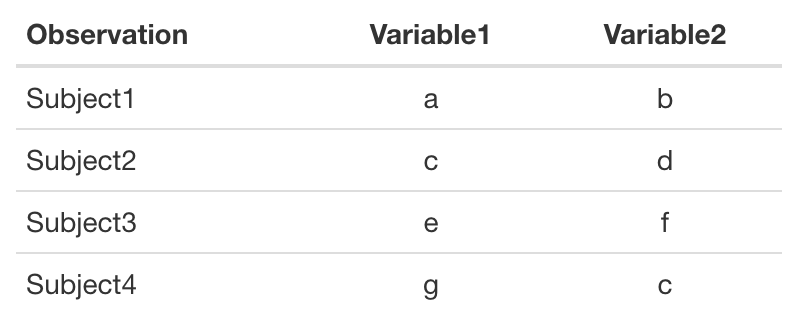
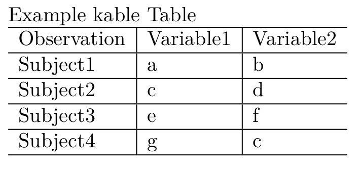

# Showing Results with Tables {#TablesChapter}

Graphs and other visual methods, discussed in the next chapter, can
often be more effective ways to present descriptive and inferential
statistics than tables.[^chapter_9_1] Nonetheless, tables of parameter estimates,
descriptive statistics, and so on can sometimes be important tools for
describing your data and presenting research findings. See
[@ehrenberg1977] and [@gelman2011tables] for information on creating
tables for effective communication.

Learning how to dynamically connect statistical results with tables in
your presentation documents aids reproducibility and can ultimately save
you a lot of time. Manually typing results into tables by hand is
tedious, not very reproducible, and can introduce errors.[^chapter_9_2] It's
especially tedious to retype tables to reflect changes you made to your
data and models. Fortunately, you don't actually need to create tables
by hand. There are many ways to have R do the work for you.

The goal of this chapter is for you to learn how to dynamically create
tables for your presentation documents written in LaTeX and Markdown. We
will first learn the simple *knitr*/*rmarkdown* syntax we need to
dynamically include tables created from R objects. Then we will learn
how to actually create the tables. There are a number of ways to turn R
objects into tables that can be dynamically included in LaTeX or
Markdown/HTML markup. In this chapter we mostly focus on three tools for
creating tables: the `kable()`\index{R function!kable} function from *knitr*, the *xtable*
package, and the *texreg* package [@R-texreg]. `kable()` can create tables
from data frames for both LaTeX and Markdown/HTML documents. *xtable*
does the same, but is much more customizable. *texreg* produces
publication-quality tables from objects containing statistical model
results--model objects. It allows you to combine results from multiple
models into one table. Unfortunately *texreg* is less flexible with
objects of classes it does not support.[^chapter_9_3]

**Warning:** Automating table creation removes the possibility of adding
errors to the presentation of your analyses by incorrectly copying
output, a big potential problem in hand-created tables. However, it is
not error-free. You could easily create inaccurate tables with coding
errors. So, as always, it is important to 'eyeball' the output. Does it
make sense? If you select a couple values in the R output, do they match
what is in the presentation document's table? If not, you need to go
back to the code and see where things have gone wrong. With that caveat,
let's start making tables.

## Basic *knitr* Syntax for Tables {#ResultsOptions}

The most important `knitr` *rmarkdown* chunk option for showing tables
is `results`. The `results` option can have one of four
values:\index{knitr option!results}

-   `'hide'`,

-   `'asis'`,

-   `'markup'`,

-   `'hold'`.

The value `hide` clearly hides the results of your code chunk from your
presentation document. `hold` collects all of the output and prints it
at the end of the chunk. To include tables created from R objects in
your LaTeX or Markdown output you should set `results='asis'` or
`results='markup'`. `asis` is the simplest option as it writes the raw
markup form of the table into the presentation document, not as a
highlighted code chunk, but as markup. It is then compiled as table
markup with the rest of the document. `markup` uses an output hook to
mark up the results in a predefined way. In this chapter we will work
with examples using the `asis` option.[^chapter_9_4]

## Table Basics

Before getting into the details of how to create tables from R objects
we need to first learn how generic tables are created in LaTeX and
Markdown/HTML. If you are not familiar with basic LaTeX or Markdown
syntax you might want to skip ahead to chapters \@ref(LatexChapter) and
\@ref(MarkdownChapter), respectively, before coming back to learn
about making tables in these languages.

### Tables in LaTeX {#LaTeXTables}

Tables in LaTeX are usually embedded in two environments: the `table`\index{LaTeX!table}
and `tabular`\index{LaTex!tabular} environments. What is a LaTeX environment in general?

A LaTeX environment is a part of the markup where special commands are
executed. A simple environment is the `center`\index{LaTeX!centre} environment.[^chapter_9_5]
Everything typed in a center environment is, unsurprisingly, centered.
Typing:

```
\begin{center}
    This is a center environment.
\end{center}
```

creates the following text in the P_df output:

\begin{center}
    This is a center environment.
\end{center}

LaTeX environments all follow the same general syntax:

```
\begin{ENVIRONMENT_NAME}
    ...
    ...
\end{ENVIRONMENT_NAME}
```

You do not have to indent the contents of an environment. Indentations
neither affect how the document is compiled nor show up in the final
P_df.[^chapter_9_6] It is conventional to indent them, however, because it makes
the markup easier to read.

In this chapter we will learn about two types of environments you need
for tables in LaTeX. The `tabular` environment allows you to format the
content of a table. The `table` environment allows you to format a
table's location in the text and its caption.

#### The `tabular` environment {-}

The `tabular`\index{LaTeX!tabular} environment allows you to create tables in LaTeX. Let's
work through the basic syntax for a simple table.[^chapter_9_7]

To begin a simple tabular environment type
`\begin{tabular}{TABLE_SPEC}`. The `TABLE_SPEC` argument allows you to
specify the number of columns in a table and the alignment of text in
each column. For example, to create a table with three columns, the
first of which is left-justified and the latter two center-justified we
type:

```
\begin{tabular}{l c c}
```

The `l` argument creates a left-justified column, `c` creates a centered
one. If we wanted a right-justified column we would use `r`.[^chapter_9_8] Finally, we can add a horizontal line between columns by adding a vertical bar
`|` between the column arguments.[^chapter_9_9] For example, to place a vertical
line between the first and second column in our example table we would
type:

```
\begin{tabular}{l | c c}
```

Now let’s enter content into our table. We saw earlier how CSV files
delimit individual columns with commas. In LaTeX’s `tabular`
environment, columns are delimited with ampersands (`&`).[^chapter_9_10]\index{LaTeX!amersand} In CSV
tables, new lines are delimited by starting a new line. In LaTeX tables
you use two backslashes (`\\`).[^chapter_9_11] Here is a simple example of the first two lines of a table:

```
\begin{tabular}{l | c c}
    Observation & Variable1 & Variable2 \\
    Subject1 & a & b \\
```

It is common to demarcate the row with a table’s column names–the first
row–with horizontal lines. A horizontal line also often visually
demarcates a table’s end. You can add horizontal lines in the `tabular`
environment with the `\hline` command.

```
\begin{tabular}{l | c c}
    \hline
    Observation & Variable1 & Variable2 \\
    \hline \hline
    Subject1 & a & b \\
    \hline
```

Finally, we close the `tabular` environment with `\end{tabular}`. The
full code (with a few extra rows added) is:

```
\begin{tabular}{l | c c}
    \hline
    Observation & Variable1 & Variable2 \\
    \hline \hline
    Subject1 & a & b \\
    Subject2 & c & d \\
    Subject3 & e & f \\
    Subject4 & g & h \\
    \hline
\end{tabular}
```
This produces the following table:

\begin{tabular}{l | c c}
    \hline
    Observation & Variable1 & Variable2 \\
    \hline \hline
    Subject1 & a & b \\
    Subject2 & c & d \\
    Subject3 & e & f \\
    Subject4 & g & h \\
    \hline
\end{tabular}

#### The `table` float environment {- #POSITIONSPEC}

\index{LaTeX!table}

You might notice that the table we created so far lacks a title and is
bunched very closely to the surrounding text. In LaTeX we can create a
`table` float environment to solve this problem. Float environments
allow us to separate a table from the text, specify its location, and
give it a caption.[^chapter_9_16] To begin a `table` float environment use
`\begin{table}[POSITION_SPEC]`. The argument allows us to determine the location of the table. It can be set
to `h` for here, i.e. where the table is written in the text. It can
also be `t` to place it on the top of a page or `b` for the bottom of
the page. To set a title for the table use the `\caption` command.\index{LaTeX!caption} LaTeX
automatically determines the table's number, so you only need to enter
the text. You can also declare a cross-reference key for the table with
the `\label` command.[^chapter_9_17] A `table` environment is Of course, closed
with `\end{table}`. Let's see a full example.

```
\begin{table}[t]
    \caption{Example Simple LaTeX Table}
    \label{ExLaTeXTable}
    \begin{center}
        \begin{tabular}{l | c c}
            \hline
            Observation & Variable1 & Variable2 \\
            \hline \hline
            Subject1 & a & b \\
            Subject2 & c & d \\
            Subject3 & e & f \\
            Subject4 & g & h \\
            \hline
        \end{tabular}
    \end{center}
\end{table}
```

\begin{table}[t]
    \caption{Example Simple LaTeX Table}
    \label{ExLaTeXTable}
    \begin{center}
        \begin{tabular}{l | c c}
            \hline
            Observation & Variable1 & Variable2 \\
            \hline \hline
            Subject1 & a & b \\
            Subject2 & c & d \\
            Subject3 & e & f \\
            Subject4 & g & h \\
            \hline
        \end{tabular}
    \end{center}
\end{table}

Notice that the `tabular` environment is further nested in the `center`
environment.\index{LaTeX!center} This centers the table while leaving the table's title
left-justified. The final result is Table \@ref(ExLaTeXTable). One final tip: to have the caption placed at
the bottom rather than the top of the table in the final document,
simply put the `caption` command after the `tabular` environment is
closed.

You can see how typing out a table in LaTeX gets very tedious very fast.
For all but the simplest tables it is best to try to have R do the
table-making work for you.

### Tables in Markdown/HTML

Now we will briefly look at the syntax for creating simple Markdown and
HTML tables before turning to learn how to have R create these tables
for us.

#### Markdown tables {-}

Markdown table syntax, as with all Markdown syntax, is generally much
simpler than LaTeX's tabular syntax. The markup is much more human
readable. Nonetheless, larger tables can still be tedious to create.

You do not need to declare any new environments to start creating a
Markdown table. Just start typing in the content. Columns are delimited
in Markdown tables with a vertical bar (`|`). Rows are started with a
new line. To indicate the head of the table--usually the row(s)
containing the column names--separate it from the body of the table with
a row of dashes (e.g. `----`). Here is an example based on the table we
created in the previous section:

````markdown
Observation | Variable1  | Variable2
----------- | ---------- | ---------
Subject1    | a          | b
````

Note that it is not necessary to line up the vertical bars. You just
need to have the same number of them on each row.

You can specify each column's text justification using colons on the
dashed row. For example, this code will create the left-center-center
justified formatted table we made earlier:

````markdown
Observation | Variable1 | Variable2
:---------- | :-------: | :-------:
Subject1    | a         | b
Subject2    | c         | d
Subject3    | e         | f
Subject4    | g         | c
````

To create a left-justified column simply use a colon on only the left
side of the dashes.

The ultimate look of a Markdown table is highly dependent on the CSS
style file you are using (see Chapter
\@ref(MarkdownChapter) for how to change your CSS style file). The
default RStudio CSS style as of late 2014 formats our table to look like
this:



Using a different CSS style file[^chapter_9_18] we can get something like this:


In basic Markdown you can add a caption with the heading syntax (see
Section \@ref(MarkdownHeader)). In this example the three hashes (`###`)
create the header:

````markdown
### Example Simple Markdown Table
Observation | Variable1 | Variable2
:---------- | :-------: | :-------:
Subject1    | a         | b
````

producing something like this:


#### HTML tables {-}

The `texreg()`\index{R function!texreg} function that we will learn in the next section doesn't create tables formatted with Markdown syntax. It can create tables with HTML syntax. This is useful for us because virtually any HTML markup can be incorporated into a Markdown document. In fact, Markdown table syntax
is only a stepping stone for more easily producing tables with HTML
syntax. So it is useful to also understand the basic syntax for HTML
tables.

HTML uses element "tags"\index{HTML!tags} to begin and end tables. The main element we
use to create tables is, well, the `tables` element. This is very
similar to LaTeX's `tabular` environment. An HTML element generally
begins with a start tag and ends with an end tag. Clearly this is very
similar to LaTeX's `\begin{}` and `\end{}` commands. Begin tags are
encapsulated in a greater-than and less-than sign and include the
element tag name (`<TAG>`). End tags are similar, but include a forward
slash like this `</TAG>`. The content of the element goes between the
start and end tags. For example:

````html
<table>
    . . .
    . . .
</table>
```

As in LaTeX you are not required to tab the content of a table element;
however, it does make the markup document easier to read and, as the
number of tags proliferates, easier to write.

You can specify element attributes inside of start tags.[^chapter_9_19] For
example, to add a border to the table use: `<table border="1">`.[^chapter_9_20]\index{HTML!table border}

Table rows are put inside of `tr` (table rows) element tags. Individual
cells are delimited with `td` (standard cell) tags. Here is what the
first row of our example table looks like in basic HTML:

````html
<table>
    <tr>
        <td>Observation</td> <td>Variable1</td> <td><Variable2/td>
    </tr>
````

We can further delimit a table's header row(s) from its body with the
`thead`\index{HTML!thead} and `tbody`\index{HTML!tbody} tags. Finally, before making a full table it's
useful to mention that table captions can be included with `caption`
tags.\index{HTML!caption} Let's put this all together:

````html
<table>
    <thead>
        <tr>
            <td>Observation</td> <td>Variable1</td> <td>Variable2</td>
        </tr>
    </thead>
    <tbody>
        <tr>
            <td>Subject1</td> <td>a</td> <td>b</td>
        </tr>
        <tr>
            <td>Subject2</td> <td>c</td> <td>d</td>
        </tr>
        <tr>
            <td>Subject3</td> <td>e</td> <td>e</td>
        </tr>
        <tr>
            <td>Subject4</td> <td>f</td> <td>f</td>
        </tr>
    </tbody>
</table>
````

As with Markdown tables, the ultimate appearance of the table is highly
dependent on the style files you use.

## Creating Tables from Supported Class R Objects

Just as the `write.csv()`\index{R function!write.csv} function turns an R data frame into a CSV
formatted text file, there are a number of methods in R to take an
object--e.g. a matrix, data frame--the output from a statistical
analysis, and so on--and turn them into LaTeX and HTML tables. `kable()`,
*xtable*, and *texreg* each work most easily with specific object
classes that their designers explicitly supported.

### `kable` for Markdown and LaTeX

\index{R function!kable|(}

`kable()` easily converts matrices and data frames into tables for
Markdown, HTML, and LaTeX among others. Let's create a simple data
frame:

```{r Ch9kable_df}
library(knitr)

kable_ex <- data.frame(
            Observation = c("Subject1", "Subject2",
                            "Subject3", "Subject4"),
            Variable1 = c("a", "c", "e", "g"),
            Variable2 = c("b", "d", "f", "c")
)
```

Then simply place this data frame into a `kable()` call:

```{r Ch9kableBasic}
kable(kable_ex, caption = "Example kable Table")
```

This creates the following table:



Beyond setting the tables caption with `caption`, there are a few other
alterations that can be made with `kable` arguments. You can specify new
column and row names by passing character vectors to `col.names` and
`row.names`, respectively. These are very useful as it can be difficult,
or at least irritating, for your readers to try to decode the names you
give to your data frame rows and columns in R. Another useful argument
is `digits`. This will round numbers in the table to a specified number
of digits after the decimal place. To effectively convey your results
you should *at the least* only include digits that are significant in
that they meaningfully vary in the data [@ehrenberg1977 281].

You can also change the markup language that the table is created in
using the `format` argument. For example, to create a LaTeX formatted
table use `format = 'latex'`. In general, you do not need to specify the
format if you are using *knitr* or *rmarkdown* to include the table in a
presentation document. This will be done automatically.

\index{R function!kable|)}

### *xtable* for LaTeX and HTML

\index{R function!xtable|(}

While `kable()` allows you to quickly create simple tables, it can only do
so from matrices and data frames. It also has limited customizability.
The *xtable* package can create more customizable tables from a wider
variety of R objects, including statistical model objects.

Different R statistical model estimation commands can produce model
objects of different classes. For example, the `lm()`\index{R function!lm} (linear model) function creates model summaries of the `lm` class. Let's create a simple linear regression using the *swiss* data frame and `lm()`. This
data frame is included with R by default. The simple linear regression
model we are going to make has the *swiss* variable **Examination** as
the dependent variable and **Education** as the only independent
variable.[^chapter_9_21]

```{r Ch9SimpleSwissRegression}
# Fit simple linear regression model
M1 <- lm(Examination ~  Education, data = swiss)

# Show M1 class
class(M1)
```

By using the `class` function we can see that *M1* is of the `lm` class.
*M1* contains items estimated by the linear regression model[^chapter_9_22] such
as the coefficient estimates and their standard errors. To get a summary
of a model object's contents use the `summary()`\index{R function!summary} function like this:

```{r Ch9SimpleSwissSummary}
summary(M1)
```

To find a full list of object classes that *xtable* supports, type
`methods(xtable)`\index{R function!methods} into the R Console after you have loaded the package.

##### *xtable* for LaTeX

Let's look at how to create LaTeX tables with *xtable* by creating a
table summarizing the estimates from the *M1* model object.

```
<<results=asis, echo=FALSE>>=
library(xtable)

# Create LaTeX table from M1 and show the output markup
xtable(M1, caption = "Linear Regression,
       Dependent Variable: Exam Score",
       label = "BasicXtableSummary",
       digits = 1)
@
```

When included in an R Sweave-style LaTeX document, this code will create
a table exactly like Table \@ref(BasicXtableSummary).

Let's go through this code, working from the outside in. First you'll
notice that we've set two *knitr* code chunk options. As we discussed
earlier, `results='asis'`\index{knitr option!results} allows us to include the LaTeX formatted table
created by *xtable*. The next option `echo=FALSE`\index{knitr option!echo} hides the code from being shown in our final document. The *xtable* function creates the
summary table of our *M1* model object. Not only does it produce both
complete `tabular` and `table` environments,\index{LaTeX!tabular}\index{LaTeX!table} but also through the
`caption` and `label` arguments it automatically adds in the table's
title and cross-reference label, respectively. Finally, notice that I
added the `digits = 1` argument. As in `kable`, this specifies that I
want numbers in the table to be rounded to one decimal digit.

```{r Ch9xtableSummaryPrint, results='asis', echo=FALSE}
library(xtable)

# Create LaTeX table from M1 and show the output markup
xtable(M1,
       caption = "Linear Regression, Dependent Variable: Exam Score",
       label = "BasicXtableSummary",
       digits = 1)
```

##### *xtable* for Markdown/HTML

We can use *xtable* and the `print.xtable` function[^chapter_9_23] to also create tables for Markdown and HTML documents. The *xtable* function produces,
unsurprisingly, `xtable` class objects. We can run these through the
`print()`\index{R function!print} function and add arguments to customize how the table is
formatted. By default, `print.xtable()`'s\index{R function!print.xtable} `type` argument is set to
`"latex"`. To create an HTML table that can be inserted into Markdown
and HTML documents, set the `type` argument from `"latex"` to `"html"`.
For example, to create an HTML version of the table summarizing *M1* and
include it in an R Markdown document we type:

````r
`r ''````{r, results=asis, echo=FALSE}
library(xtable)

# Create an xtable object from M1
m1_table <- xtable(M1, caption = "Linear Regression, Dependent Variable: Exam Score",
                label = "BasicXtableSummary",
                digits = 1)

# Create HTML summary table of m1_table
print.xtable(m1_table, type = "html", caption.placement = "top")
```
````

If you intend to include multiple tables in your R Markdown document you
will want to set all of the tables to be printed in HTML. You can place
`options("xtable.type" = "html")` in a code chunk near the beginning of
your document.[^chapter_9_24] This simply makes it so that you don't need to
include `type = "html"` every time you use `print`.

Notice in the previous code example that we also added the
`caption.placement = "top"` argument. This will move the caption from
the bottom of the table, as it is in Table \@ref(BasicXtableSummary) \@ref(BasicXtableSummary), to the top. See the *xtable* package
documentation[^chapter_9_25] for the full list of `print.xtable()` options.

\index{R function!xtable|)}

### *texreg* for LaTeX and HTML

`kable()` and *xtable* are limited when it comes to creating tables from
statistical model objects. `kable` only works with matrices and data
frames. *xtable* is easiest when working with only one model object at a
time. Furthermore, by default these tools do not create output tables
that present estimates from multiple statistical models in the style
used by many prominent academic journals. The *texreg* package is very
useful for creating these types of tables. It also supports more model
object types than *xtable*.

##### *texreg* for LaTeX

Imagine we want to show the estimates from a number of nested regression
models in LaTeX a table like Table \@ref(Basic_texregTable). For example, to estimate nested
regression models from the remaining variables in the *swiss* data set
we would type:

```{r Ch9EstimateNested}
# Estimated nested regression models
M2 <- lm(Examination ~ Education + Agriculture, data = swiss)

M3 <- lm(Examination ~ Education + Agriculture + Catholic,
            data = swiss)

M4 <- lm(Examination ~ Education + Agriculture + Catholic +
            Infant.Mortality, data = swiss)

M5 <- lm(Examination ~ Education + Agriculture + Catholic +
            Infant.Mortality + Fertility, data = swiss)
```

##### *xtable* for LaTeX

We can now include these model objects in one LaTeX table with *texreg*.
Remember to include `results='asis'` in the code chunk head.

```{r Ch9BasictexregTable1Display, echo=TRUE, eval=FALSE, message=FALSE}
library(texreg)

# Create custom coefficient names
cust_coef <- c('(Intercept)', 'Education', 'Agriculture',
               'Catholic', 'Infant Mortality', 'Fertility')

# Create nested regression model table
texreg(list(M1, M2, M3, M4, M5),
    caption = 'Nested Estimates Table with \\emph{texreg}',
    caption.above = TRUE,
    label = 'Basic_texregTable',
    custom.coef.names = cust_coef)
```

```{r Ch9BasictexregTable1Create, echo=FALSE, results='asis'}
library(texreg)

# Create custom coefficient names
cust_coef <- c('(Intercept)', 'Education', 'Agriculture',
               'Catholic', 'Infant Mortality', 'Fertility')

# Create nested regression model table
texreg(list(M1, M2, M3, M4, M5),
       caption = 'Nested Estimates Table with \\emph{texreg}',
       caption.above = TRUE,
       label = 'Basic_texregTable',
       custom.coef.names = cust_coef)
```

Notice that we placed the model objects in a list when we called
`texreg()`. `texreg()` automatically created the `table` and `tabular`
environments\index{LaTeX!tabular}\index{LaTeX!table} and by default centers the table.[^chapter_9_26] We added a caption
and reference label with the `caption` and `label` arguments,
respectively. By default, the caption is placed below the table, so we
used `caption.above = TRUE` to place it on top. Finally, we created
custom coefficient names with `custom.coef.names` that are a bit tidier
than the variable names in our R dataset. Your readers will appreciate
easily discernible coefficient names.

In the LaTeX caption you'll notice `\\emph{texreg}`. In LaTeX the `emph`
command italicizes text (we'll see this again in Chapter \@ref(LatexChapter)). We added an additional escape character `\`
so that R would not try to interpret the `e` and instead feed it to
LaTeX. By default, `texreg` uses `stars = c(0.001, 0.01, 0.05)` to
determine at what p-values to display statistical significance stars.
This is the same as the `lm` model summary default showing three sets of
statistical significance stars. You can define the significance levels
by assigning a different numeric vector to the `stars` argument.

There are many other changes you can make to tables created with
*texreg*. You can change the column and coefficient names, determine
what type of standard errors to show, and so on. For the full list of
arguments, see the help file by typing `?texreg` into your R Console.

#### *texreg* for HTML {-}

You can also use the *texreg* package to create tables in Markdown/HTML
documents. Instead of the `texreg` function, use `htmlreg`. The syntax
is largely similar, though arguments relating to LaTeX are not
available, while others relating the HTML are. Here is a simple example
creating Table \@ref(Basic_texregTable) in an HTML document:

```{r Ch9htmlreg, eval=FALSE, echo=TRUE}
htmlreg(list(M1, M2, M3, M4, M5),
        caption = 'Nested Estimates Table in HTML Document',
        caption.above = TRUE, custom.coef.names = cust_coef)
```

Notice that we did not include the `label` argument as this is not
available in HTML. The resulting table looks like this:


### Fitting Large Tables in LaTeX

Sometimes you may have large tables that are difficult to fit onto a
page in LaTeX. There are a number of ways to adjust tables so that they
fit on the page.

#### LaTeX landscape tables {-}

If your LaTeX table is very wide, e.g. because it shows results from
many estimation models, you can use LaTeX's `lscape` package to create
`landscape`\index{LaTeX!landscape} formatting environments. Rather than orienting the text of a page so that it is in profile (a long page), a `landscape` environment turns it 90 degrees so that it has a landscape orientation (a wide
page).

To use the *lscape*\index{LaTeX package!lscape} package, first place `\usepackage{lscape}` in your
LaTeX document's preamble. Then begin a `landscape` environment with
`\begin{landscape}` where you would like it located in the text. Then
place the `table` environment information and *knitr* code for creating
the table. Finally, close the `landscape` environment with
`\end{landscape}`.

#### LaTeX scalebox for tables {-}

In addition, the `scalebox` command from the *graphics*\index{LaTeX package!graphics} package could be
useful for fitting large tables onto a P_df page. This command expands or
shrinks the text in the table. `texreg` actually has a `scalebox`
argument. If you use `scalebox = 0.5` it will halve the size of the
table; `scalebox = 2` doubles it.

More generally, to rescale a table use:

`\scalebox{HORIZONTAL_SCALE}``[``VERTICAL_SCALE``]``{TABLE}`

`HORIZONTAL_SCALE` is how much to scale the table horizontally.
`VERTICAL_SCALE` is how much to scale vertically and `TABLE` is the
table or R code chunk to create the table.

### *xtable* with non-supported class objects {#NonSupportedClasses}

The `kable`, *texreg*, and *xtable* packages are very convenient for
model objects they know how to handle. With supported class objects the
functions in these packages know where to look for the vectors
containing the things--coefficient names, standard errors, and so
on--that they need to create tables. With unsupported classes, however,
they don't know where to look for these things. Luckily, there is a work
around. You tell `xtable` where to find elements you want to include in
your table. `xtable` can handle matrix and data frame class objects. The
rows of these objects become table rows and the columns become the table
columns. So, to create tables with non-supported class objects you need
to:

1.  find and extract the information from the unsupported class object that you want in the table,

2.  convert this information into a matrix or data frame where the rows
    and columns of the object correspond to the rows and columns of the
    table that you want to create,

3.  use *xtable* with this object to create the table.

Imagine that you want to create a results table showing the covariate
names, coefficient means, and quantiles for marginal posterior
distributions estimated from an linear regression using the *brms*
package [@R-brms] and data from the *swiss* data frame. Let's fit the
model:

```{r Ch9MCMC, message=FALSE, warning=FALSE, tidy=FALSE, echo=TRUE, cache=TRUE}
library(brms) 

# Fit model
linear_brms <- brm(Examination ~ Education,
                   data = swiss,
                   family = gaussian(link = "identity"),
                   refresh = 0)

# Find linear_brms's class
class(linear_brms)
```

Note: I included `refresh = 0` to suppresses output about the model fitting process. 

Using the `class` function we see that the model output object in
*linear_brms* is of the `brmsfit` class. This class is not supported by
*xtable*. If you try to create a table summarizing the estimates in
*linear_brms_table* you will get the following error:

```{r Ch9BadTable, dependson=-1, error=TRUE, message=FALSE}
library(xtable)

# Attempt to create a table with linear_brms
linear_brms_table <- xtable(linear_brms)
```

With unsupported class objects you have to create the summary yourself
and extract the elements that you want from it manually. A good
knowledge of vectors, matrices, and component selection is very handy
for this (see Chapter \@ref(GettingStartedRKnitr)).

First, create a summary of your output object *linear_brms*:

```{r Ch9MCMCSummary, echo=TRUE, dependson=-2}
linear_brms_summary <- summary(linear_brms)
```

This creates a new object of the class `brmssummary`. We're still not
there yet as this object contains not just the covariate names and so on
but also information we don't want to include in the results table, like
the estimation formula. The second step is to extract a matrix from
inside *linear_brms_summary* called *summary* with the component
selector (`$`). Remember that to find the components of an object use
the `names` command.

```{r Ch9MCMCSummaryNames, echo=TRUE}
names(linear_brms_summary)
```

The *fixed* matrix is where the things we want in our table are located.
I find it easier to work with data frames, so let's also convert the
matrix into a data frame.

```{r Ch9NBSum, echo=TRUE}
linear_brms_summary_df <- data.frame(linear_brms_summary$fixed)
```

Here is what the model summary data frame looks like:

```{r Ch9NBSumDisplay, echo=TRUE}
linear_brms_summary_df
```

Now we have a data frame object *xtable* can handle. After a little
cleaning up (see the chapter's Appendix for more details) you can use *xtable* as before to create Table \@ref(CoefEstTable).

```{r Ch9NBTable, echo=FALSE, message=FALSE, results='asis'}
library(dplyr)

# Change posterior summary variable names
linear_brms_summary_df <- rename(linear_brms_summary_df, 
                                 `2.5%` = `l.95..CI`)
linear_brms_summary_df <- rename(linear_brms_summary_df, 
                                 `50%` = Estimate)
linear_brms_summary_df <- rename(linear_brms_summary_df, 
                                 `97.5%` = `u.95..CI`)

# Reorder variables and remove the Est. Error
linear_brms_summary_df <- linear_brms_summary_df[, 
                            c("2.5%", "50%", "97.5%")]

# Create table
xtable(linear_brms_summary_df,
       caption = "Coefficient Estimates Predicting
                  Examination Scores in Swiss Cantons
                  (1888) Found Using Bayesian Linear Regression",
       label = "CoefEstTable")
```

It may take some hunting to find what you want, but a similar process
can be used to create tables from objects of virtually any class.[^chapter_9_27]
Hunting for what you want can be easier if you look inside of objects by
clicking on them in RStudio's tab.

### Creating variable description documents with *xtable* {#Vardescript_tables}

You can use *xtable* to create a table describing variables in your data
set and insert these into Markdown documents created with the
concatenate and print (`cat`) command (see Section \@ref(catR)). This is
useful because our data so far has been stored in plain-text files.
Unlike binary Stata or SAS data files, plain-text data files do not
include variable descriptions.

Imagine that we want to create a Markdown file with a table describing
the variables from the *swiss* data frame. First we will create two
vectors: one for the variable names and the other for the variable
descriptions.

```{r Ch9VarDescriptVect, tidy=FALSE, echo=TRUE}
# Create variable vector from column names
Variable <- names(swiss)

# Create variable description vector
Description <- c("common standardized fertility measures",
            "% of males involved in agriculture as occupation",
            "% draftees receiving highest mark on army examination",
            "% education beyond primary school for draftees",
            "% catholic",
            "% live births who live less-than 1 year"
)
```

In the first line we use the `names` command to create a vector of the
*swiss* data frame's column names. Then we simply create a vector of
descriptions with the combine function (`c()`).\index{R function!c} Now we can combine these vectors into a matrix and use it to create an HTML table.

```{r Ch9CbindDescript, results='hide'}
# Combine Variable and Description variables into a matrix
descriptions_bound <- cbind(Variable, Description)

# Create an xtable object from descriptions_bound
descriptions_table <- xtable(descriptions_bound)

# Format table in HTML
descript_table <- print.xtable(descriptions_table, type = "html")
```

Finally, we can use `cat()`\index{R function!cat} to create our Markdown variable description file.

```{r Ch9Cat, tidy=FALSE, eval=FALSE}
# Create variable description file
cat("# Swiss Data Variable Descriptions \n",
    "### Source: Mosteller and Tukey, (1977) \n",
    descript_table,
    file = "swiss-variable-descriptions.md"
)
```

The first part of the `cat()` function\index{R function!cat} here is the title of the document. As we will see in Chapter
\@ref(MarkdownChapter), hashes (`#`) create headers. `\n`
creates a new line in the Markdown document. The next line is
information on the *swiss* data frame's source. We then include the HTML
table in the *descript_table* object and save it to a file called
*swiss-variable-descriptions.md*.

It is convenient to simply include the creation of this table in your
data gathering makefiles and have it saved into the same directory as
your data. This way it will be easy to update as you update your data
and easy to find. If you are storing your data on GitHub it will
automatically render the variable description Markdown file and make it
easy for others to read. See this book's makefile example for more
information: <https://bit.ly/2UtvOys>.[^chapter_9_28]

### Chapter summary {-}

In this chapter we have learned how to take the results from our
statistical analyses and other information from our data and dynamically
present it in LaTeX and Markdown documents with *knitr*/*rmarkdown*. In
the next chapter we will do the same thing with figures.

## Appendix {-}

Source code for cleaning *linear_brms_summary_df* and using it to create a
LaTeX table:

```{r Ch9NBSumClean, eval=FALSE, tidy=FALSE}
library(dplyr)
library(xtable)

# Change posterior summary variable names
linear_brms_summary_df <- rename(linear_brms_summary_df, `2.5%` = `l.95..CI`)
linear_brms_summary_df <- rename(linear_brms_summary_df, `50%` = Estimate)
linear_brms_summary_df <- rename(linear_brms_summary_df, `97.5%` = `u.95..CI`)

# Reorder variables and remove the Est. Error
linear_brms_summary_df <- linear_brms_summary_df[, 
                                                 c("2.5%", "50%", "97.5%")]

# Create table
xtable(linear_brms_summary_df,
    caption = "Coefficient Estimates Predicting
    Examination Scores in Swiss Cantons (1888)
    Found Using Bayesian Linear Regression",
    label = "CoefEstTable")

# Create table
xtable(linear_brms_summary_df,
    caption = "Coefficient Estimates Predicting
    Examination Scores in Swiss Cantons (1888)
    Found Using Bayesian Normal Linear Regression")
```

Note that the new variable names are in quotation marks, in contrast to
the example from Chapter \@ref(DataClean).
The quotation marks allow us to specify a name that begins with a number
and has special characters like the percent sign.

[^chapter_9_1]: This is especially true of the small-print, high-density
    coefficient estimate tables that are sometimes descriptively called
    'train schedule' tables.

[^chapter_9_2]: For example, in a replication of Reinhart and Rogoff's much cited
    [-@rr2010] study of economic growth and public debt, [@herndon2014]
    found a number of apparent transcription errors. Analysis results in
    the original spreadsheets appear to not have been entered into the
    paper's tables accurately.

[^chapter_9_3]: These are not the only packages available in R for creating
    presentation document tables from R objects. I personally really
    like the *stargazer* package [@R-stargazer]. It has a similar syntax
    to *texreg* and is particularly good for showing results from
    multiple models estimated using different model types in one table.

[^chapter_9_4]: Note that the `results` option is a major difference in syntax
    between *knitr* and *Sweave*. In *Sweave* the equivalent option is
    `results=TEX`.

[^chapter_9_5]: For a comprehensive list of LaTeX environments see:
    <http://latex.wikia.com/wiki/List_of_LaTeX_environments>.

[^chapter_9_6]: An aside: the `tabbing` environment is a useful way to create
    tabbed text in LaTeX. We don't cover this here though.

[^chapter_9_7]: For a comprehensive overview, see the LaTeX Wiki page on tables:
    <http://en.wikibooks.org/wiki/LaTeX/Tables>.

[^chapter_9_8]: You can also specify a column's width by using `m{WIDTH}` instead.
    Be sure to load the *array* package\index{LaTeX package!array} in the preamble for this to
    work. Using `m` will create a column of a specified width that is
    vertically justified in the middle. For example, `m{3cm}` would
    create a column with a width of 3 centimeters. Text in the column
    would automatically be wrapped onto multiple lines if need be. You
    can replace the `m` with either `p` or `b`. `p` vertically aligns
    the text at the top, `b` aligns it at the bottom.

[^chapter_9_9]: If you add two vertical bars (`||`) you will get two lines.

[^chapter_9_10]: If you want to include an ampersand in the text of your LaTeX
    document you need to escape it like this: `\&`.

[^chapter_9_11]: You can use two backslashes outside of the `tabular` environment
    as well to force a new line. Also, to increase the space between the
    line you can add a vertical width argument to the double
    backslashes. For example, `\[3cm]` will give you a 3-centimeter gap
    between the current line and the next one.

[^chapter_9_12]: You can also specify a column's width by using `m{WIDTH}`
    instead. Be sure to load the *array* package in the preamble for
    this to work. Using `m` will create a column of a specified width
    that is vertically justified in the middle. For example, `m{3cm}`
    would create a column with a width of 3 centimeters. Text in the
    column would automatically be wrapped onto multiple lines if need
    be. You can replace the `m` with either `p` or `b`. `p` vertically
    aligns the text at the top, `b` aligns it at the bottom.

[^chapter_9_13]: If you add two vertical bars (`||`) you will get two lines.

[^chapter_9_14]: If you want to include an ampersand in the text of your LaTeX
    document you need to escape it like this: `\&`.

[^chapter_9_15]: You can use two backslashes outside of the `tabular` environment
    as well to force a new line. Also, to increase the space between the
    line you can add a vertical width argument to the double
    backslashes. For example, `\[3cm]` will give you a 3-centimeter gap
    between the current line and the next one.

[^chapter_9_16]: We will see in the next chapter how to use `figure` floats as
    well.

[^chapter_9_17]: This command works throughout LaTeX. To reference the table type
    in the text of your document `\ref{KEY}`, where `KEY` is what you
    set with the `\label` command. Use `\pageref` to reference the page
    number.

[^chapter_9_18]: The table was created using the Upstanding Citizen style from the
    program Marked.

[^chapter_9_19]: These work like arguments in R in that they change how the
    element is evaluated.

[^chapter_9_20]: Whether or not a border appears is determined by whether or not
    the style sheet you are using includes borders.

[^chapter_9_21]: For a description of these variables type `?swiss` into the
    console

[^chapter_9_22]: If you are unfamiliar with the syntax of R statistical estimation
    models the previous code might be confusing. In general 'response'
    ($Y$) variables are written first and are separated from the
    'explanatory' ($X$) variables by a tilde (`\sim`). Crawley
    [-@crawley2005 107] notes that you can read $Y \sim X$ as '$Y$ is
    modeled as a function of $X$'. In later examples we will see that
    individual explanatory variables are generally separated by plus
    signs (`+`), indicating that they are included in the model, not
    that they are added. For more information see Crawley [-@crawley2005
    Ch. 7].

[^chapter_9_23]: Note: you can abbreviate `print.xtable` simply as `print`.

[^chapter_9_24]: Of course, you will probably want to use the `include=FALSE`
    *knitr* option with this code chunk.

[^chapter_9_25]: <http://cran.r-project.org/web/packages/xtable/xtable.pdf>

[^chapter_9_26]: Use the `center = FALSE` argument to override centering. If you
    would like to only create the `tabular` environment use the argument
    `table = FALSE`. Creating your own `table` environment can be useful
    in situations where you want more customizability.

[^chapter_9_27]: This process can also be useful for creating graphics
    as we will see in Chapter \@ref(FiguresChapter).

[^chapter_9_28]: The long URL is:
    <https://github.com/christophergandrud/rep-res-book-v3-examples/tree/master/data>.
