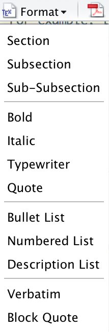

# (PART) Presentation Documents {-}

# Presenting with LaTeX {#LatexChapter}

We have already begun to see how LaTeX works for presenting research
results. This chapter gives you a more detailed and comprehensive
introduction to basic LaTeX document structures and commands. It is not
a complete introduction to all that LaTeX is capable of, but we will
cover enough that you will be able to create an entire well-formatted
article and slideshow with LaTeX that you can use to dynamically present
your results.

For basic LaTeX documents, such as short articles or simple
presentations, it may often be quicker and simpler to write the markup
using an R Markdown document and compile it to PDF with the *rmarkdown*
package. Markdown syntax is much simpler than
normal LaTeX. However, there are at least two reasons why it is useful
to become familiar with LaTeX syntax. First, understanding LaTeX syntax
will help you debug issues you might encounter when using *rmarkdown*
with LaTeX that would otherwise be mysterious if you were only familiar
with Markdown. Second, R Markdown has limited capabilities for creating
more complex documents such as books and documents with highly
customizable formatting needs.[^chapter_11_bookdown] Using *knitr* LaTeX or including LaTeX syntax
directly in you R Markdown documents can be useful in these situations.

In this chapter we will learn about basic LaTeX document structures and
syntax as well as how to dynamically create LaTeX bibliographies with
BibTeX, R, and *knitr*. Finally, we will look at how to create PDF
beamer slideshows.

**Note:** This chapter and the following chapter are unusual for this
book in that they do not refer to knitr and R Markdown interchangeably.
Remember you can  almost always include LaTeX syntax in an R Markdown document, though typically this will only impact the document when it is compiled to PDF.

## The Basics

In this section we look at how to create a LaTeX article including
what editor programs to use, the basic structure of a LaTeX document,
including preamble and body, LaTeX syntax for creating headings,
paragraphs, lines, text formatting, math, lists, footnotes, and
cross-references. I will assume that you already have a fully
functioning TeX distribution installed on your computer. See Section
\@ref(InstallMarkup) for information on how to install TeX.

### Getting started with LaTeX editors

RStudio is a fully functional LaTeX editor in
addition to being an integrated development environment for R. If you
want to create a new LaTeX document you can click in the menu bar then `R` and `R Sweave`.

```{r echo=FALSE, fig.cap='RStudio TeX Format Options', fig.lb='TeXFormat', out.width='2cm', out.height='5cm'}

```

Remember from Chapter \@ref(GettingStartedRKnitr) that R Sweave files are basically
LaTeX files that can include *knitr* code chunks. You can use RStudio to
knit and compile a document with the click of one button: **Compile
PDF**. You can
use this button to compile R Sweave files like regular LaTeX files in
RStudio even if they do not have code chunks. If you use another program
to compile them you might need to change the file extension from *.Rnw* to *.tex*.
You can also insert many of the items we will cover in this section into
your documents with RStudio's LaTeX `TeX Format` button. See the figure above.

There are many other LaTeX editors[^chapter_11_1] and many text editors that can be
modified to compile LaTeX documents. For example, alongside writing this
book in RStudio, I typed much of the LaTeX markup in the Atom[^chapter_11_2] text editor because it was easier to work with a large number of files simultaneously. However, RStudio has by far the best integration with *knitr*.

### Basic LaTeX command syntax

As you probably noticed in Part III's examples, LaTeX commands start
with a backslash (`\`). For example, to create a section heading you use
the `\section` command. The arguments for LaTeX commands are written
inside of curly braces (`{}`) like this:

    \section{My Section Name}

Probably one of the biggest sources of errors that occur when compiling
a LaTeX document to PDF are caused by curly brackets that aren't closed,
i.e. an open bracket (`{`) is not matched with a subsequent closed
bracket (`}`). Watch out for this and use an editor (like RStudio) that
highlights brackets' matching pairs. As we will see, unlike in R with
parentheses, if your LaTeX command does not have an argument you do not
need to include the curly brackets at all.

There are a number of places to find comprehensive lists of LaTeX
commands. The Netherlands TeX users group has compiled one:
<http://www.ntg.nl/doc/biemesderfer/ltxcrib.pdf>.

### The LaTeX preamble and body {#LaTeXPreamble}

All LaTeX documents require a preamble. The preamble goes at the very
beginning of the document. The preamble usually starts with the
`documentclass` command.\index{LaTeX command!documentclass} This specifies what type of presentation
document you are creating--e.g. an article, a book, a slideshow,[^chapter_11_4] and
so on. LaTeX refers to these as classes. Classes specify a document's
formatting. You can add options to `documentclass` to change the format
of the entire document. For example, if we wanted to create an article
class document with two columns we would type:

````latex
\documentclass[twocolumn]{article}
````

In the preamble you can also specify other style options and load  extra packages\index{LaTeX!packages}. The command to load a package in LaTeX is `\usepackage`.\index{LaTeX command!usepackage} For example, if you include `\usepackage{url}` in the preamble of your document you will be able to specify URL links in the body with the command `\url{SOMEURL}`.\index{LaTeX package!url}

The preamble is often followed by the body of your document. It is specified with the `body` environment.\index{LaTeX environment!body} See Chapter \@ref(TablesChapter) for more details about LaTeX environments. You tell LaTeX where the body\index{LaTeX!begin document} of your document starts by typing `\begin{document}`. The very last line of your document is usually `\end{document}`,
indicating that your document has ended. When you open a new R Sweave
file in RStudio it creates an article class document with a very simple preamble and body like this:

````latex
\documentclass{article}

\begin{document}
\SweaveOpts{concordance=TRUE}


\end{document}
````

This is all you need to get a very basic article class document working.[^ch11_concordance]
If you want the document to be of another class, simply change `article`
to something else, a `book` for example.

Let's begin to modify the markup. First we will include in the preamble
the (`hyperref`) for clickable hyperlinks and `natbib` for bibliography
formatting. We will discuss `natbib` in more detail below. Note that in
general, and unlike in R, almost all of the LaTeX packages you will use
are installed on your computer when you installed the TeX distribution.

Next, it's often a good idea to include *knitr* code chunks that specify
features of the document as a whole. These can include global chunk
options as well as loading data and packages used throughout the
document.

Then it's you likely want to specify title information just after the
`document` environment begins. Use the `title` command to add a title,
the `author` command to add author information, and `date` to specify
the date.[^chapter_11_5]\index{LaTeX command!title}\index{LaTeX command!author}\index{LaTeX command!date} Then include the `maketitle` command.\index{LaTeX command!maketitle} This will place your
title and author information in the body of the document. If you are
writing an article you may also want to follow `maketitle` with an
abstract. Unsurprisingly, you can use the `abstract` environment to
include this.\index{LaTeX environment!abstract}

Here is a full LaTeX article class document with all of these changes
added:

````latex
%%%%%%%%%%%%%% Article Preamble %%%%%%%%%%%%%%
\documentclass{article}

%% Load LaTeX packages
\usepackage{url}
\usepackage{hyperref}
\usepackage[authoryear]{natbib}

%% Set knitr global options and gather data
<<Global, include=FALSE>>=
#### Set chunk options ####
knitr::opts_chunk$set(fig.align='center')

#### Load and cite R packages ####
# Create list of packages
packages_used <- c("knitr", "ggplot2", "knitr")

# Load PackagesUsed and create .bib BibTeX file.
# Load packages
lapply(packages_used, library,
        character.only = TRUE)

# Create package BibTeX file
knitr::write_bib(packages_used, file = "packages.bib")

#### Gather Democracy data from Pemstein et al. (2010)
#### # For simplicity, store the URL in an object called 'url'.
url <- "http://www.unified-democracy-scores.org/files/20140312/
z/uds_summary.csv.gz"

# Create a temporary file called 'temp' to put the zip file into.
temp <- tempfile()

# Create a temporary file called 'temp' to put the zip file into.
temp <- tempfile()

# Download the compressed file into the temporary file.
download.file(url, temp)

# Decompress the file and convert it into a data frame
# class object called 'data'.
uds_data <- read.csv(gzfile(temp, "uds_summary.csv"))

# Delete the temporary file.
unlink(temp)
@

%% Start document body
\begin{document}
\SweaveOpts{concordance=TRUE}

%%%%%%%%%%%%% Create title %%%%%%%%%%%%%%%%%
\title{An Example knitr LaTeX Article}
\author{Christopher Gandrud \\
Zalando SE\thanks{Email: \href{mailto:christopher.gandrud@zalando
.de}{christopher.gandrud@zalando.de}}}
\date{August 2019}
\maketitle

%%%%%%%%%%%%% Abstract %%%%%%%%%%%%%%%%%%%%
\begin{abstract}
  Here is an example of a knittable article class LaTeX
  document.
\end{abstract}

%%%%%%%%%%% Article Main Text %%%%%%%%%%%%%
\section{The Graph}

I gathered data from \cite{Pemstein2010} on countries' democracy
level. They call their democracy measure the Unified Democracy
Score (UDS). Figure \ref{DemPlot} shows the mean UDS scores
over time for all of the countries in their sample.

\begin{figure}
  \caption{Mean UDS Scores}
  \label{DemPlot}
<<echo=FALSE, message=FALSE, warning=FALSE, out.width='7cm',
out.height='7cm'>>=
# Graph UDS scores
    ggplot(uds_data, aes(x = year, y = mean)) +
        geom_point(alpha = I(0.1)) +
        stat_smooth(size = 2) +
        ylab("Democracy Score") + xlab("") +
        theme_bw()
@
\end{figure}

%%%%%%%%%%% Reproducing the Document %%%%%
\section*{Appendix: Reproducing the Document}

This document was created using the R version
\Sexpr{paste0(version$major, ".",
version$minor)} and the R package \emph{knitr}
\citep{R-knitr}.

It also relied on the R packages \emph{ggplot2} and
\citep{R-ggplot2}. The document can be completely
reproduced from source files available on GitHub
at: \url{https://github.com/christophergandrud/
rep-res-book-v3-examples}.

%%%%%%%%% Bibliography %%%%%%%%%%%%%%%%%%%%
\bibliographystyle{apa}
\bibliography{main.bib, packages.bib}
\end{document}
````

The *knitr* code chunk syntax should be familiar to you from previous
chapters, so let's unpack the LaTeX syntax from just after the first
code chunk, including the "Create Title" and "Abstract" parts. New
syntax shown in later parts of this example is discussed in the
remainder of this section and the next section on bibliographies.

First, remember that the percent sign (%) is LaTeX's comment character.
Using it to comment your markup can make it easier to read. Second, as
we saw in Chapter
\@ref(TablesChapter), double backslashes (`\\`), like those after
the author's name, force a new line in LaTeX. We will discuss the `emph`
command in a moment.\index{LaTeX command!emph} Third, using the `thanks`\index{LaTeX command!thanks}
command allows us to create a footnote for author contact information[^chapter_11_6] that is not numbered like the other footnotes (see below). Finally, you'll notice
`\href{mailto: . . . .org}}`. This creates an email address in the final
document that will open the reader's default email program when clicked.\index{LaTeX command!href}

You may have noticed the following line:

`\Sexpr{paste0(version$major, ".", version$minor)}`

This code finds the current version of R being used and prints the
version number into the presentation document.\index{LaTeX command!Sexpr}

### Headings

Earlier in the chapter we briefly saw how to create section-level
headings with `section`. There are a number of other sub-section-level
headings including `subsection`, `subsubsection`, `paragraph`, and
`subparagraph`. Headers are numbered automatically by LaTeX.[^chapter_11_7] To have
an unnumbered section, place an asterisk in it like this:
`\section*{UNNUMBERED_SECTION}`. In book class documents you can also
use `chapter` to create new chapters and `part` for collections of
chapters.\index{LaTeX command!section}\index{LaTeX command!subsection}\index{LaTeX command!paragraph}\index{LaTeX command!subparagraph}\index{LaTeX command!chapter}\index{LaTeX command!part}

### Paragraphs and spacing

In LaTeX, paragraphs are simply created by adding a blank line between
lines. It will format all of the tabs for the beginning of paragraphs
based on the document's class rules. As we discussed before, writing
tabs in the markup version of your document does nothing in the compiled
document. They are generally used just to make the markup easier for
people to read.

Note that adding more blank lines between paragraphs will not add extra
space between the paragraphs in the final document. To specify the space
following paragraphs (or almost any line) use the `vspace` (vertical
space) command. For example, to add three centimeters of vertical space
on a page type: `\vspace{3cm}`.\index{LaTeX command!vspace}

Similarly, adding extra spaces between words in your LaTeX markup won't
create extra spaces between words in the compiled document. To add
horizontal space use the `hspace` command in the same way as `vspace`.\index{LaTeX command!hspace}

### Horizontal lines

Use the `hrulefill` command to create horizontal lines in the text of
your document. For example, `\hrulefill` creates:\index{LaTeX command!hrulefill}

---

Inside of a `tabular` environment, use the `hline` command rather than
`hrulefill`.\index{LaTeX environment!tabular}\index{LaTeX command!hline}

### Text formatting

Let's briefly look at how to do some of the more common types of text
formatting in LaTeX and how to create some commonly used diacritics and
special characters.

#### Italics & Bold {-}

To italicize a word in LaTeX use the `emph` (emphasis) command. For bold
use `textbf`. You can nest commands inside of one another to combine
their effect. For example, to ***italicize and bold*** a word use:
`\emph{textbf{italicize and bold}}`.\index{LaTeX command!emph}\index{LaTeX command!textbf}

#### Font size {- #FontSize}

You can specify the base font size of an entire document with a
`documentclass` option. For example, to create an article with 12-point
font use: `\documentclass[12pt]{article}`.

There are a number of commands to set the size of specific pieces of
text relative to the base size. See the following table for the full list. Usually a slightly
different syntax is used for these commands that goes like this:
`{\SIZE_COMMAND . . . }`. For example, to use the tiny size in your text
use: `{\tiny{tiny size}}`.

You can change the size of code chunks that *knitr* places in
presentation documents using these commands. Just place the code chunk
inside of `{\SIZE_COMMAND . . . }`. This is similar to using the `size`
code chunk option.

\begin{table}
    \caption{LaTeX Font Size Commands}
    \label{LaTeXFontSize}
    \begin{center}
        \vspace{0.2cm}
        \begin{tabular}{c}
            {\Huge \texttt{Huge}} \\
            {\huge \texttt{huge}} \\
            {\LARGE \texttt{LARGE}} \\
            {\Large \texttt{Large}} \\
            {\large \texttt{large}} \\
            {\normalsize \texttt{normalsize}} \\
            {\small \texttt{small}} \\
            {\footnotesize \texttt{footnotesize}} \\
            {\scriptsize \texttt{scriptsize}} \\
            {\tiny \texttt{tiny}}
        \vspace{0.2cm}
        \end{tabular}
    \end{center}
\end{table}

#### Diacritics {-}

You cannot directly enter letters with diacritics--e.g. accent
mark--into LaTeX. For example, to create a letter c with a cedilla (ç)
you need to type `\c{c}`. To create an 'a' with an acute accent (á)
type: `\'{a}`. There are obviously many types of diacritics and commands
to include them within LaTeX-produced documents. For a comprehensive
discussion of the issue and a list of commands see the LaTeX Wikibook
page on the topic:
<https://en.wikibooks.org/wiki/LaTeX/Special_Characters>. If you
regularly use non-English alphabets you might also be interested in
reading the LaTeX Wikibook page on internationalization:
<https://en.wikibooks.org/wiki/LaTeX/Internationalization>.

#### Quotation marks {-}

To specify double left quotation marks (") use two back ticks
(``` `` ```). For double right quotes (") use two apostrophes (`''`).
Single quotes follow the same format (`` `' ``).

### Math {#MathLaTeX}

LaTeX is particularly popular among quantitative researchers and
mathematicians because it is very good at rendering mathematical notation. A
complete listing of every math command would take up quite a bit of
space.[^chapter_11_8] I am briefly going to discuss how to include math in a LaTeX
document. This discussion includes a few math syntax examples.

To include math inline with your text, place the math syntax in between
backslashes and parentheses, i.e. `\( . . . \)`. For example,
`\( s^{2} = \frac{\sum(x - \bar{x})^2}{n - 1} \)` produces
$s^{2} = \frac{\sum(x - \bar{x})^2}{n - 1}$ in our final document.[^chapter_11_9]
We can display math separately from the text by placing the math
commands inside of backslashes and square brackets: `\[ . . . \]`.[^chapter_11_10]
For example,

````latex
\[
  s^{2} = \frac{\sum(x - \bar{x})^2}{n - 1}
\]
````

gives us:

$$s^{2} = \frac{\sum(x - \bar{x})^2}{n - 1}$$


### Lists

To create bullet lists in LaTeX use the `itemize` environment. Each list
item is delimited with the `item` command. For example:\index{LaTeX environment!itemize}\index{LaTeX command!item}


````latex
\begin{itemize}
    \item The first item.
    \item The second item.
    \item The third item.
\end{itemize}
````

gives us:

-   The first item.

-   The second item.

-   The third item.

To create a numbered list use the `enumerate` environment instead of
`itemize`.

You can create sublists simply by nesting lists inside of
lists like this:\index{LaTeX environment!enumerate}

````latex
\begin{itemize}
    \item The first item.
    \item The second item.
    \begin{itemize}
        \item A sublist item
    \end{itemize}
    \item The third item.
\end{itemize}
````

which gives us:

-   The first item.

-   The second item.

    -   A sublist item

-   The third item.

### Footnotes

\index{LaTeX!footnotes}

To create plain, non-bibliographic footnotes,
place `\footnote{` where you would like the footnote number to appear in
the text. Then type the footnote's text. Remember to close
the footnote with a `}`. LaTeX does the rest, including formatting and
numbering.

### Cross-references

\index{LaTeX!cross-references}

LaTeX will also automatically format cross-references. We were already
partially introduced to cross-references in chapters
\@ref(TablesChapter) and \@ref(FiguresChapter). At the place where you would like to
reference, add a `label` such as `\label{ACrossRefLabel}`.\index{LaTeX command!label} It doesn't
really matter what label name you choose, though make sure they are not
duplicated in the document. Then place a `ref` command (e.g.
`\ref{ACrossRefLabel`) at the place in the text where you want the
cross-reference to be.\index{LaTeX command!ref}

If you place the `label` on the same line as a heading command, `ref`
will place the heading number. If `label` is in a `table` or `figure`\index{LaTeX environment!table}\index{LaTeX environment!figure}
environment you will get the table or figure number. You can also use
`pageref` instead of `ref` to include the page number.\index{LaTeX command!pageref} Finally, loading the *hyperref* package makes cross-references (or footnote) clickable.\index{LaTeX package!hyperref}
Clicking on them will take you to the items they refer to.

## Bibliographies with BibTeX {#BibTeXBib}

LaTeX can take advantage of very comprehensive bibliography-making
capabilities. All major TeX distributions come with BibTeX. BibTeX is
basically a tool for creating databases of citation information. In this
section, we are going to see how to incorporate a BibTeX bibliography
into your LaTeX documents. Then we will learn how use R to automatically
generate a bibliography of packages used to create a knitted document.
For more information on BibTeX syntax see the LaTeX Wikibook page on
Bibliography management:
<https://en.wikibooks.org/wiki/LaTeX/Bibliography_Management>.

### The *.bib* file

BibTeX bibliographies are stored in plain-text files with the extension
`.bib`. These files are databases of citations.[^chapter_11_11] The syntax for each
citation goes like this:

````latex
@DOCUMENT_TYPE{CITE_KEY,
    title = {TITLE},
    author = {AUTHOR},
    . . . = {. . .}
}
````

`DOCUMENT\_TYPE` specifies what type of document--article, book,
webpage, and so on--the citation is for. This determines what items the
citation can and needs to include. Then we have the `CITE_KEY`. This is
the reference's label that you will use to include the citation in your
presentation documents. We'll look more at this later in the section.
Each citation must have a unique `CITE_KEY`. A common way to write
these keys is to use the author's surname and the publication year, e.g.
`donoho2009`. The cite key is followed by the other citation attributes
such as `author`, `title`, and `year`. These attributes all follow the
same syntax: `ATTRIBUTE = {. . .}`.

It's worth taking a moment to discuss the syntax for the BibTeX author
attribute. First, multiple author names are separated by `and`. Second,
BibTeX assumes that the last word for each author is their surname. If
you would like multiple words to be taken as the "surname" then enclose
these words in curly brackets. If we wanted to cite the World Bank as an
author we write `{World Bank}`; otherwise it will be formatted "Bank,
World" in the presentation document.

Here is a complete BibTeX entry for @donoho2009:

````latex
@article{donoho2009,
  author = {David L Donoho and Arian Maleki and Morteza
  Shahram and Inam Ur Rahman and Victoria Stodden},
  title = {Reproducible research in computational harmonic
    analysis},
  journal = {Computing in Science & Engineering},
  year = {2009},
  volume = {11},
  number = {1},
  pages = {8--18}
}
````

Each item of the entry must end in a comma, except the last one.[^chapter_11_12]

### Including citations in LaTeX documents

When you want to include citations from a BibTeX file in your LaTeX
document you first use the `bibliography` command.\index{LaTeX command!bibliography} For example, if the
BibTeX file is called *ain.bib* and it is in the same directory as your
markup document, then type: `\bibliography{ain.bib}`. You can use a
bibliography stored in another directory; just include the appropriate
file path information. Usually `bibliography` is placed right before
`\end{document}` so that it appears at the end of the compiled
presentation document.

You can also specify how you would like the references to be formatted
using the `bibliographystyle` command.\index{LaTeX command!bibliographystyle} For example, this book uses the
American Psychological Association (APA) style for references. To set
this I included `\bibliographystyle{apa}` directly before
`bibliography`. The default style[^chapter_11_13] is to number citations (e.g. `[1]`) rather than include author-year information[^chapter_11_14] used by the APA.
You will need to include the LaTeX package *natbib* in your preamble to
be able to use author-year citation styles. This book includes
`\usepackage[authoryear]{natbib}` in its preamble.\index{author-year citations}\index{Harvard style citations}

Place the `cite` command\index{LaTeX command!cite} in your document's text where you want to place
a reference. You include the `CITE_KEY` for the reference in this
command, e.g. `\cite{donoho2009}`. You can include multiple citations in
`cite`, just separate the `CITE_KEY`s with commas. You can add options
such as the page numbers or other text to a citation using square
brackets (`[]`). For example, if we wanted to cite the tenth page of
@donoho2009 we type: `\cite[10]{donoho2009}`. The author-year style
in-text citation that this produces looks like this: [@donoho2009 10].
You can add text at the beginning of a citation with another set of
square brackets. Typing `\cite[see][10]{donoho2009}` gives us: [see
@donoho2009 10].

If you are using an author-year style you can use a variety of *natbib*
commands to change what information is included in the parentheses. The following table contains a selection of these commands and examples:

\begin{table}
    \caption{A Selection of \emph{natbib} In-text Citation Style Commands}
    \label{NatbibTable}
        \begin{center}
            \begin{tabular}{l r}
                \hline
                Command Example & Output \\[0.25cm]
                \hline\hline
                \verb|\cite{donoho2009}| & \cite{donoho2009} \\
                \verb|\citep{donoho2009}| & \citep{donoho2009} \\
                \verb|\citeauthor{donoho2009}| & \citeauthor{donoho2009} \\
                \verb|\citeyear{donoho2009}| & \citeyear{donoho2009} \\
                \verb|\citeyearpar{donoho2009}| & \citeyearpar{donoho2009} \\
                \hline
            \end{tabular}
        \end{center}
\end{table}

### Generating a BibTeX file of R package citations

Researchers are pretty good about citing others' articles and data.
However, citations of R packages used in analyses is very inconsistent.
This is unfortunate not only because correct attribution is not being
given to those who worked to create the packages, but also because it
makes reproducibility harder. Not citing packages obscures important
steps that were taken in the research process, primarily which package
versions were used. Fortunately, there are R tools for quickly and
dynamically generating package BibTeX files, including the versions of
the packages you are using. They will automatically update the citations
each time you compile your document to reflect any changes made to the
packages.

You can automatically create citations for R packages using the
`citation` command inside of a code chunk.\index{LaTeX command!citation} For example, if you want the
citation information for the `knitr` package you simply type:

```{r Ch11IntroCite}
citation("knitr")
```

This gives you both the plain citation as well as the BibTeX version. If
you only want the BibTeX version of the citation you can use the
`toBibtex` function.\index{R function!toBibTeX}

````r
toBibtex(citation("knitr"))
````

The *knitr* package creates BibTeX bibliographies for R packages with
the `write_bib()` function.\index{R function!write\_bib} Let's make a BibTeX file called *packages.bib*
containing citation information for the *knitr* package.

````r
# Create package BibTeX file
knitr::write_bib("knitr", file = "packages.bib")
````

`write_bib` automatically assigns each entry a cite key using the
format `R-PACKAGE_NAME`, e.g. `R-knitr`.

**Warning:** *knitr*'s `write_bib()` function currently does not have the
ability to append package citations to an existing file, but instead
writes them to a new file. If there is already a file with the same
name, it will overwrite the file. So, be very careful using this function
to avoid accidental deletions. It is a good idea to have `write_bib()`
always write to a file specifically for automatically generated package
citations. You can include more than one bibliography in LaTeX's
`bibliography` command. All you need to do is separate them with a
comma.

````latex
\bibliography{main.bib, packages.bib}
````

We can use these techniques to automatically create a BibTeX file with
citation information for all of the packages used in a research project.
Simply make a character vector of the names of packages that you would
like to include in your bibliography. Then run this through
`write_bib()`.

You can make sure you are citing all of the key packages used in a
knitted document by (a) creating a vector of all of the packages and
then (b) using this in the following code to both load the packages and
write the bibliography:

````r
# Package list
packages_used <- c("ggplot2", "knitr", "xtable")

# Load packages
lapply(packages_used, library, character.only = TRUE)

# Create package BibTeX file
knitr::write_bib(packages_used, file = "packages.bib")
````

In the first executable line we just create our list of packages to load
and cite. The next function is `lapply()` (list apply).\index{R function!lapply} This applies the
function `library()`\index{R function!library} to all of the items in *packages_used*.
`character.only = TRUE` is a `library` argument that allows us to use
character string versions of the package names as R sees them in the
*packages_used* vector, rather than as objects (how we have used
`library` up until now). If you include these functions in a code chunk
at the beginning of your knitted document, then you can be sure that you
will have a BibTeX file with all of your packages.

## Presentations with LaTeX Beamer {#latexBeamer}

You can make slideshow presentations with LaTeX. Creating a presentation
with a markup language can take a bit more effort than using a WYSIWYG
program like Microsoft PowerPoint or Apple's Keynote. However, combining
LaTeX and *knitr* can make fully reproducible presentations that
dynamically create and present results. I have found this particularly
useful in my teaching as dynamically produced presentations allow me to
provide my students with fully replicable examples of how I created a
figure on a slide. *knitr* also makes it easy to
beautifully present code examples.

One of the most popular LaTeX tools for slideshows is the beamer class.
When you compile a beamer class document, a PDF will be created where
every page is a different slide.
All major PDF viewer programs have some sort of "View Full Screen"
option to view beamer PDFs as full screen slideshows. Usually you can
navigate through the slides with the forward and back arrows on the
keyboard.

In this section we will take a brief look at the basics of creating
slideshows with beamer, highlighting special considerations that need to
be made when working with beamer and *knitr*. In Chapter \@ref(MarkdownChapter) we will see how to use the *rmarkdown* package to create beamer presentations with the much simpler Markdown
syntax.

![Knitted Beamer PDF
Example[]{label="BeamerExample"}](images/chapter_11/BeamerExample.png){#BeamerExample}

### Beamer basics

*knitr* largely works the same way in LaTeX slideshows as it does in
article or book class documents. There are a few differences to look out
for.

#### The Beamer preamble {-}

You use `documentclass`\index{LaTeX command!documentclass} to set a LaTeX document as a `beamer` slideshow.
You can also include global style information in the preamble by using
the commands `usetheme`, `usecolortheme`, `useinnertheme`,
`useoutertheme`.\index{LaTeX command!usetheme}\index{LaTeX command!usecolortheme}\index{LaTeX command!useinnertheme}\index{LaTeX command!useoutertheme} For a fairly comprehensive compilation of beamer themes
see the Hartwork's Beamer theme matrix:
<https://hartwork.org/beamer-theme-matrix/>.

#### Slide frames {-}

\index{LaTeX!beamer slides}

After the preamble, you start your document as usual by beginning the
`document` environment.\index{LaTeX environment!document} Then you need to start creating slides.
Individual beamer slides are created using the `frame` environments.\index{LaTeX command!frame}\index{LaTeX environment!frame}
Create a frame title using `frametitle`.\index{LaTeX command!frametitle}

````latex
\frame{
    \frametitle{An example frame}


}
````

Note that you can also use the usual `\begin{frame} . . \end{frame}`
syntax. Unlike in a WYSIWYG slide show program, you will not be able to
tell if you have tried to put more information on one slide than it can
handle until after you compile the document.[^chapter_11_16]

#### Title frames {-}

One important difference from a regular LaTeX article is that instead of
using `maketitle` to place your title information, in beamer you place
the `titlepage` inside of a frame by itself.\index{LaTeX command!titlepage}

#### Sections & outlines {-}

\index{LaTeX command!section}

We can use section commands in much the same way as we do in other types
of LaTeX documents. Section commands do not need to be placed inside of
frames. After the title slide, many slideshows have a presentation
outline. You can automatically create one from your section headings
using the `tableofcontents` command.\index{LaTeX command!tableofcontents} Like the `titlepage` command, `tableofcontents` can go on its own frame:\index{LaTeX!table of contents}\index{LaTeX!outlines}

```latex
%%% Title slide
\frame{
    \titlepage
}

%% Table of contents slide
\frame{
    \frametitle{Outline}
        \tableofcontents
}
````

#### Make list items appear {-}

\index{LaTeX!list appear}

Lists work the same way in beamer as they do in other LaTeX document
classes. They do have an added feature in that you can have each item
appear as you progress through the slide show. After `\item`, place the
number of the order in which the item should appear. Enclose the number
in `< ->`. For example,

````latex
\begin{itemize}
    \item<1-> The first item.
    \item<2-> The second item.
    \item<2-> The third item.
\end{itemize}
````

In this example the first item will appear before the next two. These
two will appear at the same time.

### *knitr* with LaTeX slideshows

*knitr* code chunks have the same syntax in LaTeX slideshows as in other
LaTeX documents. You do need to make one change to the `frame` options,
however, to include highlighted *knitr* code chunks on your slides. You
should add the `fragile` option to the `frame` command.[^chapter_11_17] Here is an
example: \index{LaTeX command!frame}

````latex
\begin{frame}[fragile]
    \frametitle{An example fragile frame.}

\end{frame}
````

### Chapter summary {-}

In this chapter we have learned the nitty-gritty of how to create simple
LaTeX documents--articles and slideshows--that we can embed our
reproducible research in using *knitr*. In the next chapter we look at
how to use R Markdown to expand the type of presentation documents we can create reproducibly.

[^chapter_11_bookdown]: The *bookdown* [@R-bookdown] R package greatly improved the ability to created book-like documents with R Markdown. The third edition of this book is written in Bookdown.

[^chapter_11_1]: Wikipedia has collated a table that comprehensively compares many of these editors: <https://en.wikipedia.org/wiki/List_of_text_editors>.

[^chapter_11_2]: <https://atom.io/>

[^ch11_concordance]: `\SweaveOpts{concordance=TRUE}` maps the line numbers in your `.Rnw` file to the `.tex` file it generates. This especially helps with debugging. See: <https://support.rstudio.com/hc/en-us/articles/200532247-Weaving-Rnw-Files> (accessed 3 October 2019).

[^chapter_11_4]: "Slideshow" is not a valid class. One slideshow class that we discuss later is called "beamer".

[^chapter_11_5]: In some document classes the current data will automatically be
    included if you don't specify the date.

[^chapter_11_6]: Frequently it also includes thank-yous to people who have helped the research.

[^chapter_11_7]: The `paragraph` level does not have numbers.

[^chapter_11_8]: See the Netherlands TeX user group list mentioned earlier for an
    extensive compilation of math commands.

[^chapter_11_9]: Instead of backslashes and parentheses you can also use a pair of
    dollar signs (`$. . .$`).

[^chapter_11_10]: Equivalently, use two pairs of dollar signs (`$$…$$`) or the
    `display` environment. Though it will still work in most cases, the
    double dollar sign math syntax may cause errors. You can also number
    display equations using the `equation` environment.

[^chapter_11_11]: The order of the citations does not matter.

[^chapter_11_12]: This is very similar to how we create vectors in R, though in
    BibTeX you can actually have a comma after the last attribute.

[^chapter_11_13]: It is referred to in LaTeX as the plain style.

[^chapter_11_14]: This is sometimes referred to as the "Harvard" style.

[^chapter_11_15]: It can also install the packages if the option `install = TRUE`.
    You can have it install specific package versions by entering the
    version numbers with the `versions` argument. This is very useful
    for enabling the replication of analyses that rely on specific
    package versions.

[^chapter_11_16]: One way to deal with frames that span multiple slides is to use the `allowframebreaks` command,\index{LaTeX command!allowframebreaks} `\begin{frame}[allowframebreaks].`

[^chapter_11_17]: For a detailed discussion of why you need to use the `fragile`option with the `verbatim` environment that *knitr* uses to display \index{LaTeX environment!verbatim} highlighted text in LaTeX documents see this blog post by Pieter Belmans: <https://pbelmans.ncag.info/blog/2011/02/20/why-latex-beamer-needs-fragile-when-using-verbatim/> (posted 20 February 2011).
