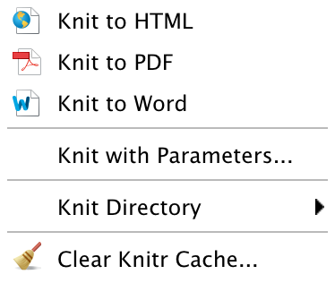

# Presenting in a Variety of Formats with R Markdown {#MarkdownChapter}

While Markdown started as a simple way to write HTML documents for the web, R Markdown (and the programs it relies on in the background, particularly Pandoc) dramatically expands our ability to take advantage of simple markdown syntax for creating documents in many formats.

In this chapter we will learn about Markdown editors and the basic
Markdown syntax for creating simple reproducible documents, including
many of the things we covered for *knitr*/LaTeX documents such as
headings and text formatting. Please refer back to previous chapters for
syntax used to display code and code chunks (Chapter
\@ref(StatsModel)), tables (Chapter \@ref(TablesChapter)), and figures (Chapter \@ref(FiguresChapter)) with R Markdown documents. In this chapter we
will also briefly look at some more advanced features for including math
with MathJax, footnotes and bibliographies with Pandoc, and customizing
styles with CSS. Then we will learn how to create slideshows. We'll
finish up the chapter by looking at options for publishing
Markdown-created HTML documents, including locally on your computer and GitHub Pages.

## The Basics

Markdown was created specifically to make it easy to write HTML (or
XHTML[^chapter_web_1]) using a syntax that is human readable and possibly
publishable without compiling. For example, compare the Markdown table
syntax in Chapter \@ref(TablesChapter) to the HTML syntax for virtually the same
table.[^chapter_web_2] That being said, to make Markdown simple, it does not have as
many capabilities as HTML. To get around this problem, you can still use
HTML in Markdown, though note that Markdown syntax cannot be used
between HTML element tags. Pandoc and R Markdown extend Markdown
so that it can be used to create reproducible PDF and MS Word documents.

**Note:** If you are using *rmarkdown* to compile a document to PDF or
Word, using raw HTML syntax will often not work as intended, if at all.
As a rule, syntax specific to LaTeX or HTML that is included in an R
Markdown document can only be properly compiled to a PDF or HTML
document, respectively. Similarly, you are only able to include graphics
that are of types supported by the output format. You are not able to
include a JavaScript plot directly in a PDF. R Markdown has been continuously improving its ability to interoperate between the different formats. For example, the `kable()` function\index{R function!kable} creates tables without having to worry too much about the output format. The *knitr* code chunck option `fig.ext` (figure extension)\index{knitr option!fig.ext} allows you to more dynamically set the output format of a dynamically created figure so that it will be compilable to multiple formats.

### Getting started with Markdown editors

RStudio functions as a very good editor for R Markdown
documents and regular non-knittable Markdown documents as well. To
create a new R Markdown document in RStudio, click `File` in the menu
bar, then `New` `R Markdown`. You will then be able to select what output
format you would like. RStudio has full syntax highlighting for code
chunks and can compile *.Rmd* files into *.md*, then render them in
*.html*, for example, with one click of the `Knit HTML` button. As we saw in
Chapter \@ref(GettingStartedRKnitr), when you knit a Markdown document in
RStudio, it will preview the HTML document for you. You can always view
HTML documents by opening them with your web browser. You can do this
directly from RStudio's **Preview HTML** window by clicking the
`Open in Browser` button.

```{r echo=FALSE, fig.cap='R Markdown Compile Dropdown Menu', fig.lb='Rmarkdrop', out.width='2cm', out.height='6cm'}

```

If you click on the downward arrow next to `Knit HTML`, you will see the
above dropdown menu. This allows you to also compile the
document to PDF or MS Word, regardless of which format you originally
chose when you created the document. As with HTML, you will be given a
preview of the PDF or Word document when it is compiled.

Being plain-text, you can also use any other text editor to modify
Markdown documents, though they will lack the level of integration with
knitr/R Markdown that RStudio has.

### Preamble and document structure

That was kind of a trick subsection title. Unlike LaTeX documents, plain
Markdown documents do not have a preamble. R Markdown documents can
have a header, basically another name for a preamble, but we will get to
that later. There is also no need to start a body environment or
anything like that. HTML head elements (HTML's preamble equivalent) are
added automatically when you render Markdown documents into HTML. With Markdown, you can just start typing the content of your document.

Here is an example of an R Markdown document that creates the map we saw
in Chapter \@ref(FiguresChapter). We'll go through all of the code below.

````markdown
---
title: "Fertilizer Consumption"
author: "Christopher Gandrud"
date: "12/29/2018"
output: html_document
---

## Fertilizer Consumption (kilograms per hectare of arable land)
in 2003

Note: Data is from the [World Bank](https://data.worldbank.org/
indicator/AG.CON.FERT.ZS)

`r ''````{r CreategvisGeoMap, echo=FALSE, message=FALSE, results='asis'}
source("analysis/googlevis-map.R")
```
-----------

## R Session Info

`r ''````{r echo=FALSE}
sessionInfo()
```
````

### Headings {#MarkdownHeader}

Headings in Markdown are simple. Note that Markdown *headings* and R
Markdown *headers* are not the same thing. The latter gives instructions
for how to render the document, the former are section titles in the
text. To create a line in the topmost heading style---maybe a title---just
place one hash mark (`#`) at the beginning of the line. The second-tier
heading gets two hashes (`##`) and so on. You can also put the hash
mark(s) at the end of the heading, but this is not necessary. Here is an
example of the three headings:

````markdown
# A level one heading

## A level two heading

### A level three heading
````

There are six heading levels in Markdown. You can also create a
level one heading by following a line of text with equal signs.
Level two headings can be created by following a line of text with
dashes:

````markdown
A level one heading
===================

A level two heading
-------------------
````

### Horizontal lines

If you would like to create horizontal lines that run the width of the
page in Markdown, place three or more equal signs or dashes
separated by text from above by one blank line:

````markdown
Create a horizontal line.

=========
````

### Paragraphs and new lines

\index{Markdown!lines}

Just like in LaTeX, new paragraphs are created by putting text on a new
line separated from previous text with a blank line. For example:

````markdown
This is the first paragraph.

This is the second paragraph.
````

Separating lines with a blank line places a blank line\index{Markdown!new line} in the final document. End a line with two or more white spaces (  ) to create a new line that is not separated by a blank line.

### Italics and bold

\index{Markdown!italics}\index{Markdown!bold}

To *italicize* a word in Markdown, place it between two
asterisks, e.g. `*italicize these words*`. To make words **bold**, place
them between four asterisks, two on either side:
`**make these words bold**`.

### Links {#MarkdownLinks}

To create hyperlinks in Markdown, use the `[LINK_TEXT](URL)`
syntax.[^chapter_web_4] `LINK_TEXT` is the text that you would like to show up as the hyperlink text. When you click on this text, it will take you to the linked site specified by `URL`. If you want to show only a URL as the
text, type it in both the square brackets and parentheses. This is a
little tedious, so in RStudio you can just type the URL and it will be
hyperlinked. In regular Markdown, place the URL between less than and
greater than signs (`<URL>`).

### Special characters and font customization {-}

\index{Markdown!special characters}

Unlike LaTeX rendered with pdfLaTeX,\index{pdfLaTeX} Markdown can include almost any
letters and characters included in your system. The main exceptions are
characters used by Markdown syntax (e.g. `*`, `#`, `\` and so on). You
will have to escape these (see below). Font sizes and typefaces cannot
be set directly with Markdown syntax. You need to set these with HTML or
CSS, which I don't cover here, though below we will look at how to use a custom CSS file.

### Lists

To create itemized lists in Markdown, place the items after one
dash:

````markdown
- Item 1
- Another item
- Item 3
````

To create a numbered list, use numbers and periods rather than dashes.

````markdown
1. Item 1
2. Another item
3. Item 3
````

### Escape characters {-}

Markdown, like LaTeX and R, uses a backslash (`\`) as an escape
character. For example, if you want to have an asterisk in the text of
your document (rather than start to italicize your text, e.g.
`*some italicized text*`), type: `\*`. Two characters---ampersand (`&`)
and the less-than sign (`<`)---have special meanings in HTML.[^chapter_web_5] So, to
have them printed literally in your text, you have to use the HTML code
for the characters. Ampersands are created with `&amp`. Less than signs
are created with `&lt`.

### Math with MathJax

Markdown by itself can't format mathematical equations. We can create
LaTeX-style equations in HTML documents by adding on the MathJax JavaScript engine.
MathJax syntax is the same as LaTeX syntax (see Section \@ref(MathLaTeX)), especially when used from RStudio or when
rendered with *rmarkdown*. Markdown-HTML documents rendered in RStudio
automatically link to the MathJax engine online.[^chapter_web_6] If you want to use
another program to render Markdown documents with MathJax equations, you
may need to take extra steps to link to MathJax. For more details, see
<https://www.mathjax.org/#gettingstarted>.

Because backslashes are Markdown escape characters, in many Markdown
editors you will have to use two backslashes to create math environments
with MathJax. For example, in LaTeX and RStudio's Markdown, you can
create a display equation like this:

$$s^{2} = \frac{\sum(x - \bar{x})^2}{n - 1}$$

by typing:[^chapter_web_7]

````markdown
$$s^{2} = \frac{\sum(x - \bar{x})^2}{n - 1}$$
````

But, in other Markdown programs, you may have to use:

````markdown
\\[
    s^{2} = \frac{\sum(x - \bar{x})^2}{n - 1}
\\]
````

To make inline equations, use parentheses instead of square brackets as
in LaTeX, e.g. `\( s^{2} = \frac{\sum(x - \bar{x})^2}{n - 1} \)`. You can also use single dollar signs, e.g. `$ s^{2} = \frac{\sum(x - \bar{x})^2}{n - 1} $`

## Further Customizability with *rmarkdown*

Markdown is simple and easy to use. But being simple means that it lacks important functionality for presenting research results, such as
footnotes and bibliographies, and custom formatting. In this section we
will learn how to overcome these limitations with Pandoc via the
*rmarkdown* package.

### More on *rmarkdown* Headers {-}

In Chapter \@ref(GettingStartedRKnitr) we first saw an R Markdown
header written in YAML. Just as a refresher, here is the basic header we
looked at:

````yaml
---
title: "A Basic PDF Presentation Document"
author: "Christopher Gandrud"
date: "29 August 2019"
output: pdf_document:
    toc: true
---
````

This header provides instructions for what to do when the document is
rendered, gives instructions to render the document as a PDF (via
LaTeX), and inserts a title, author, date, and table of contents at the
beginning.

We also have the option to include other formatting options, many of
which we would include in a *knitr* LaTeX document's preamble.\index{LaTeX!preamble} You
include these at the top level, i.e. without being tabbed. R Markdown
refers to these options as "metadata". For example, to change the font
size to 11 point we could use:

````yaml
---
title: "A Basic PDF Presentation Document"
author: "Christopher Gandrud"
date: "30 November 2019"
output: pdf_document:
    toc: true
fontsize: 11pt
---
````

We could double-space the PDF document with a similar top-level entry:
`linestretch: 2`.[^chapter_web_8] To find more options for PDF documents, type
`?pdf_document` into your R console. Note that these options will only
affect your PDF document, not a rendered HTML file.

Remember from Chapter \@ref(GettingStartedRKnitr) that we can specify rendering instructions for multiple output formats in the same header. Here is a longer header, building on what we just saw:

````yaml
---
title: "An Example rmarkdown Article"
author: "Christopher Gandrud"
date: "15 January 2019"
output:
    pdf_document:
        latex_engine: xelatex
        number_sections: yes
        toc: yes
    html_document:
        toc: no
        theme: "flatly"
linestretch: 2
fontsize: 11pt
bibliography:
    - main.bib
    - packages.bib
---
````

Ok, let's go through this in detail. We have already seen the `title`,
`author`, `date`, `linestretch`, and `fontsize` options. Notice that we
used `latex_engine` to set the LaTeX engine to XeLaTeX, which is useful
for documents that include non-standard English characters.\index{XeLaTeX} We also
specified with `number_sections` that the PDF document should have
numbered section headings.

For the HTML version of the document we do not want a table of contents
as we set `toc: no`. We specified a CSS theme called Flatly for our HTML document using `theme: "flatly"`. As of this writing, *rmarkdown* has a
built-in ability to use a range of themes from Bootswatch\index{Bootswatch}\index{Bootswatch!Flatly}
(<https://bootswatch.com/>). Alternatively, you can link to a custom CSS\index{CSS}
file with the `css` option. Use `html_document` to see other options.
Notice that we can use `no` and `yes` instead of `false` and `true`,
respectively.

We linked to two BibTeX files with the `bibliography` option. Using
Pandoc syntax, the references will apply to both the PDF and HTML
documents.

If you want to also enable the creation of a Microsoft Word document,
include `output: word_document` in the header.

#### Bibliographies with Pandoc {-}

\index{bibliography}

Pandoc via *rmarkdown* allows us to insert citations from normal BibTeX
files (see Chapter \@ref(LatexChapter)) specified in the header with `bibliography`.
The main difference is that Pandoc has a different syntax from LaTeX for
making in-text citations. Basic Pandoc citations begin with `@` followed
by the BibTeX citation key. Square brackets (`[]`) create parentheses
around the citation. Here is an example:

````markdown
This is a citation \[@donoho2009].
````

Pandoc uses *natbib*\index{LaTeX package!natbib}\index{bibliography}\index{in-text citation} by default, so the citation `[@donoho2009]` will
appear as (Donoho et al., 2009). To add text before and after the
citation inside of the parentheses, use something like this:
`[see @donoho2009, 10]`; which creates: (see Donoho et al. 2009, 10). If you do not want the parentheses around the entire citation (only the
year) then omit the square brackets. To include only the year, and not
the authors' surnames, add a minus sign, e.g. `[-@donoho2009]`. See the table above for more options.

Full bibliographic information for each item that is cited in the text
will be produced at the end of the output document. I suggest placing a
heading like `# References` at the very end of your document so that the bibliography will be differentiated from the document's text.

Markup                       Result
---------------------------- ---------------------------
`[@donoho2009]`              (Donoho 2009)
`[-@donoho2009]`             (2009)
`[see @donoho2009]`          (see Donoho 2009)
`[see @donoho2009, 10-11]`   (see Donoho 2009, 10--11)
`[@donoho2009; @Box1973]`    (Donoho 2009; Box 1973)
`@donoho2009 [10-11]`        Donoho (2009, 10--11)

: A Selection of Pandoc In-text Citations

#### Footnotes with Pandoc {-}

\index{Pandoc!footnotes}\index{Markdown!footnotes}

You can also include footnotes in documents rendered with *rmarkdown* by
using Pandoc's footnote syntax. In the text where you would like a
footnote to be located, use: `[^NOTE_KEY]`. Then at the end of your
document, place `[^NOTE_KEY]: The footnote text`.[^chapter_web_9]
`NOTE_KEY`s generally follow the same rules as BibTeX citation keys, so no spaces.
The footnotes will be numbered sequentially when rendered.

To sum up, here is an example of a document that can be rendered in HTML
or PDF using R Markdown. It includes footnotes and a bibliography.

````markdown
---
title: "Minimal rmarkdown Example"
output:
    pdf_document:
        toc: true
    html_document:
        toc: false
bibliography: main.bib
---

This is some text.[^FirstNote]

This is a *knitr* code chunk:

`r ''````{r}
plot(cars$speed, cars$dist)
```

This is a citation [see @donoho2009, 10].

[^FirstNote]: This is a footnote.

# References
````

We have only covered a small proportion of Pandoc's capabilities that
you can take advantage of with *rmarkdown*. For full range of Pandoc's
abilities, see <https://pandoc.org/MANUAL.html>.

### CSS style files and Markdown

You can customize the formatting of HTML documents created with Markdown
files using custom CSS style sheets. CSS files allow you to specify the
way a rendered Markdown file looks in a web browser including fonts,
margins, background color, and so on. We don't have space to cover CSS
syntax here. There are numerous online resources for learning CSS. One
of the best ways may be to just copy a CSS style sheet into a new file
and play around with it to see how things change. A really good resource
for this is Google Chrome's Developer Tools.\index{Google Chrome!Developer Tools} The Developer Tools allows you to edit your webpages, including their CSS, and see a live preview.
It is a really nice way to experiment with CSS (and HTML and
JavaScript).\index{HTML}\index{JavaScript}[^chapter_web_10] There are also numerous pre-made style sheets available online.[^chapter_web_11]

#### Rendering R Markdown files to HTML using custom CSS {-}

The simplest way to use a custom CSS style sheet is to include the file\index{CSS}
path to the CSS file in an *rmarkdown* header. As mentioned earlier,
*rmarkdown* has a number of built-in CSS file options that you can
access with `style`. If you want to use another custom CSS file, use the
`css` option. If our custom CSS file is called *custom_style.css* in the
same directory as the R Markdown document, then a basic header would be:

````yaml
---
output:
    html_document:
        css: custom_style.css
---
````

If you are using the *knitr* package to render an R Markdown document to
HTML, you can also include a custom CSS file. First use `knit` to knit
the document to a plain Markdown file. Then use the `markdownToHTML()`\index{R function!markdownToHTML}
function from the *markdown* package [@R-markdown] to render the plain
Markdown document in HTML, including the `stylesheet` argument with the
path to the CSS file.

## Slideshows with Markdown, R Markdown, and HTML

Because R Markdown documents can be compiled into HTML files, it is
possible to use them to create HTML5\index{HTML5} slideshows.[^chapter_web_12] There are a number
of advantages to creating HTML presentations with Markdown:

-   You can use the relatively simple Markdown syntax.

-   HTML presentations are a nice native way to show content on the web.

-   HTML presentations can incorporate virtually any content that can be
    included in a webpage. This includes interactive content, like
    motion charts created by *googleVis*\index{R package!googleVis} (see Chapter \@ref(FiguresChapter)).

Let's look at how to create HTML slideshows from Markdown documents
using (a) the *rmarkdown* package and (b) RStudio's built-in slideshow
files, called R Presentations. You can also use *rmarkdown* to create
beamer presentations.

#### HTML5 frameworks {-}

Before getting into the details of how to use R Markdown for presentations and R Presentations, let's briefly look more into what an HTML5\index{HTML5} slideshow is and the frameworks that make it possible. HTML5 slideshows rely on a number of web technologies in addition to HTML5, including CSS,\index{CSS} and JavaScript\index{JavaScript} to create a website that behaves like a LaTeX beamer\index{beamer} or PowerPoint\index{PowerPoint} presentation. They run in your web browser and you may need to be connected to the internet for them to work properly, as key components are often located remotely. Most browsers have `Full Screen` mode you can use to view presentations.

There are a number of different HTML5 slideshow frameworks that let you
create and style your slideshows. In all of the frameworks, you view the
slideshow in your web browser and advance through slides with the
forward arrow key on your keyboard. You can go back with the back arrow.
Despite these similarities, the frameworks have different looks and
capabilities.

### HTML slideshows with *rmarkdown*

It is very easy to create an HTML presentation using *rmarkdown* and the IO Slides[^chapter_web_13] or Slidy[^chapter_web_14] HTML5 frameworks. The syntax for IO Slides
and Slidy presentations with *rmarkdown* presentations is almost exactly
the same as the syntax we have seen throughout this chapter. There are
two main differences from the syntax we have seen so far. First,
`ioslides_presentation` for IO Slides or `slidy_presentation` for
Slidy presentations is the output type to set in the header. Second, two hashes (`##`) set a frame's header.[^chapter_web_15] For example,

````markdown
---
title: "Simple rmarkdown Presentation Example"
author: "Christopher Gandrud"
date: "26 December 2015"
output:
    ioslides_presentation:
        incremental: true
---

## Access the code

The code to create the following figure is available online.
````

This code creates a slide show that begins with the slide in the following figure. Bullet points
will be brought in incrementally because we used `incremental: true`
under `output: ioslides_presentation`. Bullets are created using
Markdown list syntax.

![R Markdown/IO Slides Example Title
Slide[]{label="BasicIO"}](images/chapter_web/rmarkdownIo_slidesExample.png){#BasicIO}

Use three dashes (`---`) to delineate a new slide without a header. You
can style the presentation further using the `css` option in the header
to link to a custom CSS file.

You can create a new IO Slides or Slidy *rmarkdown* presentation in
RStudio by selecting `File` `R Markdown...` then `Presentation` in the
menu on the left of the window (see figure below). Finally, click `HTML (ioslides)` or
`HTML (Slidy)`.

![Create New R Markdown Presentation in
RStudio[]{label="rmarkdownPresRStudio"}](images/chapter_web/rmarkdownPresRStudio.png){#rmarkdownPresRStudio}

### LaTeX Beamer slideshows with *rmarkdown* {#rmarkdownBeamer}

As we saw in Chapter \@ref(LatexChapter), creating a presentation with LaTeX beamer involves rather convoluted syntax. Luckily, we can use *rmarkdown* to create beamer presentations using much cleaner Markdown syntax.

\index{beamer|(}\index{LaTeXbeamer|(}

An R Markdown beamer presentation uses the same syntax that we just saw with HTML presentations. The main difference is in the header where we
use `output: beamer_presentation`. You create a new R Markdown beamer
document in RStudio in a similar way as IO Slides or Slidy. The only
difference is that we select `PDF (Beamer)`. As before, frame titles are
delineated with two hashes (`##`). You can mark sections in much the
same way with one hash. In the header you can switch the beamer theme,
font theme, and color theme with `theme`, `colortheme`, and `fonttheme`,
respectively. For example:

````yaml
output:
    beamer\_presentation:
        incremental: true
        theme: "Bergen"
        colortheme: "crane"
        fonttheme: "structurebold"
````

Note that themes are placed in quotation marks. You can also include a
custom template with the `template` option followed by the path to the
custom template file.

![*rmarkdown*/Beamer Example Title
Slide[]{label="rmarkdownBeamerExample"}](images/chapter_web/rmarkdownBeamerExample.png)

\index{beamer|)}\index{LaTeXbeamer|)}

### Slideshows with Markdown and RStudio's R Presentations

Another easy, but less customizable way to create HTML slideshows is
with RStudio's R Presentation documents.\index{R Presentation}\index{RStudio!R Presentation} To get started, open RStudio
and click `File`, `New`, then `R Presentation`. RStudio will then ask you to
give the presentation a name and save it in a particular file. The
reason RStudio does this is because an R Presentation is not just one
file. Instead, it includes:

-   A *.Rpres* file, which is very similar to a *knitr* Markdown *.Rmd*
    file.

-   A *.md* Markdown file created from the *.Rpres* file.

-   *knitr* cache and figure folders, also created from the *.Rpres*
    file.

#### Editing and compiling the presentation {-}

You change the presentation's content by editing the *.Rpres* file using
the normal *knitr* Markdown syntax we've covered. The only difference is
how you create new slides. Luckily, the syntax for this is very simple.
Type the slide's title, then at least three equal signs (`===`). For example,

````markdown
This is an Example .Rpres Slide Title
===
````

The very first slide is automatically the title slide and will be
formatted differently from the rest.[^chapter_web_16] Here is an example of a complete *.Rpres* file:

````markdown
Example R Presentation
===

## Christopher Gandrud

## 1 July 2019

Access the Code
===

The code to create the following figure is available online.

To access it we type:

`r ''````{r, eval=FALSE}
# Access and run the code to create a caterpillar plot

devtools::source_url("http://bit.ly/VRKphr")
```

Caterpillar Plot
===

`r ''````{r, echo=FALSE, message=FALSE}
# Access and run the code to create a caterpillar plot

devtools::source_url("http://bit.ly/VRKphr")
```

Fertilizer Consumption Map (2003)
===

`r ''````{r CreategvisGeoMap, echo=FALSE, message=FALSE, results='asis'}
# Create geo map of global fertilizer consumption for 2003
devtools::source\_url("http://bit.ly/VNnZxS")
```
````

This example includes four slides and three code chunks. The last code
chunk uses the *googleVis* package to create the global map of
fertilizer consumption we saw earlier. Because the slideshow we are creating is in
HTML, the map will be fully dynamic. Note that, like before, you will not
be able to see the map in the RStudio preview, only in a web browser.

To compile the slideshow, either click the `Preview` button or save the
*.Rpres* document. When you do this, you can view your updated slideshow in the *Presentation* pane.\index{RStudio!Presentation pane} You can navigate through the slideshow using the arrow buttons at the bottom right of the *Presentation* pane. If you click the magnifying glass icon at the top of the
*Presentation* pane, you will get a much larger view of the slideshow.
You can also view the slideshow in your web browser by clicking on the
`More` icon, then
`View in Browser`.

#### Publishing slideshows {-}

You can of course, view your slideshows locally. To share your
presentation with others, you probably want to either publish the
presentation to a standalone HTML file and host it (e.g. with a service like Netlify <https://www.netlify.com/>\index{Netlify}) or publish it directly to RPubs. For R
Presentations, create a standalone HTML file by clicking the
`More` button in the *Presentation* pane, then `Save as Webpage...`.
Under the `More` button, you can also choose the option
`Publish to RPubs...`.

![RStudio R Presentation
Pane[]{label="PresentPane"}](images/chapter_web/PresentationPane.png){#PresentPane
width="\\textwidth"}

## Publishing HTML Documents Created with R Markdown

In Chapter \@ref(GettingStartedRKnitr) we saw how to publish other R Markdown documents compiled with RStudio to RPubs. The *knitr* function `knit2wp()`\index{R function!knit2wp}
can be used to post a knitted Markdown file to WordPress[^chapter_web_17] sites,
which are often used for blogging. In this section we will look at how to publish R Markdown documents using GitHub.

### Standalone HTML files {-}

You can open the HTML file rendered from any R
Markdown document in your web browser. If the HTML file contains the
full information for the page as is generally does when created by
*rmarkdown*, e.g. the file does not depend on any auxiliary files, you
can share this file via email or other means and anyone with a web
browser can open it. We can of course, also send auxiliary files if need
be, but this can get unwieldy.

### GitHub Pages {-}

\index{GitHub!Pages}\index{GitHub}

GitHub also offers a free hosting service for webpages. These can be
much more complex than a single HTML file. The simplest way to create
one of these pages is to create a repository with a file called
*README.Rmd*. You can `knit` this file and then create your GitHub Page
with it. To do this, go to the `Settings`, then `GitHub Pages` on your
repository's main GitHub website. Then click `Automatic Page Generator`. This places the contents of your *README.md* file in the page and provides you with formatting options. Click `Publish` and you will have a new website.

Clicking `Publish` creates a new orphan branch[^chapter_web_19] called *gh-pages*.
When these branches are pushed to GitHub, it will create a website based
on a file called *index.html* that you include in the branch. This will
be the website's main page.

If you want to create more customized and larger websites with GitHub
Pages, you can manually create a GitHub Pages orphan branch\index{git!orphan branch} and push it
to GitHub.\index{GitHub!gh-pages branch} This is essentially what *slidify* did for us with its
`publish` function.\index{R function!publish} Imagine we have our working directory set as a
repository containing an R Markdown file that we have rendered into an
HTML file called *index.html*. Let's create a new orphan branch:

````sh
# Create orphan
gh-pages branch git checkout --orphan gh-pages
````

Now `add` the files, `commit` the changes and `push` it to GitHub. Push
it to the *gh-pages* branch like this\index{git!add}\index{git!commit}\index{git!push}

````sh
# Add files
git add .

# Commit changes
git commit -am "First gh-pages commit"

# Push branch to GitHub Pages
git push origin gh-pages
````

A new webpage will be created at: *USERNAME.github.io/REPO\_NAME* You
can also add custom domain names. For details, see
<https://help.github.com/en/articles/using-a-custom-domain-with-github-pages>.

### Further information on R Markdown

We have covered many of the core capabilities of R Markdown for
creating reproducible research documents. Please see RStudio's R
Markdown documentation (<https://rmarkdown.rstudio.com/>) for even more
information. Another tool to look into for interactive results
presentation is the *shiny* package [@R-shiny].\index{R package!shiny} It gives R the
capability to create interactive web applications, not just the static
websites that we have covered in this chapter. This package is well
integrated with RStudio. For more information, please see
<http://shiny.rstudio.com/>.

### Chapter summary {-}

In this chapter we learned a number of tools for dynamically presenting
our reproducible research on the web, as well as how to create PDFs with
the simple R Markdown syntax. Though LaTeX and PDFs will likely remain
the main tools for presenting research in published journals and books
for some time to come, choosing to also make your research available in
online native formats can make it more accessible to general readers. It
also allows you to take advantage of interactive tools for presenting
your research. R Markdown also makes it easy to create documents in a
variety of formats.

[^chapter_web_1]: Extensible HyperText Markup Language.

[^chapter_web_2]: For more information, see John Gruber's website:
    <https://daringfireball.net/projects/markdown/>.

[^chapter_web_4]: You can also include a `title` attribute after the URL, though this is generally not very useful.

[^chapter_web_5]: Ampersands declare the beginning of a special HTML character.
    Less-than signs begin HTML tags.

[^chapter_web_6]: You will not be able to render equations when you are not online.

[^chapter_web_7]: In RStudio you can also use dollar signs to delimit MathJax
    equations as in LaTeX.

[^chapter_web_8]: 1 would be for single space and 1.5 would be for one and a half
    spacing.

[^chapter_web_9]: You can actually put this almost anywhere and it will be placed
    and numbered correctly in the output document, but I find it easier
    to organize the footnotes when they are placed at the end.

[^chapter_web_10]: For more information on how to access and use Developer Tools in
    Chrome see: <https://developers.google.com/chrome-developer-tools/>.

[^chapter_web_11]: One small note: when you create a new style sheet or copy an old
    one, make sure the final line is blank. Otherwise you may get an
    "incomplete final line" error when you render the document.

[^chapter_web_12]: The slideshows created by the tools in this section use features
    introduced in the 5th version of HTML, i.e. HTML5. In this section I
    often refer to HTML5 as just HTML for simplicity.

[^chapter_web_13]: <https://code.google.com/p/io-2012-slides/>

[^chapter_web_14]: <https://www.w3.org/Talks/Tools/Slidy2/#(1)>

[^chapter_web_15]: You can create sections with one hash.

[^chapter_web_16]: As of this writing, it is a blue slide with white letters.

[^chapter_web_17]: <https://wordpress.com/>

[^chapter_web_19]: An orphan branch is a branch with a different root from other
    repository branches. Another way of thinking about this is that orphan branches
    have their own history.
